# Inequalities with Rational Functions (Precalculus - College Algebra 47)

[Video](https://www.youtube.com/watch?v=QSh1xcbYKZk)

---

Graphing inequalities with rational functions is very similar to graphing
equalities with rational functions.

We start by setting our numerator equal to the function or constant on the other
side of the inequality. This is in order to find where the function intersects
this constant or other function. When set to $0$, this means we are looking to
see where our function crosses the $x$-axis (_i.e._ the $x$-intercepts).

---

$$ \frac{(x - 3)(x + 2)}{x - 1} \leq 0 $$

$$ (x - 3)(x + 2) = 0 $$

$$ x - 3 = 0 $$

$$ x = 3 \text{ : crossing} $$

$$ x + 2 = 0 $$

$$ x = -2 \text{ : crossing} $$

We're also going to find the Vertical Asymptotes by setting the denominator
equal to $0$.

$$ x - 1 = 0 $$

$$ x = 1 $$

And the power of this factor, $(x - 1)^1$ is _odd_, and so therefore it is
indeed a Vertical Asymptote that causes _opposite_ infinities.

Much like setting up inequalities on a number line for polynomials, we will do
the same for rational inequalities. We will want to label the $x$-intercepts and
the Vertical Asymptotes. Labeling them will make sure we understand how our
graph is interacting with these points and therefore inform how we're going to
express this inequality using interval notation.

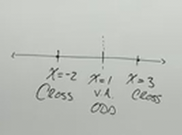

The easiest way to figure out what is included in our output set is to plug in a
value in at least one interval.

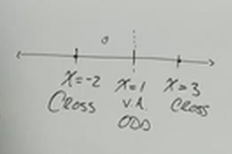

So, for example, let's take the value $0$, which lies in the interval between
$-2$ and $1$. If we evaluate for $x$ where $x = 0$, we get:

$$ \frac{(0 - 3)(0 + 2)}{0 - 1} \leq 0 $$

$$ \frac{(-3)(2)}{-1} \leq 0 $$

$$ \frac{-6}{-1} \leq 0 $$

$$ 6 \leq 0 $$

Which is a false statement, from this we can determine based off the crossing
and the vertical asymptote's end behavior (based off of even vs odd) what will
happen at each interval. And therefore we get this:

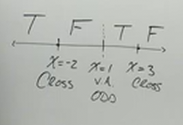

Hopefully you can see why this is. When you have _odd multiplicity_ around the
vertical asymptote, this means that you are going to have graphs that head
towards _opposite_ infinities, and therefore the sign change occurs at the
Vertical Asymptote here. Additionally, we have crosses (based off the
multiplicity of the factor sin the numerator) and therefore we have sign changes
at these intervals as well. Now all that's left is to consider the fact that our
inequality comparitor is inclusive to determine our interval notation.

$$ \frac{(x - 3)(x + 2)}{x - 1} \leq 0 \text{ : } (-\infty, -2] \cup (1, 3] $$

---

$$ \frac{(x + 5)^2}{x^2 - 4} \geq 0 $$

Let's find our $x$-intercepts by setting the numerator to the constant $0$ that
is on the other side of the inequality (when this changes in furture examples,
we will not inherently be setting it to $0$).

$$ (x + 5)^2 = 0 $$

$$ x + 5 = 0 $$

$$ x = -5 $$

Because the multiplicity of this factor is _even_ $(x + 5)^2$, we know that this
is a _Bounce_ along the $x$-axis.

Next we will find our vertical asymptotes by setting the denominator equal to
$0$ (this is regardless of what is on the other side of the inequality, it is
always set to $0$).

$$ x^2 - 4 = 0 $$

$$ (x + 2)(x - 2) = 0 $$

$$ x + 2 = 0 $$

$$ x = -2 \text{ : Vertical Asymptote, Odd} $$

$$ x - 2 = 0 $$

$$ x = 2 \text{ : Vertical Asymptote, Odd} $$

Let's now put this on the $x$-axis and find our intervals.

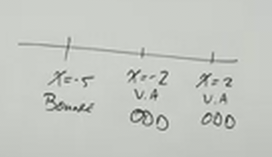

We now plug in the constant to determine how our function at the interval that
contains this constant (in this case, $0$), and from there, based off the notes
we've taken, we can determine where the sign changes occur for the rest of our
number line, and thereby, deterine our intervals. By plugging in $0$, we find:

$$ \frac{(0 + 5)^2}{0^2 - 4} \geq 0 $$

$$ \frac{5^2}{-4} \geq 0 $$

$$ \frac{25}{-4} \geq 0 $$

We don't really have to evalute, we know that this is negative, and that
negatives are not greater than or equal to $0$, therefore this is a _False_
statement. After evaluating how our graph behaves at odd vertical asymptotes and
bounces, we get this further annotated number line:

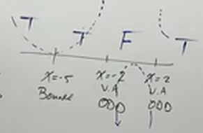

Now, because we have a bounce, and we're looking for all values for $f(x)$ that
are greater than or equal to $0$, then the intervals on both signs of the bounce
are true, and we don't bother creating a union between these two intervals, they
count as a single interval. The rest of our interval notation is hopefully
pretty intuitive based off of the behavior of Vertical Asymptotes (_i.e._ the
values themselves are not included in the set).

$$ \frac{(x + 5)^2}{x^2 - 4} \geq 0 \text{ : } (-\infty, -2) \cup (2, \infty) $$

---

Let's look at one last example where our function is set to the constant $0$,
which equates to finding where our function is above/below the $x$-axis.

$$ \frac{x(x^2 + 1)(x - 2)}{(x - 1)(x + 1)} \geq 0 $$

We can find our $x$-intercepts by setting the numerator equal to the constant,
$0$.

$$ x(x^2 + 1)(x - 2) = 0 $$

$$ x = 0 \text{ : cross } $$

$$ x^2 + 1 = 0 $$

This is an irrational factor , and therefore has no affect on determining this
inequality as it never crosses the $x$-axis.

$$ x - 2 = 0 $$

$$ x = 2 \text{ : cross } $$

We then determine our vertical asymptotes by setting our denoinator to $0$.

$$ (x - 1)(x + 1) = 0 $$

$$ x - 1 = 0 $$

$$ x = 1 \text{ : odd } $$

$$ x + 1 = 0 $$

$$ x = -1 \text{ : odd } $$

Now we can plot the number line:

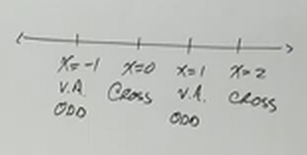

An easy number to plug in in this case is $3$ (we can't plug in $0$ in this case
since it is on the border of one of our intervals as a cross).

$$ \frac{(3)(3^2 + 1)(3 - 2)}{(3 - 1)(3 + 1)} \geq 0 $$

$$ \frac{3(10)(1)}{(2)(4)} $$

$$ \frac{30}{8} \geq 0 $$

We don't have to evaluate further, we know this is true, since the left hand
side of our inequality above is positive.

Because we have all crosses and odd multiplicities, we know that this means the
sign of our function will always invert at each interval boundary.

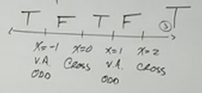

We can then determine which ends of these interval boundaries are included or
not based off of if it is a vertical asymptote, as well as whether or not the
inequality is inclusive or not.

Thusly, our final interval notation looks like:

$$ \frac{x(x^2 + 1)(x - 2)}{(x - 1)(x + 1)} \geq 0 \text{ : } (-\infty, -1) \cup [0, 1) \cup [2, \infty) $$

---

Now, what happens if we don't have a $0$ on the other side of our inequality?
What if we have a _constant_ or another _function_?

Let's deal with how we evaluate a _constant_ first. Consider the following
inequality:

$$ \frac{3x - 5}{x + 2} \leq 2 $$

It's actually quite similar, but requires a bit more work, first we simply
substitute our inequality for an equals sign, and solve to find where our
function intersects with the constant (our constant is just a number different
than $0$).

Afterwards, it's very similar to as before where we find our Vertical Asymptotes
by setting the denominator equal to $0$.

$$ \frac{3x - 5}{x + 2} \leq 2 $$

$$ \frac{3x - 5}{x + 2} = 2 $$

$$ 3x - 5 = 2(x + 2) $$

$$ 3x - 5 = 2x + 4 $$

$$ x = 9 \text{ : cross} $$

And now we have to find our vertical asymptotes:

$$ x + 2 = 0 $$

$$ x = -2 \text{Vertical Asymptote, Odd} $$

We can now draw our number line.

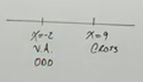

We can now take an easy number that occurs within one of our intervals to
determine the behavior of our function. Let's just plug in $0$ since it lies
inbetween $-2$ and $9$.

$$ \frac{3(0) - 5}{(0 + 2)} \leq 2 $$

$$ \frac{-5}{2} \leq 2 $$

Negative number, definitely less than $2$, this is a _True_ statement. We can
easily determine the rest, odd multiplicity on our numerator's factor indicate a
_cross_ and therefore a _sign change_, and similarly, an odd multiplicity on our
denominator factor indicate a _vertical asymptote_ with an _odd_ multiplicity,
and therefore another _sign change_.

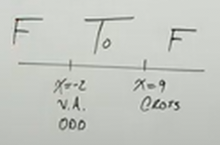

We can now determine our interval notation from this simple annotation.

$$ \frac{3x - 5}{x + 1} \leq 2 \text{ : } (-2, 9] $$

---

$$ \frac{5}{x - 3} \geq \frac{3}{x + 1} $$

This is very similar in how it is solved from the previous example.

$$ \frac{5}{x - 3} = \frac{3}{x + 1} $$

Let's just cross multiply to solve this.

$$ 5(x + 1) = 3(x - 3) $$

$$ 5x + 5 = 3x - 9 $$

$$ 2x = -14 $$

$$ x = -7 \text{ cross } $$

Now, we find vertical asymptotes by setting both our denominators equal to $0$.

$$ x - 3 = 0 $$

$$ x = 3 \text{ : Vertical Asymptote, Odd} $$

$$ x + 1 = 0 $$

$$ x = -1 \text{ : Vertical Asymptote, Odd} $$

Now, let's write this on our number line:

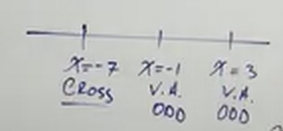

And plug in an easy number inbetween one of our intervals, $0$ is always a good
choice as long as $0$ is not an interval boundary.

$$ \frac{5}{0 - 3} \geq \frac{3}{0 + 1} $$

$$ \frac{5}{-3} \geq \frac{3}{1} $$

This is a _False_ Statement.

And from that point on our number line, we can determine the rest based off of
our understanding of how the graph interacts with crosses and _odd_ vertical
asymptotes.

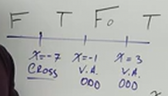

And from here, we can write our interval notation:

$$ \frac{5}{x - 3} \geq \frac{3}{x + 1} \text{ : } [-7, -1) \cup (3, \infty) $$
