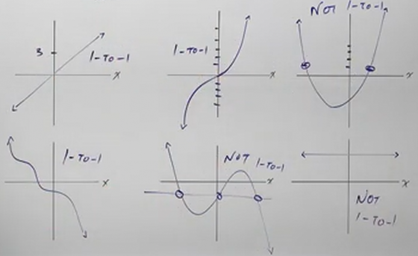

# One to One Functions (Precalculus - College Algebra 50)

[Video](https://www.youtube.com/watch?v=C0Q_m2UDerc)

---

Before moving onto _Inverse Functions_, we'll first need to understand what a
_One To One_ Function is. In essence, a _One To One_ Function is just a function
where one input gives one _Unique_ output. This can help us determine when a
function is going to have an inverse, and when it's not, which will further help
us evaluate Exponential and Logarithmic Functions.

As a sneak peek, however, what we will find out about _Inverse Functions_ is
that when we have an _Inverse_ we are going to "switch" the $x$ value for the
$y$ value in everything that we do. This means that we can easily determine the
graph of a function's _Inverse_ by simply switching the $x$ and $y$ values, but
this can only occur if the values for the output are _Unique_ for both of these
functions. This concept will be further in the following section.

---

Consider the following table:

| Employee | ID  |
| -------- | --- |
| Mark     | 325 |
| Joe      | 184 |
| Ty       | 007 |
| Jane     | 291 |

These show inputs of some names, and the outputs of the ID numbers.

$$
\begin{align*}
\text{Mark} \rightarrow 325 \\
\text{Joe} \rightarrow 184 \\
\text{Ty} \rightarrow 007 \\
\text{Jane} \rightarrow 291 \\
\end{align*}
$$

A good concept to keep in mind when talking about _One To One_ function is that
they have to maintain this relationship going backwards in forwards as a sort of
_mapping_. This means that if a specific name goes to a specific id, then the
inverse statement must be true, in other words, a specific id must go to a
specific name.

$$
\begin{align*}
\text{Mark} \leftrightarrow 325 \\
\text{Joe} \leftrightarrow 184 \\
\text{Ty} \leftrightarrow 007 \\
\text{Jane} \leftrightarrow 291 \\
\end{align*}
$$

Now, the following relationship wouldn't be considered a one to one function:

$$
\begin{align*}
\text{Ty} \rightarrow 007 \\
\text{Jane} \rightarrow 007 \\
\end{align*}
$$

This wouldn't work very well in an ID like system, would it? If $007$ refers to
_both_ Ty and Jane, well...which one would our system refer to if both employees
punched in their ID number to clock in at the beginning of the day or for some
other day to day operation? It simply wouldn't work.

Note that this would still be a function! A function is simply an operation
where one input gives one output. Notice that we didn't say _Unique_ output! But
the above illustration would not be an example of a _One To One_ Function.

We can tell this, because if we inverse the Id to Employee mapping in this case,
we would not get a function at all! $007$ would refer to _both_ Ty and Jane, and
thusly would break the rule of a function being an operation where _one_ input
returns _one_ output, not _two_.

---

Consider the following sets:

$$ f = \left\{(1, -2), (3, 4), (-7, 1), (18, 12) \right\} $$

$$ g = \left\{(2, 6), (11, 9), (-5, -2), (6, -3), (-1, 6) \right\} $$

As a brief recap, this would represent the inputs and outputs for the functions
$f(x)$ and $g(x)$ and the points they would represent on a graph, where the
first number in each point represents the input $x$, and the second number
represents the output $f(x)$ (or $g(x)$).

Now, to determine if one has a one to one function, one simply has to look at
the inputs and outputs. If one has repeated outputs, one does _not_ have a _One
To One_ Function. If the inputs are repeated, it is _not_ even a function at
all.

In the case of $f$, we can see that for every input, there is one _unique_
output, and thusly $f$ is an example of a _One To One_ function.

In the case of $g$, however, we have two inputs that give the output $6$ ($2$
and $-1$), and thusly $g$ is _not_ a _One To One_ function.

---

When graphing these functions, we can use both the _Vertical_ and _Horizontal_
Line tests to determine 1. if they are functions, and 2. if they are _One To
One_ functions.

Recall that the _Vertical Line_ test (drawing vertical lines through our graph
and if it hits the graph more than once, this indicates that we have multiple
inputs for a single output), which is used to determine if our graph is a
function.

Well, similarly, we can use the _Horizontal Line Test_ (drawing horizontal lines
through nour graph and if it hits the graph more than once, this indicates that
we have multiple outputs for a single input), which is used to determine if our
graph is a _One To One_ function. The following illustrations show some common
examples:

