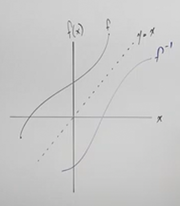
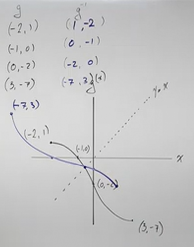

# Finding Inverse Functions (Precalculus - College Algebra 51)

[Video](https://www.youtube.com/watch?v=fK7IPeeZoFE)

---

In this section we're going to cover _Inverse Functions_ in depth. We're going
to discuss what an _Inverse Function_ is, how we can tell if we have an inverse
function, as well as what they look like as graphs.

To reiterate on why we are covering _Inverse Functions_, we will be using the
lessons learned here to further our understanding of Exponentials and
Logarithms, which will further our understanding of various concepts related to
Calculus and other Mathematical concepts.

---

A few rules on _Inverse Functions_.

- A Function has an inverse if and only if it is a _One To One_ Function
  (covered in the previous section). (note: "if and only if" is a biconditional
  statement, meaning the reverse is also true).

- Inverse Functions "undo" each other

- For $f(x)$ is a _One To One_ Function, the Inverse, $f^{-1}(x)$ is also a _One
  To One_ Function. (note: $f^{-1}(x)$ is pronounced "f inverse of x").

---

As covered in the previous sections on _One To One_ and _Composite Functions_,
we made note of the fact that whenever we compose two functions and the output
of that function is the same as the input, then this means that these two
functions are Inverses of each other. We can denote this with the following two
statements:

$$ (f \circ f^{-1})(x) = x $$

$$ (f^{-1} \circ f)(x) = x $$

---

Before moving on, consider the following statement, in which we declare a
function $f$, and a set of inputs and outputs like so:

$$ f = \left\{(1, -2), (3, 5), (7, -3), (5, 8) \right\} $$

Note briefly that this is a Function (as indicated by every input having one
output), and it is a _One To One_ Function (as indicated by every input having
one _unique_ output). Now consider it's inverse:

$$ f^{-1} = \left\{(-2, 1), (5, 3), (-3, 7), (8, 5) \right\} $$

And that really is all there is to it, you're just swapping input and output,
your $x$ and $y$, or your $x$ and $f(x)$.

---

Let's now find inverses of functions. Consider the following function:

$$ f(x) = 1 - 3x $$

This is easiest when replacing $f(x)$ with $y$:

$$ y = 1 - 3x $$

We then switch $y$ and $x$:

$$ x = 1 - 3y $$

And we then solve for $y$ to find the inverse:

$$ x = 1 - 3y $$

$$ x - 1 = -3y $$

$$ \frac{x - 1}{-3} = y $$

$$ -\frac{x - 1}{3} = y $$

And we get our inverse:

$$ y = -\frac{x - 1}{3} $$

And replace $y$ with $f^{-1}(x)$:

$$ f^{-1}(x) = -\frac{x - 1}{3} $$

Let's do another.

---

$$ g(x) = x^3 + 4 $$

$$ y = x^3 + 4 $$

$$ x = y^3 + 4 $$

$$ x - 4 = y^3 $$

$$ \sqrt[3]{x - 4} = y $$

$$ g^{-1}(x) = \sqrt[3]{x - 4} $$

Note because we have an odd powered radical, we don't need a $\pm$ when taking a
cube root.

Let's now demonstrate how we can prove two functions are inverses of each other
by composing them:

$$ (g \circ g^{-1})(x) $$

$$ (g \circ g^{-1})(x) = (\sqrt[3]{x - 4})^3 + 4 $$

$$ (g \circ g^{-1})(x) = x - 4 + 4 $$

$$ (g \circ g^{-1})(x) = x $$

And if you get $x$ (you get the input) as your output, then the two functions
are inverses of each other. You could do it the other way around, but just
checking one will prove it.

---

$$ h(x) = x^2 + 9 $$

Before proceeding, consider this, is this a _One To One_ Function? No. This is a
Parabola when graphed, and that means that for every input, we get two different
outputs, that means that the outputs are _not_ unique, and therefore this is not
a _One To One_ Function. This means we can't find an _Inverse_.

We can address this issue by limiting the Domain to when $x$ is greater than or
equal to $0$, or when $x$ is negative. This would make it a _One To One_
Function and we can then find the _Inverse_.

$$ h(x) = x^2 + 9, x \geq 0 $$

We start off the same then when solving this:

$$ h(x) = x^2 + 9 $$

$$ y = x^2 + 9 $$

$$ x = y^2 + 9 $$

$$ x - 9 = y^2 $$

$$ \pm \sqrt{x - 9} = y $$

$$  y = \pm \sqrt{x - 9} $$

And here we have two inputs for one output... that is not a function.

But if we restrict the domain to be positive (_i.e._ $x \geq 0$), then we get
this:

$$  y = \sqrt{x - 9} $$

$$  h^{-1}(x) = \sqrt{x - 9} $$

If we had to use composition to prove that this is inverse, we could do so like
so:

$$ (h^{-1} \circ h)(x) $$

$$ (h^{-1} \circ h)(x) = \sqrt{(x^2 + 9) - 9} $$

$$ (h^{-1} \circ h)(x) = \sqrt{x^2 + 9 - 9} $$

$$ (h^{-1} \circ h)(x) = \sqrt{x^2} $$

$$ (h^{-1} \circ h)(x) = x $$

---

Let's now take a look at the graphs of inverses.

$$ f(x) = \frac{4}{2 - x} $$

$$ y = \frac{4}{2 - x} $$

$$ x = \frac{4}{2 - y} $$

$$ x(2 - y) = 4 $$

$$ 2 - y = \frac{4}{x} $$

$$ -y = \frac{4}{x} - 2 $$

$$ y = -\frac{4}{x} + 2 $$

$$ y = 2 - \frac{4}{x} $$

$$ f^{-1}(x) = 2 - \frac{4}{x} $$

We can also multiply our outside term $2$ by the LCD, $x$ to get this form of
the answer (not necessary, but gives a different form of the answer):

$$ f^{-1}(x) = \frac{2x - 4}{x} $$

Notice how for $f(x)$ there is a Verticle Asymptote at $x = 2$, and a Horizontal
Asymptote at $y = 0$. And for $f^{-1}(x)$, there is a Vertical Asymptote at
$x = 0$ and a Horizontal Asymptote at $y = 2$. They have switched, very much how
the Domain and Range switch.

---

$$ g(x) = \frac{-2x}{x - 1} $$

$$ y = \frac{-2x}{x - 1} $$

$$ x = \frac{-2y}{y - 1} $$

$$ x(y - 1) = -2y $$

$$ xy - x = -2y $$

$$ -x = -2y - xy $$

$$ -x = y(-2 - x) $$

$$ \frac{-x}{-2 - x} = y $$

$$ \frac{x}{2 + x} = y $$

$$ \frac{x}{x + 2} = y $$

$$ y = \frac{x}{x + 2} $$

$$ g^{-1}(x) = \frac{x}{x + 2} $$

Again, notice here that for $g(x)$, there is a Vertical Asymptote at $x = 1$ and
a Horizontal Asymptote at $y = -2$. For $f^{-1}(x)$, there is a Vertical
Asymptote at $x = -2$, and a Horizontal Asymptote for $y = 1$. They have
switched, as have the Domain and Range.

Let's go ahead and practice proving of inverses using composition:

$$ (g \circ g^{-1})(x) $$

$$ (g \circ g^{-1})(x) = \frac{-2\left(\dfrac{x}{x + 2}\right)}{\left(\dfrac{x}{x + 2}\right) - 1} $$

$$ (g \circ g^{-1})(x) = \frac{-2\left(\dfrac{x}{x + 2}\right)}{\left(\dfrac{x}{x + 2}\right) - 1} \cdot \frac{x + 2}{x + 2} $$

$$ (g \circ g^{-1})(x) = \frac{-2x}{x - (x + 2)} $$

$$ (g \circ g^{-1})(x) = \frac{-2x}{x - x - 2} $$

$$ (g \circ g^{-1})(x) = \frac{-2x}{-2} $$

$$ (g \circ g^{-1})(x) = x $$

---

$$ h(x) = -\frac{3x + 4}{x - 2} $$

$$ y = -\frac{3x + 4}{x - 2} $$

$$ x = -\frac{3y + 4}{y - 2} $$

$$ x(y - 2) = -3y - 4 $$

$$ xy - 2x = -3y - 4 $$

$$ xy + 3y = 2x - 4 $$

$$ y(x + 3) = 2x - 4 $$

$$ y = \frac{2x - 4}{x + 3} $$

$$ h^{-1}(x) = \frac{2x - 4}{x + 3} $$

Again, for $h(x)$, we have a Vertical Asymptote at $x = 2$, and a Horizontal
Asymptote at $y = -3$. For $h^{-1}(x)$, we have a Vertical Asymptote at
$x = -3$, and a Horizontal Asymptote at $y = 2$.

---

$$ f(x) = \frac{x^2 + 3}{3x^2} $$

Right away, the presence of a square root on our numerator (and denominator)
should indicate that this is not a _One To One_ Function. Even powered functions
are symmetric along the $y$-axis, meaning that for every input, we have _two_
outputs, and thusly it is not a _One To One_ Function, and does _not_ have an
_Inverse_.

As you recall from earlier in this section, however, we can limit the Domain of
our function and with this restriction, we can find an Inverse.

$$ f(x) = \frac{x^2 + 3}{3x^2}, x \geq 0 $$

But wait, we have another problem now. It can't be equal to $0$, because that
would cause a division by zero error on our denominator. Thusly our domain
restriction cannot include $0$:

$$ f(x) = \frac{x^2 + 3}{3x^2}, x > 0 $$

Now we can solve for the inverse:

$$ y = \frac{x^2 + 3}{3x^2} $$

$$ x = \frac{y^2 + 3}{3y^2} $$

$$ x(3y^2) = y^2 + 3 $$

$$ 3xy^2 = y^2 + 3 $$

$$ 3xy^2 - y^2 = 3 $$

$$ y^2(3x - 1) = 3 $$

$$ y^2 = \frac{3}{3x - 1} $$

$$ y = \pm \sqrt{\frac{3}{3x - 1}} $$

And thanks to our domain restriction, we can get rid of the $\pm$:

$$ y = \sqrt{\frac{3}{3x - 1}} $$

$$ f^{-1}(x) = \sqrt{\frac{3}{3x - 1}} $$

---

**Graphing Inverses**

To sketch out the inverse of a function, we reflect that function along the
slope $y = x$ line. Again, this is because all we are doing is switching out our
inputs and outputs.

Let's say we were given a series of points and asked to find the inverse of that
function. We'd simply switch the inputs and outputs.

| $g$       | $g^{-1}$  |
| --------- | --------- |
| $(-2, 1)$ | $(1, -2)$ |
| $(-1, 0)$ | $(0, -1)$ |
| $(0, -2)$ | $(-2, 0)$ |
| $(3, -7)$ | $(-7, 3)$ |

We can then use these points to graphically find our inverse and sketch it out:

