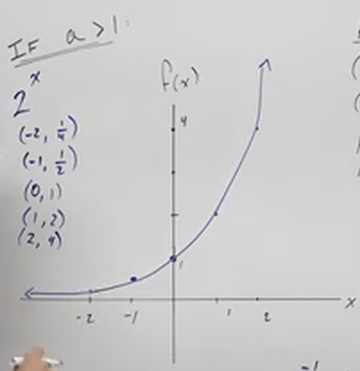
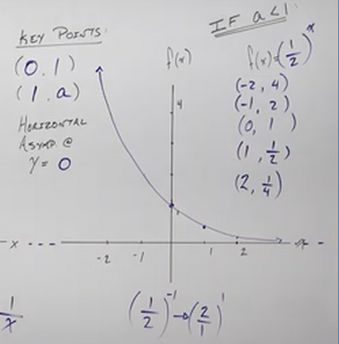

# Graphs of Exponential Functions (Precalculus - College Algebra 52)

[Video](https://www.youtube.com/watch?v=2w14jBb0e9Q)

---

We are now going to go a bit in depth on Exponential Functions. Even if you
covered Exponentials before, we are going to having a more in-depth lecture here
about what Exponential Functions are, why they look the way they do when
graphed, which will lead us into Logarithms.

---

**What Is An Exponential?**

An Exponential Function is different than a Polynomial Function in that a
Polynomial takes a variable and raises it to a _constant_ exponent. It contains
multiple different terms that exhibit this trait and then it is simplified or
added up in some way.

An exponential switches up this concept in that it takes a constant as it's
_base_ (that's not $1$ or $0$), and raises it to an variable exponent.

This can be demonstrated by the following statement:

$$ f(x) = a^x $$

In the above expression, $x$ is the variable exponent, $a$ is the _base_. Note
that $a > 0$ is a retriction for Exponential Function, the _base must be
positive!_ This is because allowing for negative numbers would create a very
disjointed and difficult to interpret graph that it is assumed at the time of
this writing has few practical applications.

Another constraint is that $a \neq 1$. The reason that $a$ cannot equal $1$ is
because this creates a constant, $1$ to any power is $1$. This leads into a
general finding about graphing Exponentials, is that the more and more that $a$
becomes greater than $1$, we will get a more and more dramatically increasing
graph. The smaller $a$ as it becomes less than $1$ (but not $0$ and definitely
not negative), the more and more dramatically we will have a decreasing graph.

---

Let's take a simple example:

$$ f(x) = 2^x $$

Let's consider some base cases.

$$
\begin{align*}
2^1 = 2 \\
2^2 = 4 \\
2^3 = 8 \\
2^4 = 16 \\
\end{align*}
$$

Notice that as long as $a$ is greater than $1$, then the output of our function
will continue to grow.

Now consider a number where $a$ is less than $1$:

$$ f(x) = \left(\frac{1}{2}\right)^x $$

And consider some base cases:

$$
\begin{align*}
\left(\frac{1}{2}\right)^1 = \frac{1}{2} \\
\left(\frac{1}{2}\right)^2 = \frac{1}{4} \\
\left(\frac{1}{2}\right)^3 = \frac{1}{8} \\
\left(\frac{1}{2}\right)^4 = \frac{1}{16} \\
\end{align*}
$$

Notice that as $x$ gets larger, the output, $f(x)$, gets smaller.

Recall also that any base raised to a negative exponent creates fractions. And
thusly whenever you see a negative exponent, you should be thinking "decreasing
graph".

$$ x^{-1} = \frac{1}{x} $$

Now, let's actually consider some points from our initial example of $f(x) =
2^x$:

$$
\begin{align*}
\left(-2, \frac{1}{4}\right) \\
\left(-1, \frac{1}{2}\right) \\
(0, 1) \\
(1, 2) \\
(2, 4) \\
\end{align*}
$$

Now, as you continue this train of thought, you may have noticed that you can
neer get a negative number from exponential functions, you can never have $0$.
There is no number within the restrictions already in place for our _base_ $a$,
where it will ever equal $0$ or a negative number. Thusly we have a _Horizontal
Asymptote_ at $f(x) = 0$.

Now, let's do the same for our other example
$f(x) = \left(\dfrac{1}{2}\right)^x$:

$$
\begin{align*}
(0, 1) \\
\left(1, \frac{1}{2}\right) \\
\end{align*}
$$

Before we move on, these two points above are crucial to understanding
Exponentials. As long as you don't have any shifts or transformations,
Exponentials will always yield two points: $(0, 1)$, and $(1, a)$. This is
because exponentials always return $1$ when raised to the $0$ power, and always
return back the _base_ when raised to the $1$ power.

$$
\begin{align*}
(-2, 4) \\
(-1, 2) \\
(0, 1) \\
\left(1, \frac{1}{2}\right) \\
\left(2, \frac{1}{4}\right) \\
\left(3, \frac{1}{8}\right) \\
\end{align*}
$$

Notice as our input increases, our output gets smaller. This is very similar to
our previous example, we have a _Horizontal Asymptote_ at $f(x) = 0$, it's just
the direction of our graph is reverse of the previous example.

Also notice that for our negative exponents, $-1$, and $-2$, there's a nice
property of negative exponents with fractions as their base, in that we can
simply take the reciprocal of the fraction, raise it to the positive power of
the exponent, and change the sign to get our answer:

$$ \left(\frac{1}{2}\right)^{-2} = \left(\frac{2}{1}\right)^2 = 4 $$

---

**Domain And Range**

A brief note on the Domain and Range of Exponentials. The Domain of Exponential
Functions is _All Real Numbers_, while the Range is _All Positive Real Numbers_.

So this could be written as:

$$ \text{Domain Of Exponential Functions : } \left\{x | \text{All Real Numbers} \right\} $$

$$ \text{Range Of Exponential Functions : } \left\{x | x > 0 \right\} $$

---

**Euler's Number**

[Euler's Number](https://en.wikipedia.org/w/index.php?title=E_(mathematical_constant))
(pronounced "Oiler's Number"), also known as the "Natural Number", is a
mathematical constant around $2.7$. It is a transcendental number in that it's
decimal place goes on forever and doesn't repeat (akin to $\pi$). This number
occurs very often in nature and in mathematics. It is denoted by the letter
$\mathbf{e}$.

$$ f(x) = \mathbf{e}^x $$

$$ \mathbf{e} \approx 2.7 $$

Now, because $\mathbf{e}$ is greater than $1$, it will look very similar to our
first graph.

---

**Inverse, One To One, And Logarithms**

Leading into the next section, let's first ask the question "Are Exponential
Functions also One To One Functions?" The answer is yes they are, we can
determine this simply by using the Horizontal Line Test, in which we draw
horizontal lines across our graph and determine if there are any repeated
outputs. In this case, no there are not, and therefore this is indeed a _One To
One_ Function.

Recall from the previous section that if a Function is _One To One_, this means
there exists also an _Inverse Function_ for that Function.

We will find in an upcoming lecture that Exponential Functions indeed have
Inverses, and we can find them using Logarithms.
