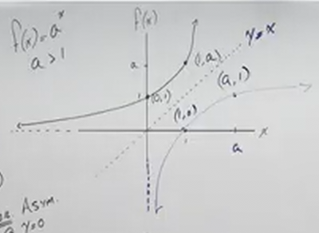

# Introduction to Logarithms and Their Graphs (Precalculus - College Algebra 55)

[Video](https://www.youtube.com/watch?v=jfnTwz79PWU)

---

We're going to finally introduce _Logarithms_. The following lectures will deal
extensively with _Logarithms_ and _Exponentials_, which are inexorably linked
together as they are _Inverses_ of each other.

One cannot understand _Logarithms_ without understanding _Exponentials_, which
we've covered rather extensively throughout Algebra and within this Precalculus
series. Let's review, however, to ensure that we have a good understanding of
_Exponentials_.

---

**A Brief Review Of Features Of Exponential Functions**

Before we shift around or transform _Exponential Functions_, we notice some very
important features. consider the following:

$$ f(x) = a^x, a > 1 $$

If $a$ is greater than $1$, then we will always have an ascending graph where
the output is always positive and never $0$. This output creates a _Horizontal
Asymptote_ at $f(x) = 0$, and no matter how small $x$ is as the input, the
output will never reach $0$, it will just get exponentially smaller.

Conversely, if $a < 1$ (but not $0$ or $1$):

$$ f(x) = a^x, a < 1 $$

Then this will produce a graph that descends towards $x = 0$, without ever
hitting it (again, a _Horizontal Asymptote_ exists at $x = 0$).

Other features of _Exponential Functions_ is that if you input $0$, you will
always get $1$, as any number to the power of $0$ is $1$. Additionally, if you
input $1$, you will always get back the base $a$. This occurs regardless of the
value of $a$ (again, $a$ can never be $0$ or $1$).

---

**Graphing when $a > 1$**

Now, in the previous sections on _Exponential Functions_, we did briefly address
that all _Exponential Functions_ are also _One To One_ Functions in that every
input has one _unique_ output. We also know from our section on _One To One_
Function that every _One To One_ Function has an _Inverse_. This means that all
_Exponential Functions_ also have a corresponding _Inverse Function_.

Now, we know that given a few points, we can find the inverse points that exist
within the _Inverse Function_'s graph by simply switching the $x$ and $y$
values. So, if we know that on every _Exponential Function_, which MUST have an
_Inverse_, that they have the points $(0, 1)$ and also $(1, a)$, this means that
the _Inverse Function_ must have the points $(1, 0)$ and also $(a, 1)$.

We also know that if an _Exponential Function_ has a _Horizontal Asymptote_
along the $x = 0$ axis, then it's _Inverse Function_ must have a _Vertical
Asymptote_ along the $f(x) = 0$ axis.

---

**Graphing when $a < 1$**

Now, the graph for this _Exponential Function_ _will look different_. This is
because even though the logic is the same, the fact that our output gets smaller
as $x$ increases, because $a$ is less than $1$, and we are switching them, this
means taht as $x$ increase on the _Inverse_, the output will get exponentially
more negative.

The logic is the same as before, $(0, 1)$ becomes $(1, 0)$, while $(1, a)$
becomes $(a, 1)$, and also our _Horizontal Asymptote_ at $x = 0$, becomes a
_Vertical Asymptote_ at $f(x) = 0$. But notice the different shape of our final
graph:

The reflection still occurs, but because $a < 1$, $a$ now becomes our output.
Recall that in this scenario, our Domain is All Real Numbers for the
_Exponential Function_ and our Range is All Positive Numbers. These _switch_ for
the _Inverse_! The Domain for the _Inverse_ is All Positive Numbers, and the
Range for the _Inverse_ is All Real Numbers.

---

**Finding the Inverse of Exponential Functions**

Now, we have covered Inverses a while back. Recall how we solve for Inverses:

- replace the $f(x)$ with $y$

- switch $y$ and $x$

- solve for $y$

Thusly if we have a basic **Exponential**:

$$ f(x) = a^x $$

We can (mostly) find the inverse like so:

$$ f(x) = a^x $$

$$ y = a^x $$

$$ x = a^y $$

But how do we solve for $y$? This is where _Logarithms_ come into play.

If an _Exponential_ puts together a _base_ an an _exponent_, then a _Logarithm_
separates the _base_ from the _exponent_. This can be expressed using
_Logarithic Notation_:

$$ y = \log_{a}x $$

$$ f^{-1}(x) = \log_{a}x $$

---

**Features Of Basic Logarithms**

Much like how _Exponentials_ have some key features, so do their counterpart,
_Logarithms_. Essentially they are the _Inverse_ of _Exponentials_. Let's
explore some of them now:

$$ \text{Domain Of Logarithmic Functions : } \left\{x | x > 0 \right\} $$

$$ \text{Range Of Logarithmic Functions : } \left\{x | \text{All Real Numbers} \right\} $$

And Key Points are also _Inverse_ of _Exponentials_:

$$ (1, 0) $$

$$ (a, 1) $$

There will also be a _Vertical Asymptote_ at $x = 0$.

---

**The Algebra Of Logarithms**

We will now need to review how _Logarithms_ work with some basic examples before
moving forward to ensure we have a good understanding of them. We'll go through
some basic examples/exercises.

_Logarithms_ _always_ separate the _base_ from the _exponent_.

---

**Exponential Notation To Logarithmic Notation**

The following are examples of Exponential Notation:

$$
\begin{align*}
9 = 3^2 \\
a^3 = 2.1 \\
2^x = 7.2 \\
10^x = 2.3 \\
\mathbf{e}^x = 8 \\
\end{align*}
$$

We can rewrite these as _Logarithms_ like so:

$$
\begin{align*}
9 = 3^2 \rightarrow \log_{3}9 = 2 \\
a^3 = 2.1 \rightarrow \log_{a}{2.1} = 3 \\
2^x = 7.2 \rightarrow \log_{2}{7.2} = x \\
10^x = 2.3 \rightarrow \log_{10}{2.3} = x \\
\mathbf{e}^x = 8 \rightarrow \ln{8} = x \\
\end{align*}
$$

When verbalizing _Logarithms_, we want to phrase them as "log base base of
argument equals exponent"

Notice where we have the $= x$ at the end of our equations above, that we are
_solving_ for $x$, we are undoing an exponent to find the value of $x$.

The $\log_{10}{2.3} = x$ statement is an example of a _Common Log_. This is
because _base_ $10$ is a very very common _Logarithm_ operation to perform.
Calculators don't even bother to have you input the base for this, often you can
hit a common "log" button to do this for you, and the default operation will be
to have the base be $10$.

Notice the difference for $\mathbf{e}^x = 8 \rightarrow \ln{8} = x$. This is the
same as $\log_{e}{8} = x$. This is known as the _Natural Log_. This is because
it is the _Logarithm_ of Euler's Number (also known as the Natural Number). This
is another very common constant and that is why we have our own notation for it
$\ln$.

---

**Logarithmic Notation To Exponential Notation**

Let's now go back to Exponential Notation. We will now put together exponents
from logarithms.

---

$$ \log_{3}{\left(\frac{1}{9}\right)} = -2 $$

$$ 3^{-2} = \frac{1}{9} $$

---

$$ \log_{b}{4} = 2 $$

$$ b^2 = 4 $$

And we could even solve this:

$$ \sqrt{b^2} = \pm \sqrt{4} $$

$$ b = \pm 2 $$

But be careful here, Logarithms _must be positive_. This is because the _base_
of an _Exponential_ _must be positive_!

Thusly our answer becomes:

$$ b = 2 $$

---

$$ \log_{2}{6} = x $$

$$ 2^x = 6 $$

---

$$ \ln{4} = x $$

$$ \mathbf{e}^x = 4 $$

---

$$ \log{x} = 3 $$

$$ 10^3 = x $$

---

**Solving Logarithms With Exponentials**

Let's practice a bit here by determining what some _Logarithms_ equal. Let's say
we are just given these statements and are asked to simply say what they are
equal to:

$$ \log_{5}25 = \text{ ?} $$

What is $?$, well, $5^2 = 25$, so thusly:

$$ \log_{5}{25} = 2 $$

---

Let's continue, how about this one:

$$ \log_{\frac{1}{3}}{9} = \text{ ?} $$

This one is a little trickier, but recall our work with _Common Bases_ from a
section ago, whenever we see a fraction, we can write it as a negative exponent
to figure it out:

$$ \left(3^{-1}\right)^{\text{?}} = 3^2 $$

$$ 3^{(-x)} = 3^2 $$

$$ -x = 2 $$

$$ x = -2 $$

And therefore:

$$ \log_{\frac{1}{3}}{9} = -2 $$

---

$$ \log{\sqrt{10}} = \text{ ?} $$

Now, this is a _Common Log_, so our _base_ is $10$. This can be rewritten then
as:

$$ 10^{?} = \sqrt{10} $$

Recall that when we have a fraction as an exponent, this is the same as having a
radical. Thusly:

$$ 10^{\frac{1}{2}} = \sqrt{10} $$

And therefore:

$$ \log{\sqrt{10}} = \frac{1}{2} $$

---

$$ \log_{5}{\sqrt[3]{25}} = \text{ ?} $$

$$ 5^{?} = \sqrt[3]{25} $$

But recall from the previous example that we can express radicals as
exponentials with fractions as the exponent:

$$ 5^{?} = (25)^{\frac{1}{3}} $$

And then we can further extrapolate to a common base of $5$:

$$ 5^{?} = (5^2)^{\frac{1}{3}} $$

And we can multiply exponents:

$$ 5^{?} = 5^{\frac{2}{3}} $$

And now we can see that $?$ is $\dfrac{2}{3}$. So therefore:

$$ \log_{5}{\sqrt[3]{25}} = \frac{2}{3} $$

---

$$ \log_{\sqrt{3}}{9} = \text{ ?} $$

$$ \sqrt{3}^{?} = 9 $$

This is somewhat convoluted, but if you think about it $3^2$ is $9$, and
$\sqrt{3}^2 = 3$. Therefore, if we think about this logically
$\left(\sqrt{3}^2\right)^2 = 9$, which becomes $\left(\sqrt{3}\right)^4 = 9$.
And that is our answer:

$$ \log_{\sqrt{3}}{9} = 4 $$

---

$$ \ln{\mathbf{e}^3} = \text{ ?} $$

This is an example of how composition of functions cancel out on inverses. If we
think about this is asking:

$$ e^{?} = e^3 $$

Quite simple actually, the bases are the same, there for $?$ is $3$, and that is
our answer:

$$ \ln{\mathbf{e}^3} = 3 $$

In a way, this is a trivial example, but it's important to understand that
whenever you have a base that is the same of the base of the argument, you will
get the exponent of the argument.

---

$$ \log_{2}{1} = \text{ ?} $$

$$ 2^{?} = 1 $$

$$ 2^0 = 1 $$

$$ \log_{2}{1} = 0 $$

Notice here that whenever we have $1$ as our _argument_ to any logarithm, then
our answer is always $0$. This is the same as "Any exponent to the power of $0$
is always $1$".

---

**Domain of Logarithms**

We have learned that the Domain of a Logarithhm Must always be positive:

$$ \text{Argument Of Logarithm} > 0 $$

Let's look at an example:

$$ f(x) = \ln{(x - 3)} $$

This means that the argument to our logarithm _MUST_ be greater than $0$:

$$ x - 3 > 0 $$

$$ x > 3 $$

Any numbers that we input for $x$ will give us an undefined value if they
violate this rule for logarithms. This is our Domain for this function:

$$ \text{Domain for } f(x) \text{ : } \left\{x | x > 3 \right\} $$

---

$$ g(x) = 3 - 2\log_{4}{\left(5 - \frac{x}{2}\right)} $$

There is a lot going on here, we have two shifts (one along the $y$-axis and one
along the $x$-axis) as well as a reflection. We'll be covering this in future
sections, but for now, let's focus on finding the _Domain_ of this function.

This is all we have to know here, the argument must be positive:

$$ 5 - \frac{x}{2} > 0 $$

Do _not_ set this simply equal to $0$. As you can see, in order to solve for
$x$, we will have to multiply by a _negative_ number. This will _change the
direction_ of our inequality, and we must include this step in order to find the
proper domain. Let's now solve:

$$ 5 - \frac{x}{2} > 0 $$

$$ -\frac{x}{2} > -5 $$

$$ x < 10 $$

Again, notice that when we multiplied by $-2$ on each side that we _changed the
direction of our inequality operator_. And that solves for our _Domain_:

$$ \text{Domain for } g(x) \text{ : } \left\{x | x < 10 \right\} $$

---

$$ h(x) = \log_{5}{\left(\frac{x + 1}{x}\right)} $$

Again, we're just trying to find the _Domain_. The argument to any logarithm
must be greater than $0$, but also notice that we have a denominator with a
variable in it, that means that $x$ must also not be $0$...but if the domain
must be greater than $0$, then that will always be the case, so to declare that
as part of the domain would be redundant...right?

Let's take this one step at a time a find out.

$$ \frac{x + 1}{x} > 0 $$

This goes all the way back to
[Rational Inequalities](https://www.youtube.com/watch?v=QSh1xcbYKZk). At $x \neq
0$, this indicates we have a _Vertical Asymptote_ at $x = 0$. This is indicated
by the undefined value we get if we have a divisor by $0$, and that $x^1$ is an
_odd_ power.

$$ x + 1 = 0 $$

$$ x = -1 $$

We have a _Cross_ at this $x$-intercept as the power is _odd_.

When evaluated on a number line as we did in that previous section, we find out
the intervals at which our domain exists:

If we evaluate $x = 1$, we discover that $2 > 0$ is a true statement, and so we
know that the interval of $(0, \infty)$ holds true for being within the Domain
of our function $h(x)$. We know that for a _Vertical Asymptote_ at an _odd_
multiplicity, that this means that the next interval will hold the opposite
condition (_i.e._ False), and at a _Cross_, it will again, hold the opposite
condition of the previous interval (_i.e._ True).

Thusly our Domain can be expressed in interval notation as:

$$ \text{Domain for } h(x) \text{ : } (-\infty, -1) \cup (0, \infty) $$
