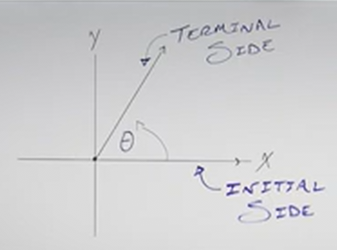
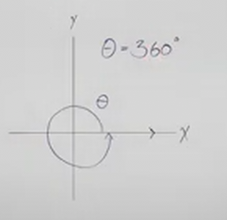
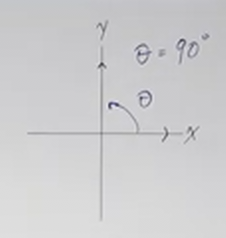
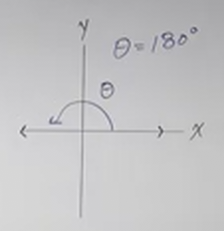
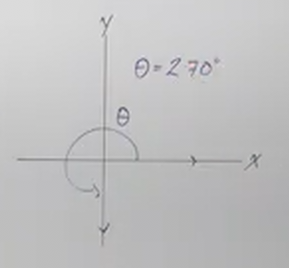
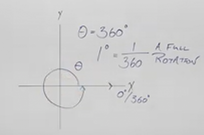
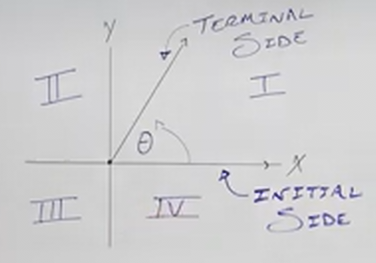
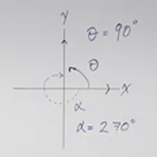

# Introduction to Angles (Precalculus - Trigonometry 1)

[Video](https://www.youtube.com/watch?v=c41QejoWnb4)

---

When you get to Calculus, you're going to find that your troubles either stem
from a lack of understanding of either Algebra or Trigonometry. In this lecture
series, we have covered Algebra in depth. Now it is time to tackle the other
subject at length. The rest of this lecture series will delve deep into
Trigonometry, which has a multitude of uses within Mathematics, Engineering,
Physics, and a Multitude of fields.

We'll start at the very beginning, with _Angles_.

---

## Angles

If you take two _Rays_ (a _Ray_ is a _Line_ that starts at one point, an
_Origin_, and goes in _One_ direction), and they both have a starting point, the
same _Origin_, they are going to have an _Angle_ between them.

So when we put an _Angle_ on what is called _Standard Position_. This Angle has
one _Ray_ that lies on the $xy$-axis with the _Origin_ representing that
_Vertex_ of an _Angle and an _Initial Side_ on the $x$-axis, and the _Terminal
Side_ measured _Counter-Clockwise_ positively. The distance between these two
_Sides_ is the _Angle_, usually represented by the Greek Characters, Alpha,
Beta, and Theta: ($\alpha$, $\beta$, $\theta$).

Note that this distance is always measured positively, going in the direction
_Counter-Clockwise_, and measured negatively if going in the direction
_Clockwise_. This is known as _Positive Measurement_ or _Negative Measurement_
respectively.

---

Our _Initial Side_ always starts on the $x$-axis. Now, consider that we make one
full rotation around our entire graph and our _Terminal Side_ ends up exactly at
the same position as our _Initial Side_, this is what is known as a "360 Degree
Angle": $360\degree \text{ Angle}$. We could represent this as "Theta equals 360
degrees:

$$ \theta = 360\degree $$

This means that $1\degree$ is equal to $\dfrac{1}{360}$th of a
rotation:

$$ 1\degree = \frac{1}{360} \text{ A Full Rotation} $$

---

Let's say that we have two _Rays_, our _Initial Side_ is at the standard
starting position of the $x$-axis, and our _Terminal Side_ has rotated through
the $1$st quadrant of our graph to sit on the positive $y$-axis.
Measuring this would be $\dfrac{1}{4}$th of a full rotation, or
$\dfrac{1}{4}$th of $360\degree$. This mean:

$$ \theta = 90\degree $$

---

Similarly, if we then travel through the $2$nd quadrant and end up
back on the negative $x$-axis, we would have gone another quarter, which would
be $\dfrac{1}{2}$ of a full rotation. This means:

$$ \theta = 180\degree $$

---

And of course, if we continue on through our rotation and end on the negative
$y$-axis, we would have gone through the $3$rd quadrant and ended up
at $\dfrac{3}{4}$th of a full rotation. And this means:

$$ \theta = 270\degree $$

---

All of these are what are known as _Quadrant Angles_, in which the angle lies at
one of the major quadrant markers (_i.e._ Positive or negative $xy$-axis).

If we didn't sweep out any angle from the _Initial Side_, and our _Terminal
Side_ was our _Initial Side_, and we didn't go out a full $360\degree$, then
this means our angle is $0\degree$.

$$ \theta = 0\degree $$

Obviously, with out some form of demarcation, it might be difficult to read a
graph that is either $0\degree$ or $360\degree$. Thusly on the $x$-axis, it is
usually denoted with $0\degree/360\degree$.

---

## Quadrants

It is useful when talking about _Angles_ that we know which region of the graph
an Angle lies in, as usually an Angle doesn't lie nicely on either the
$x/y$-axis.

Typically notated with Roman Numerals, The Quadrants of a Graph are denoted like
so:

---

## Negative Angles

There isn't much complexity to Angles, but they must be measured accurately. For
example if you sweep the angle out in the opposite direction as the previous
examples, and sweep it out in a _Clockwise_ direction, then the angle is
measured _Negatively_.

So if we were to, for example sweep out $-260\degree$, we could represent this
as a second angle $\alpha$:

$$ \alpha = -270\degree $$
