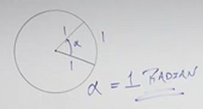
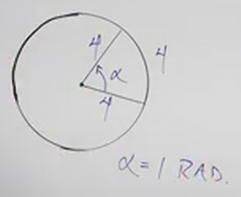

# Introduction to Radians (Precalculus - Trigonometry 3)

[Video](https://www.youtube.com/watch?v=EWd_FtOfyPc)

---

_Radians_ can be thought of as another way of measuring an Angle, but is
generally utilized when denoting Angles as they relate to _Circles_.

Specificially, a _Radian_ is the Central Angle needed on _any_ Circle to Make
the _Arc_ subtended (cut) equal to the _Radius_.

The essential idea is to take a circle, and cut a section out of it that where
both lengths of the _Initial Side_ and _Terminal Side_ are equal to the
_Radius_. The Angle of those two sides is measured in _Radians_.

---

## Unit Circle

A Unit Circle is simply a circle with a Radius of $1$ unit (the unit of
measurement doesn't matter).

The _Arc Length_ is the measurement of the Circumference that exists between the
two Sides, in other words, the Circumference that exists within the two Radii,
within the Angle is the _Arc Length_.

Now, if the two Radii of our Angle are equal, and the Arc Length is also equal
to the measurement of either of those radii (all three have equal lengths), then
the angle of that angle is exactly $1 \text{ radian}$.

We can enote this angle as $\alpha$, and it would be $1 \text{radian}$.

Note that the length of the Radii and the length of the Arc Length don't matter,
as long as they are _all equal_:

---

Now, let's say that we don't know the length of the Radii, and we represented it
as variable $r$. And let's say we had an angle $\alpha$, and we knew that the
_Arc Length_ of angle $\alpha$ was also $r$. This means that $\alpha = 1
\text{ radians}$.

Now let's assume we had another angle within that same circle called $\theta$.
We know the two radians would both still have to have the length $r$, but let's
say that we don't know the Arc Length of the Angle created by $\theta$. Let's
call the Arc Length of $\theta$ the variable, $s$.

How would we determine the Arc Length $s$?

In order to do this, we have to have some knowledge about how the proportions of
these angles work. Consider the following:

$$ \frac{r}{\alpha} = \frac{s}{\theta} $$

Where the Arc Length of $\alpha$, $r$, divided by the angle $\alpha$ has the
_same proportion_ as the Arc Length of $\theta$, $s$, divided by the angle
$\theta$.

If we rewrite this to include the measurement of radians we get:

$$ \frac{r}{1 \text{ radian}} = \frac{s}{\theta} $$

Which we then can simplify to:

$$ s = \frac{r \cdot \theta \text{ radians}}{1 \text{ radian}} $$

Please note that this setting of relations only works for radians due to the way
the relationship between the unit measurement of radians and Arc Length. It
doesn't mean something similar cannot be done with degrees, but we would need to
establish a specific relationship to the Arc Length in order to do so.

In fact, in order to simplify, the measurements of both $\alpha$ and $\theta$
have to be in _Radians_. That's the only way you can cancel out the denominator
from the above example to get:

$$ s = r \cdot \theta $$

---

Consider we have a Circle with the following Arc Length dimension and the
following angle measurement:

$$ r = 6 \text{ ft} \text{ , } \theta = \frac{1}{3} \text{ radians} $$

We can use the formula we established earlier to find the value of another angle
$s$:

$$ s = r \cdot \theta $$

$$ s = 6 \text{ ft} \cdot \frac{1}{3} \text{ radians}  $$

This would appear to have two combined units of measurement, but recall that all
of this is over $1 \text{ radians}$, and when dividing, we would cancel out
those similar units of measurements, thusly, when we calculate our answer, we
would leave the units of length (ft), to express the answer:

$$ s = 2 \text{ ft} $$

---

Now what if we were given two Arc Lengths?:

$$ r = 12 \text{m} \text{ , } s = 16\text{m} $$

In this situation, we can find the angle $\theta$ with the same formula:

$$ s = r \cdot \theta $$

$$ 16 \text{m} = 12 \text{m} \cdot \theta $$

$$ \frac{16}{12} \text{ radians} = \theta $$

$$ \theta = \frac{4}{3} \text{ radians} $$
