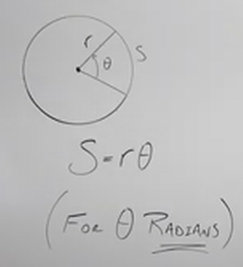
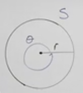
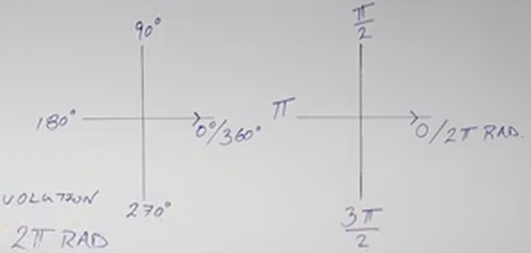

# Converting Radians and Degrees (Precalculus - Trigonometry 4)

[Video](https://www.youtube.com/watch?v=sCwcbZSZL5o)

---

Both Radians and Degrees are used in a Multitude of Applications, where in
Mathematics we tend to use Radians, and in the Real World, we tend to use
Degrees. Thusly, it is important that we understand how to convert these two
units of measurements for Angles to and from each other.

Oftentimes when students start to see common measurements in Radians, they often
see that special number $\pi$. In this section, we'll learn exactly why that is.

In the previous lecture, we learned that we can utilize a formula specificall
for Radians (and _only_ Radians) to determine the Arc Length ($s$) of Any Angle
($\theta$) or Any Angle ($\theta$) of a Given Arc Length ($\theta$) as long as
we had the radius measurement ($r$):

$$ s = r \cdot \theta $$

---

Now, consider if we wanted to measure the full circle's angle in radians? A full
sweep? In degrees this would be $360\degree$, but how would these express this
in _Radians_?

Now, we do know that the circumference of any circle can be expressed like so:

$$ C = 2\pi r $$

We also know our previous formula for determining the radians/arclength of any
angle:

$$ s = r \cdot \theta $$

But if we inspect the above diagram, we'll see that the _Arc Length_ $s$ is our
circumference in this particular example. Thusly we can rewrite our formula as:

$$ 2\pi r = r \cdot \theta $$

The measurement of the radius can be canceled out. and thusly the radians of
$\theta$ is equal to $2\pi$ radians.

$$ \theta = 2\pi \text{ radians} $$

---

## Revolutions, Degrees, Radians

We know that:

$$ 1 \text{ Revolution} = 2\pi \text{ radians} $$

And:

$$ 1 \text{ Revolution} = 360\degree $$

Therefore:

$$ 2\pi \text{ radians} = 360\degree $$

This gives us a relationship between these two units of measuring angles, and we
can use this relationship to convert between the two.

To do this, we'll need to simplify our expression so that we know exactly how
many radians equals $1\degree$:

$$ 2\pi \text{ radians} = 360\degree $$

$$ \frac{2\pi \text{ radians}}{360} = 1\degree $$

$$ \frac{\pi}{180} \text{ radians} = 1\degree $$

It would also be useful to know exactly how many degrees equals
$1 \text{ radian}$:

$$ 2\pi \text{ radians} = 360\degree $$

$$ 1 \text{ radian} = \frac{360}{2\pi}\degree $$

$$ 1 \text{ radian} = \frac{180}{\pi}\degree $$

---

## Visualizing Degrees/Radians On A Graph

You'll come to memorize these angles, and they make sense given what we have
covered in the previous sections of this lecture.

---

**Examples**

Let's first go from degrees to radians:

Recall that:

$$ 1\degree = \frac{\pi}{180}\text{ radians} $$

So now let's do some conversions:

---

$$ 60\degree =  60 \cdot 1\degree = 60 \cdot \frac{\pi}{180} \text{ radians} =
\frac{60\pi}{180} \text{ radians} = \frac{\pi}{3} \text{ radians} $$

$$ \boxed{60\degree = \frac{\pi}{3} \text{ radians}} $$

---

$$ 150\degree $$

$$ 150\degree = 150 \cdot 1\degree = 150 \cdot \frac{\pi}{180} \text{ radians} = \frac{150\pi}{180} \text{ radians} = \frac{5\pi}{6} \text{ radians} $$

$$ \boxed{150\degree = \frac{5\pi}{6} \text{ radians}} $$

---

$$ -45\degree $$

$$ -45\degree = -45 \cdot 1\degree = -45 \cdot \frac{\pi}{180} \text{ radians} = \frac{-45\pi}{180} \text{ radians} = -\frac{\pi}{4} \text{ radians} $$

$$ \boxed{-45\degree = -\frac{\pi}{4} \text{ radians}} $$

---

$$ 107\degree $$

$$ 107\degree = 107 \cdot 1\degree = 107 \cdot \frac{\pi}{180} \text{ radians} = \frac{107\pi}{180} \text{ radians} $$

There is no way to simplify this further. In the case that it doesn't, and you
need to express in radians, it is appropriate to use decimal notation:

$$ 107\degree \approx 1.868 \text{ radians} $$

---

Let's now convert from radians to degrees. Recall that:

$$ 1 \text{ radian} = \frac{180}{\pi}\degree $$

---

$$ \frac{\pi}{6} \text{ radians} $$

$$ \frac{\pi}{6} \text{ radians} = \frac{\pi}{6} \cdot \frac{180}{\pi}\degree =
\frac{180}{6}\degree = 30\degree $$

$$ \boxed{\frac{\pi}{6} \text{ radians} = 30\degree} $$

---

$$ \frac{3\pi}{2} \text{ radians} $$

$$ \frac{3\pi}{2} \text{ radians} = \frac{3\pi}{2} \cdot \frac{180}{\pi}\degree
= \frac{540}{2}\degree = 270\degree $$

$$ \boxed{\frac{3\pi}{2} \text{ radians} = 270\degree} $$

---

$$ -\frac{3\pi}{4} \text{ radians} $$

$$ -\frac{3\pi}{4} \text{ radians} = -\frac{3\pi}{4} \cdot \frac{180}{\pi}\degree = -\frac{540}{4}\degree = -135\degree  $$

$$ \boxed{-\frac{3\pi}{4} \text{ radians} = -135\degree} $$

---

$$ \frac{7\pi}{3} \text{ radians} $$

$$ \frac{7\pi}{3} \text{ radians} = \frac{7\pi}{3} \cdot \frac{180}{\pi}\degree = \frac{1260}{3}\degree = 420\degree $$

$$ \boxed{\frac{7\pi}{3} \text{ radians} = 420\degree} $$

---

$$ 4 \text{ radians} $$

$$ 4 \text{ radians} = 4 \cdot \frac{180}{\pi}\degree = \frac{720}{\pi}\degree $$

$$ \boxed{4 \text{ radians} \approx 229.18\degree} $$
