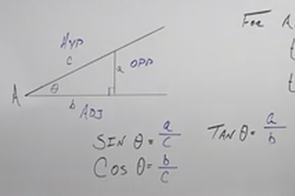
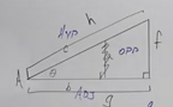
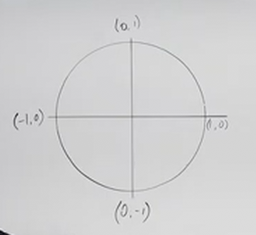
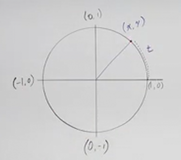
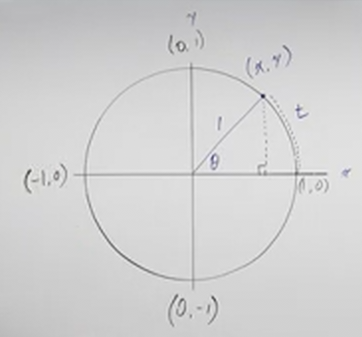

# Trigonometric Functions and the Unit Circle (Precalculus - Trigonometry 6)

[Video](https://www.youtube.com/watch?v=__nefjOhVks)

---

Trigonometric Functions are functions that that relate an angle to two sides of
a right triangle. They are often also utilized within the context of what is
known as a _Unit Circle_, which we will cover here and at length in many of the
lectures going forward.

---

Essentially, if we can define how an angle relates to two sides on a _Right
Triangle_, then that angle will _not_ change if we make that triangle larger.
These are what known as _Similar Triangles_, in which the angles remain the
same, but the lengths of their sides are different. It is this ratio between
angles and sides that remains unchanged, and this relationship is expressed by
_Trigonometric Functions_.

Consider the following image:

Note that when we talk about "sine", "cosine", and "tangent", on their own, we
are not referring to any particular values. Instead, we are referring to to a
specific angle's relationship to it's sides.

In regards to a _Right Triangle_, we can define our three sides as they relate
to our angle, $\theta$ as:

$$
\begin{align*}
a = \text{side opposite } \theta \\
b = \text{side adjacent } \theta \\
c = \text{hypotenuse} \\
\end{align*}
$$

Then we can start to define $\sin\theta$, $\cos\theta$, and $\tan\theta$:

$$
\begin{align*}
\sin\theta = \frac{a}{c} \\
\cos\theta = \frac{b}{c} \\
\tan\theta = \frac{a}{b} \\
\end{align*}
$$

So, to be verbose about it:

$$ \sin\theta = \frac{\text{side opposite } \theta}{\text{hypotenuse}} $$

$$ \cos\theta = \frac{\text{side adjacent } \theta}{\text{hypotenuse}} $$

$$ \tan\theta = \frac{\text{side opposite } \theta}{\text{side adjacent } \theta} $$

Special consideration should be given to $\tan\theta$ here, as when we get to
expressing these _Trigonometric Functions_ on a _Unit Circle_, it will be
helpful to consider tangent to also be:

$$ \tan\theta = \frac{\sin\theta}{\cos\theta} $$

This ends up being the same expression if you simplify. Consider:

$$ \tan\theta = \frac{\left(\dfrac{a}{c}\right)}{\left(\dfrac{b}{c}\right)} = \frac{\left(\dfrac{a}{\cancel{c}}\right)}{\left(\dfrac{b}{\cancel{c}}\right)} = \frac{a}{b} $$

---

Students often think of these _Trigonometric Functions_ as some kind of magic.
It's not. Each of these functions simply output a relationship of sides of a
Right Triangle, and when applied to the context of a Unit Circle, can provide us
with some useful data.

What if we were to expand out our right triangle from the previous example?:

While the length of the sides has increased, the angles all stay the same, and
thusly the measurement of the angle remains the same despite the increases in
length. These _relationships_ between the sides of our triangle _are_ the
outputs of our _Trigonometric Functions_.

---

## The Unit Circle

Before moving on, simply consider this diagram:

Put extremely simply, a Unit Circle is simply a Circle with a radius of $1$. The
unit of the radius in the context of this demonstration doesn't matter.

The horizontal and vertical lines in the diagram above represent a classic Graph
$x$-axis and $y$-axis respectively.

If we take an _Arc Length_, represented by the variable $t$, this _Arc Length_
will follow the same rules for angles we have discussed in the previous few
lectures in that if $t$ is represented by positive degrees or radians, then that
means that angle will start from the $x$-axis and move _Counter Clockwise_ (into
the $1$st quadrant of our graph), and if $t$ is represented by
negative degrees or radians, thatn that means that angle will start from the
$x$-axis and move _Clockwise_ (into the $4$th quadrant of our graph).

$$
\begin{align*}
t > 0 \text{ : Arc Length moves Counter Clockwise} \\
t < 0 \text{ : Arc Length moves Clockwise} \\
\end{align*}
$$

If we draw out our _Arc Length_ $t$, on our diagram from above, we'll notice we
start getting points on our _Unit Circle_:

This will create a unique point, represented on the diagram as $(x, y)$.

This will also create a unique angle from the $x$-axis known as a _Central
Angle_. We can represent this as angle $\theta$.

---

Recall the formula for determining An _Arc Length_ $S$, based off the radius,
$r$, and angle of the _Arc Length_, $\theta$:

$$ S = r \cdot \theta $$

Also remember that $\theta$ _must_ be represented in _radians_, not degrees.

Since $S$ represents some Arc Length, it stands to reason that along the _Unit
Circle_, we can replace $S$ with the Arc Length, $t$:

$$ t = r \cdot \theta $$

But if this is a _Unit Circle_, our radius, $r$, is $1$, and thusly we can
rewrite this as:

Interestingly, this means, at least numerically:

$$ t = \theta $$

It is worth reiterating that this only works using _radians_.

This property of a Unit Circle allows us to define our _Trigonometric
Functions_.

This means that _Trigonometric Functions_ relate the _Arc Length_/_Central
Angle_ to the _Point_ $(x, y)$ on the _Unit Circle_.

Note that this also means that if the radius is not $1$ (_i.e._ our Circle is no
longer a Unit Circle), then our _Trigonometric Functions_ are no longer defined
using the _Arc Length_.

---

## Trigonometric Functions On The Unit Circle

Let's consider how we might fill these out:

**Sine:**

$$
\begin{align*}
\sin t = \\
\sin \theta = \\
\end{align*}
$$

**Cosecant:**

$$
\begin{align*}
\csc t = \\
\csc \theta = \\
\end{align*}
$$

**Cosine:**

$$
\begin{align*}
\cos t = \\
\cos \theta = \\
\end{align*}
$$

**Secant:**

$$
\begin{align*}
\sec t = \\
\sec \theta = \\
\end{align*}
$$

**Tangent:**

$$
\begin{align*}
\tan t = \\
\tan \theta = \\
\end{align*}
$$

**Cotangent:**

$$
\begin{align*}
\cot t = \\
\cot \theta = \\
\end{align*}
$$

Note that these are written in such an order as to hopefully indicate that the
reciprocal _Trigonometric Function_ is followed by the already covered
_Trigonometric Function_.

In other words:

$$
\begin{align*}
\sin \theta \text{ is the reciprocal of } \csc \theta \\
\cos \theta \text{ is the reciprocal of } \sec \theta \\
\tan \theta \text{ is the reciprocal of } \cot \theta \\
\end{align*}
$$

Also note that there is no difference between $\sin t$ and $\sin \theta$ (or any
other of the _Trigonometric Functions_) as long as they relate along the _Unit
Circle_ for the reasons we discussed earlier.

Let's now fill out what these relationships are as they relate to the point on
the _Unit Circle_:

**Sine:**

$$
\begin{align*}
\sin t = y \\
\sin \theta = y \\
\end{align*}
$$

Why would $\sin \theta = y$?

If you think back to our initial discussion of the _Right Triangle_ and how sine
is defined there, this would make sense. If we draw a _Right Triangle_ from the
$x$-axis up to our point defined by our angle $\theta$, we see that the side we
draw has a length equal to the $y$-coordinate of our point.

Also the $x$ of our point is defined by the length that is created by drawing
this _Right Triangle_. This gives us the length of our sides for our
_Trigonometric Functions_. Additionally, we already have our hypotenuse as well,
it's simply the radius of our _Unit Circle_, which is $1$.

If we recall our verbose definition of sine:

$$ \sin\theta = \frac{\text{side opposite } \theta}{\text{hypotenuse}} $$

Then we fill this in as:

$$ \sin\theta = \frac{y}{1} $$

Which of course just becomes:

$$ \sin\theta = y $$

And that explains how we defined the relationship of $sin\theta$ to the
$y$-coordinate of our point.

Similarly:

$$ \cos\theta = x $$

For very similar reasons. If we recall our verbose definition of cosine:

$$ \cos\theta = \frac{\text{side adjacent } \theta}{\text{hypotenuse}} $$

This becomes:

$$ \cos\theta = \frac{x}{1} $$

$$ \cos\theta = x $$

Finally, this also extends out to tangent as well:

$$ \tan\theta = \frac{\text{side opposite } \theta}{\text{side adjacent } \theta} $$

$$ \tan\theta = \frac{y}{x} $$

And recall also that this means:

$$ \tan\theta = \frac{\sin\theta}{\cos\theta} $$

---

## Reciprocal Trigonometric Functions

A basic understanding of Reciprocal Fractions gives us a quick definition of
what these Reciprocal functions are.

So if cosecant is the reciprocal of sine. then that means:

**Sine and Cosecant:**

$$
\begin{align*}
\sin\theta = y \\
\csc\theta = \frac{1}{y} \\
\end{align*}
$$

To be clear, in verbose terms this means:

$$
\begin{align*}
\sin\theta = \frac{\text{side opposite } \theta}{\text{hypotenuse}} \\
\csc\theta = \frac{\text{hypotenuse}}{\text{side opposite } \theta} \\
\end{align*}
$$

To flesh out our other _Reciprocal Trigonometric Functions_:

**Cosine and Secant:**

$$
\begin{align*}
\cos\theta = x \\
\sec\theta = \frac{1}{x} \\
\end{align*}
$$

$$
\begin{align*}
\cos\theta = \frac{\text{side adjacent } \theta}{\text{hypotenuse}} \\
\sec\theta = \frac{\text{hypotenuse}}{\text{side adjacent } \theta} \\
\end{align*}
$$

**Tangent and Cotangent:**

$$
\begin{align*}
\tan\theta = \frac{y}{x} \\
\cot\theta = \frac{x}{y} \\
\end{align*}
$$

And recall that tangent can be represented as a fraction of sine over cosine,
so, cotangent would just be the reciprocal of that fraction:

$$
\begin{align*}
\tan\theta = \frac{\sin\theta}{\cos\theta} \\
\cot\theta = \frac{\cos\theta}{\sin\theta} \\
\end{align*}
$$

---

## Quadrant Angles

We'll now provide a sort of reference sheet for representations of sine, cosine,
tangent, cosecant, secant, and cotangent of some very common angles in radians:

$\theta = 0$:

Point: $(1, 0)$

$$
\begin{align*}
\sin 0 = 0 \\
\cos 0 = 1 \\
\tan 0 = 0 \\
\csc 0 = \text{ undefined} \\
\sec 0 = 1 \\
\cot 0 = \text{ undefined} \\
\end{align*}
$$

$\theta = \dfrac{\pi}{2}$:

Point: $(0, 1)$

$$
\begin{align*}
\sin \frac{\pi}{2} = 1 \\
\cos \frac{\pi}{2} = 0 \\
\tan \frac{\pi}{2} = \text{ undefined} \\
\csc \frac{\pi}{2} = 1 \\
\sec \frac{\pi}{2} = \text{ undefined} \\
\cot \frac{\pi}{2} = 0 \\
\end{align*}
$$

$\theta = \pi$

Point: $(-1, 0)$

$$
\begin{align*}
\sin \pi = 0 \\
\cos \pi = -1 \\
\tan \pi = 0 \\
\csc \pi = \text{ undefined} \\
\sec \pi = -1 \\
\cot \pi = \text{ undefined} \\
\end{align*}
$$

$\theta = \dfrac{3\pi}{2}$

Point: $(0, -1)$

$$
\begin{align*}
\sin \frac{3\pi}{2} = -1 \\
\cos \frac{3\pi}{2} = 0 \\
\tan \frac{3\pi}{2} = \text{ undefined} \\
\csc \frac{3\pi}{2} = -1 \\
\sec \frac{3\pi}{2} = \text{ undefined} \\
\cot \frac{3\pi}{2} = 0 \\
\end{align*}
$$

Notice that these Quadrant Angles repeat depending on which quadrant they are
in. These repetitions are what is known as a _Period_. This will become more
relevant when we get to the upcoming Lecture on Graphs of Trigonometric
Functions.

---

Let's now calculate these _Quadrant Angles_ based off of a specific point given:

$$ \left(-\frac{1}{2}, \frac{\sqrt{3}}{2}\right) $$

$$
\begin{align*}
\sin\theta = \frac{\sqrt{3}}{2} \\
\cos\theta = -\frac{1}{2} \\
\tan\theta = \frac{\left(\dfrac{\sqrt{3}}{2}\right)}{\left(-\dfrac{1}{2}\right)} = -\sqrt{3} \\
\csc\theta = \frac{2}{\sqrt{3}} = \frac{2\sqrt{3}}{3} \\
\sec\theta = -2 \\
\cot\theta = \frac{\left(-\dfrac{1}{2}\right)}{\left(\dfrac{\sqrt{3}}{2}\right)} = -\frac{1}{\sqrt{3}} \\
\end{align*}
$$
