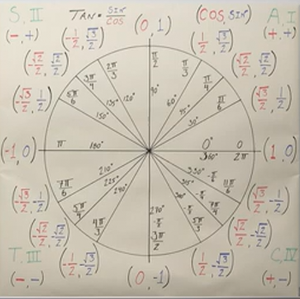
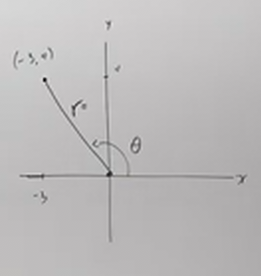

# How to Use the Unit Circle in Trigonometry (Precalculus - Trigonometry 7)

[Video](https://www.youtube.com/watch?v=GdRZfemxTFI)

---

In this section, we are going to dive a little deeper on the topic of the _Unit
Circle_. We're going to explore some common angles that show up often when
evaluating _Trigonometric Functions_ and their relations on the _Unit Circle_.

It is _highly recommended_ that you _memorize the diagram above! By the time you
get to Calculus, you'll want to know these values like the back of your hand.

---

Let's first review how do you find an angle on the _Unit Circle_.

In the previous section, we were able to easily determine some of the most
common Points on a Unit Circle, based off the angle in radians (_i.e._
$0$/$2\pi$, $\dfrac{\pi}{2}$, $\pi$, and $\dfrac{3\pi}{2}$). But let's say we
were given an angle in radians:

$$ \theta = \frac{2\pi}{3} $$

This also can be referenced in degrees as:

$$ \theta = 120\degree $$

We'll generally be using radians throughout this lecture, but you should know
that when given degrees, we can easily convert them to find any of our
_Trigonometric Function_ values.

If we consult our _Unit Circle_ chart, we can see that the point on the _Unit
Circle_ at this angle, $\theta$, is:

Point: $\left(-\dfrac{1}{2}, \dfrac{\sqrt{3}}{2}\right)$

Thusly we can start to evaluate our 6 _Trigonometric Functions_:

$$
\begin{align*}
\sin \frac{2\pi}{3} = \frac{\sqrt{3}}{2}\\
\cos \frac{2\pi}{3} = -\frac{1}{2} \\
\tan \frac{2\pi}{3} = -\sqrt{3} \\
\csc \frac{2\pi}{3} = \frac{2}{\sqrt{3}} \rightarrow \frac{2 \cdot \sqrt{3}}{\sqrt{3} \cdot \sqrt{3}}\rightarrow \frac{2\sqrt{3}}{3} \\
\sec \frac{2\pi}{3} = -2 \\
\cot \frac{2\pi}{3} = -\frac{1}{\sqrt{3}} \rightarrow -\frac{\sqrt{3}}{3} \\
\end{align*}
$$

---

Consider the following angle:

$$ \theta = \frac{8\pi}{3} \text{, } 480\degree $$

We can easily see that this goes over one full revolution. In fact if we
evaluate this further, we can see:

$$ \theta = 2\pi + \frac{2\pi}{3} $$

This means we go around one full revolution and end up at the same angle of our
previous example, $\dfrac{2\pi}{3}$, and this means we would have the same
point, $\left(-\dfrac{1}{2}, \dfrac{\sqrt{3}}{2}\right)$, and the same values
for our _Trigonometric Functions_.

When we get to our lectures on Graphing Trigonometric Functions, you'll notice
that the graph will oscillate whenever we have a repetition of these values,
this is known as a _Period_ of these Trigonometric Function's values.

---

Let's continue finding the _Trigonometric Function_ values of some common _Unit
Circle_ Angles:

$$ \theta = \frac{\pi}{45} \text{ , } 45\degree $$

Point: $\left(\dfrac{\sqrt{2}}{2}, \dfrac{\sqrt{2}}{2}\right)$

$$
\begin{align*}
\sin \frac{\pi}{4} = \frac{\sqrt{2}}{2} \\
\cos \frac{\pi}{4} = \frac{\sqrt{2}}{2} \\
\tan \frac{\pi}{4} = 1 \\
\csc \frac{\pi}{4} = \frac{2}{\sqrt{2}} \rightarrow \frac{2\sqrt{2}}{2} \rightarrow \sqrt{2} \\
\sec \frac{\pi}{4} = \frac{2}{\sqrt{2}} \rightarrow \frac{2\sqrt{2}}{2} \rightarrow \sqrt{2} \\
\cot \frac{\pi}{4} = 1 \\
\end{align*}
$$

---

$$ \theta = \frac{7\pi}{6} \text{ , } 210\degree $$

Point: $\left(-\dfrac{\sqrt{3}}{2}, -\dfrac{1}{2}\right)$

$$
\begin{align*}
\sin \frac{7\pi}{6} = -\frac{1}{2} \\
\cos \frac{7\pi}{6} = -\frac{\sqrt{3}}{2} \\
\tan \frac{7\pi}{6} = \frac{1}{\sqrt{3}} \rightarrow \frac{\sqrt{3}}{3} \\
\csc \frac{7\pi}{6} = -2 \\
\sec \frac{7\pi}{6} = -\frac{2}{\sqrt{3}} \rightarrow -\frac{2\sqrt{3}}{3} \\
\cot \frac{7\pi}{6} = \sqrt{3} \\
\end{align*}
$$

---

$$ \theta = \frac{5\pi}{3} \text{ , } 300\degree $$

Point: $\left(\dfrac{1}{2}, -\dfrac{\sqrt{3}}{2}\right)$

$$
\begin{align*}
\sin \frac{5\pi}{3} = -\frac{\sqrt{3}}{2} \\
\cos \frac{5\pi}{3} = \frac{1}{2} \\
\tan \frac{5\pi}{3} = -\sqrt{3} \\
\csc \frac{5\pi}{3} = -\frac{2}{\sqrt{3}} \rightarrow -\frac{2\sqrt{3}}{3} \\
\sec \frac{5\pi}{3} = 2 \\
\cot \frac{5\pi}{3} = -\frac{1}{\sqrt{3}} \rightarrow -\frac{\sqrt{3}}{3} \\
\end{align*}
$$

---

$$ \theta = -\frac{3\pi}{4} \text{ , } -135\degree $$

Point: $\left(-\dfrac{\sqrt{2}}{2}, -\dfrac{\sqrt{2}}{2}\right)$

$$
\begin{align*}
\sin -\frac{3\pi}{4} = -\frac{\sqrt{2}}{2} \\
\cos -\frac{3\pi}{4} = -\frac{\sqrt{2}}{2} \\
\tan -\frac{3\pi}{4} = 1 \\
\csc -\frac{3\pi}{4} = -\frac{2}{\sqrt{2}} \rightarrow -\frac{2\sqrt{2}}{2} \rightarrow -\sqrt{2} \\
\sec -\frac{3\pi}{4} = -\frac{2}{\sqrt{2}} \rightarrow -\frac{2\sqrt{2}}{2} \rightarrow -\sqrt{2} \\
\cot -\frac{3\pi}{4} = 1 \\
\end{align*}
$$

---

Let's now do some edge cases:

---

$$ \tan 6\pi = $$

This is just 3 full revolutions around our Unit Circle, thusly:

$$ \tan 6\pi = \tan 2\pi = \tan 0 $$

Which is just $\dfrac{y}{x}$, and thusly we get:

$$ \tan 6\pi = 0 $$

---

$$ \sec(-\pi) = $$

$$ \sec(-\pi) = \sec(\pi) $$

$$ \cos(\pi) = \frac{-1}{1} = -1 $$

$$ \sec(-\pi) = \frac{1}{-1} = -1 $$

$$ \sec(-\pi) = -1 $$

---

$$ \sin \frac{11\pi}{2} = $$

$$ \sin \frac{11\pi}{2} = \sin \frac{3\pi}{2} $$

Point: $(0, -1)$

$$ \sin \frac{11\pi}{2} = -1 $$

---

$$ \sin(45\degree) + \cos(60\degree) \rightarrow $$

$$ \sin(45\degree) = \frac{\sqrt{2}}{2} $$

$$ \cos(60\degree) = \frac{1}{2} $$

$$ \frac{\sqrt{2}}{2} + \frac{1}{2} = \boxed{\frac{1 + \sqrt{2}}{2}} $$

---

$$ \csc(45\degree)\tan(60\degree) \rightarrow $$

$$ \sin(45\degree) = \frac{\sqrt{2}}{2} $$

$$ \csc(45\degree) = \frac{2}{\sqrt{2}} \rightarrow \frac{2\sqrt{2}}{2} \rightarrow \sqrt{2} $$

$$ \tan(60\degree) = \sqrt{3} $$

$$ \csc(45\degree)\tan(60\degree) \rightarrow \sqrt{2} \cdot \sqrt{3} \rightarrow \boxed{\sqrt{6}} $$

---

$$ 3\csc\left(\frac{\pi}{3}\right) + \cot\left(\frac{\pi}{4}\right) \rightarrow $$

$$ \sin\left(\frac{\pi}{3}\right) = \frac{\sqrt{3}}{2} $$

$$ \csc\left(\frac{\pi}{3}\right) = \frac{2}{\sqrt{3}} \rightarrow \frac{2\sqrt{3}}{3} $$

$$ \tan\left(\frac{\pi}{4}\right) \rightarrow 1 $$

$$ \cot\left(\frac{\pi}{4}\right) \rightarrow 1 $$

$$ 3\left(\frac{2\sqrt{3}}{3}\right) + 1 $$

$$ 3\csc\left(\frac{\pi}{3}\right) + \cot\left(\frac{\pi}{4}\right) \rightarrow \boxed{2\sqrt{3} + 1} $$

---

$$ 2\sin\left(\frac{\pi}{4}\right) + 3\tan\left(\frac{\pi}{4}\right) \rightarrow $$

$$ \sin\left(\frac{\pi}{4}\right) = \frac{\sqrt{2}}{2} $$

$$ \tan\left(\frac{\pi}{4}\right) = 1 $$

$$ 2\left(\frac{\sqrt{2}}{2}\right) + 3(1) = \sqrt{2} + 3 $$

$$ 2\sin\left(\frac{\pi}{4}\right) + 3\tan\left(\frac{\pi}{4}\right) \rightarrow \boxed{\sqrt{2} + 3} $$

---

Now, what happens if are asked to find one of these _Trigonometric Functions_ on
an angle that isn't within our Handy Dandy Unit Circle Cheat Sheet?

$$ \sin 28\degree \approx $$

$$ \cot \frac{\pi}{12} \approx $$

$$ \sin 1\degree \approx $$

$$ \sin 1 \approx $$

This is where you'd want to use your calculator, you just want to be sure you
are in the right _mode_ (_i.e._ radians or degrees).

$$ \sin 28\degree \approx 0.47 $$

$$ \cot \frac{\pi}{12} \approx 3.73 $$

$$ \sin 1\degree \approx 0.02 $$

$$ \sin 1 \approx 0.84 $$

These last two examples are simply pointing out that you should make absolutely
sure you are in the right _mode_.

---

Okay, but what if we want to determine some of these _Trigonometric Functions_
for a point that is _not_ on the _Unit Circle_? Suppose we have some angle
$\theta$ along the circle that has the following point on its circumference:

Point: $(-3, 4)$

If we draw this point out the graph, we get:

Hopefully, you can see that we can determine the radius of the point from its
origin, recall pythagorean theorem:

$$ (-3)^2 + 4^2 = r^2 $$

$$ 25 = r^2 $$

$$ 5 = r $$

Note that we didn't include the $\pm$ here, as it is not relevant to the problem
we are trying to solve (the $\pm$ of a radius will show up when we get to _Polar
_Coordinates in a future lecture).

We can now solve for our _Trigonometric Functions_ using these values, we just
need to put all of our values over the radius.

Consider that if we had a _Unit Circle_ here, our sine for $\theta$ would be:

$$ \sin\theta = 4 $$

But consider that this is the $y$-coordinate _over_ our _radius_:

$$ \sin\theta = \frac{4}{\text{radius}} = \frac{4}{1} = 4 $$

But if our radius isn't $1$, then we actually have to plug that in:

$$ \sin\theta = \frac{4}{5} $$

This applies to all our other _Trigonometric Functions_. We can use this
knowledge to write out our Trigonometric functions now:

$$
\begin{align*}
\sin\theta = \frac{4}{5} \\
\\
\cos\theta = -\frac{3}{5} \\
\\
\tan\theta = -\frac{4}{3} \\
\\
\csc\theta = \frac{5}{4} \\
\\
\sec\theta = -\frac{5}{3} \\
\\
\cot\theta = -\frac{3}{4} \\
\\
\end{align*}
$$
