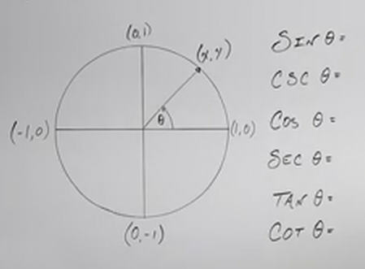

# Basic Properties of Trigonometric Functions (Precalculus - Trigonometry 8)

[Video](https://www.youtube.com/watch?v=_dTRpq_yGIc)

---

In this lecture, we are going to be discussing something called _Identities_.
We'll discover that in understanding _Identities_, we'll begin to understand a
lot more about Trigonometry.

---

Let's start by examining the _Unit Circle_:

Consdider sine/cosecant, $\sin\theta$/$\csc\theta$ in terms of their
$xy$-coordinates on the _Unit Circle_, as well as the other _Trigonometric
Functions_.

Hopefully by now, you understand that when we ask for the sine of some given
angle, theta (_i.e._ $\sin\theta$), on the _Unit Circle_, that we're simply
asking for the $y$-coordinate of that point is along the _Unit Circle_.

_Trigonometric Functions_ are really just ways of defining relationships between
angles and their opposite/adjacent lengths as they relate to the hypotenuse of a
drawn right angle triangle (in this context, when drawn within the _Unit
Circle_).

$$ \sin\theta = y $$

And recall from the previous lecture that the cosecant of that same angle is the
reciprocal of sine:

$$ \csc\theta = \frac{1}{y} $$

The simple fact that $y$ is on the denominator when we calculate the cosecant
immediately has some implications in regards to the _Domain_ of the cosecant, as
$y$ cannot equal $0$ when on the denominator.

Let's now consider cosine of the same angle theta. As you recall from the
previous couple lectures, cosine along a _Unit Circle_ simply returns the
$x$-coordinate of a point along the circumference of the _Unit Circle_.

$$ \cos\theta = x $$

Likewise, the secant of this same angle is the reciprocal:

$$ \sec\theta = \frac{1}{x} $$

Similar to what we talked about with cosecant, the secant of an angle also
implies that the _Domain_ of the secant is restricted in that $x$ cannot equal
$0$.

Now, when we talk about tangent of that same angle:

$$ \tan\theta = \frac{y}{x} $$

And recall this can also be expressed as:

$$ \tan\theta = \frac{\sin\theta}{\cos\theta} $$

And just as before, we have a reciprocal _Trigonometric Function_ cotangent,
that is the reciprocal of tangent:

a$ \cot\theta = \frac{x}{y} $$

$$ \cot\theta = \frac{\cos\theta}{\sin\theta} $$

And both $\tan\theta$ and $\cot\theta$ have _Domain_ restrictions as well as $x$
and $y$ cannot be $0$ respectively.

---

## Domain And Range Of Trigonometric Functions

We'll now evaluate the _Domain_ and _Range_ of these _Trigonometric Functions_,
and we'll do that by looking at what the output of these functions could
possibly be.

**Domain**

When evaluating _Domain_, we're simply going to ask "What inputs can we put into
our function to get a _Real_ output?"

In other words, we are looking to define what inputs we'll need to exclude from
our Domain. These inputs that we'll exclude would be any value that gives us an
_undefined_ output.

Let's start with $\sin\theta$. Since the $y$ coordinate can never be undefined,
we can simply state that $\sin\theat$ is all real numbers:

$$ \text{Domain: } \left\{\theta \mid \theta \in \mathbb{R} \right\} $$

In interval notation this would be:

$$ \theta \in (-\infty, \infty) $$

Or also:

$$ \theta \in \mathbb{R} $$

The _Range_ consists of the possible real number outputs to our function. In the
case of $\sin\theta$, our range of outputs is at least $-1$, and at most $1$.
Thusly our range for $\sin\theta$ could be expressed as:

$$ \text{Range of } \sin \theta: \left\{ y \mid y = \sin \theta, \; \theta \in \mathbb{R}, \; -1 \leq y \leq 1 \right\} $$

In interval notation this would be:

$$ \sin\theta \in [-1, 1] $$

We'll now fill in the other _Trigonometric Functions_ based off these ideas. All
of the following will be in _Interval Notation_:

| $f(\theta)$  | Domain                                                                                             | Range                                           |
| ------------ | -------------------------------------------------------------------------------------------------- | ----------------------------------------------- |
| $\sin\theta$ | $\theta \in \mathbb{R}$                                                                            | $\sin\theta \in [-1, 1]$                        |
| $\cos\theta$ | $\theta \in \mathbb{R}$                                                                            | $\cos\theta \in [-1, 1]$                        |
| $\tan\theta$ | $\theta \in \bigcup_{n \in \mathbb{Z}} \left(n\pi - \dfrac{\pi}{2}, n\pi + \dfrac{\pi}{2} \right)$ | $\tan\theta \in (-\infty, \infty)$              |
| $\csc\theta$ | $\theta \in \bigcup_{n \in \mathbb{Z}} \left(n\pi, (n + 1)\pi \right)$                             | $\csc\theta \in (-\infty, -1] \cup [1, \infty)$ |
| $\sec\theta$ | $\theta \in \bigcup_{n \in \mathbb{Z}} \left(n\pi - \dfrac{\pi}{2}, n\pi + \dfrac{\pi}{2} \right)$ | $\sec\theta \in (-\infty, -1] \cup [1, \infty)$ |
| $\cot\theta$ | $\theta \in \bigcup_{n \in \mathbb{Z}} \left(n\pi, (n + 1)\pi \right)$                             | $\cot\theta \in (-\infty, \infty)$              |

Note that if you want a full explanation as to how these values are calculated,
see 00:08:55 of the video onwards.

---

## Periods In Trigonometric Functions

A _Period_ in _Trigonometric Functions_ is an interval in which the outputs of
that function repeat.

Take $\sin\theta$, when does the output of $\sin\theta$ repeat? Well that's
after one full revolution, thusly we can say that the period of $\sin\theta$ is
$2\pi$. As is the same for $\cos\theta$. Since the output of $\tan\theta$ is
based off of the division and sign of both $\sin\theta$ and $\cos\theta$, this
occurs every $180\degree$ or every $\pi \text{radians}$.

When these periods are calculated, and then put into a table, we get this:

| $f(\theta)$  | Period |
| ------------ | ------ |
| $\sin\theta$ | $2\pi$ |
| $\cos\theta$ | $2\pi$ |
| $\tan\theta$ | $\pi$  |
| $\csc\theta$ | $2\pi$ |
| $\sec\theta$ | $2\pi$ |
| $\cot\theta$ | $\pi$  |

These helps us identify the _Identities_ of our _Trigonometric Functions_.
Consider $\sin\theta$, we can continually add or subtract $2\pi$ however many
$k$ times (where $k$ is the number of _Periods_ we iterate through) and get the
same output as $\sin\theta$, and this gives us an equation we can use to
demonstrate the Identity:

| $f(\theta)$  | Period | Identity                                     |
| ------------ | ------ | -------------------------------------------- |
| $\sin\theta$ | $2\pi$ | $\sin(\theta \pm 2\pi \cdot k) = \sin\theta$ |

We can similarly define our Identities for our other _Trigonometric Functions_:

| $f(\theta)$  | Period | Identity                                     |
| ------------ | ------ | -------------------------------------------- |
| $\sin\theta$ | $2\pi$ | $\sin(\theta \pm 2\pi \cdot k) = \sin\theta$ |
| $\cos\theta$ | $2\pi$ | $\cos(\theta \pm 2\pi \cdot k) = \cos\theta$ |
| $\tan\theta$ | $\pi$  | $\tan(\theta \pm \pi \cdot k) = \tan\theta$  |
| $\csc\theta$ | $2\pi$ | $\csc(\theta \pm 2\pi \cdot k) = \csc\theta$ |
| $\sec\theta$ | $2\pi$ | $\sec(\theta \pm 2\pi \cdot k) = \sec\theta$ |
| $\cot\theta$ | $\pi$  | $\cot(\theta \pm \pi \cdot k) = \cot\theta$  |

These _Identities_ allow us to evaluate very large angles and quickly deduce
which base function we will need to use to evaluate our function. Let's go over
a few examples:

---

**Examples**

---

$$ \sin\left(\frac{19\pi}{2}\right) \rightarrow $$

Recall that our _Identity_ for any $\sin\theta$ is:

$$ \sin(\theta \pm 2\pi \cdot k) = \sin\theta $$

Because we know that every revolution is equal to $2\pi$, we can continually
subtract $2\pi$ from our input until we can no longer further reduce it:

$$ \frac{19}{2} - 2 \rightarrow \frac{15}{2} - 2 \rightarrow \frac{11}{2} - 2
\rightarrow \frac{7}{2} - 2 \rightarrow \frac{3}{2} $$

And this is $\dfrac{3\pi}{2}$. Thusly we can easily evaluate it from here:

$$ \sin\left(\frac{19\pi}{2}\right) \rightarrow \sin\left(\frac{3\pi}{2}\right) \rightarrow \boxed{-1} $$

---

$$ \csc\left(\frac{9\pi}{2}\right) \rightarrow  $$

$$ \frac{9\pi}{2} - 2 \rightarrow \frac{5\pi}{2} \rightarrow \frac{\pi}{2} $$

$$ \csc\left(\frac{9\pi}{2}\right) \rightarrow \csc\left(\frac{\pi}{2}\right) \rightarrow \frac{1}{1} \rightarrow \boxed{1} $$

---

$$ \tan\left(\frac{19\pi}{6}\right) \rightarrow $$

In this case we subtract just by $\pi$ every time, but we can use a trick where
we multiply our denominator by the coefficient of $\pi$, in this case $6 \cdot 1
= 6$. So we can continually reduce $19\pi$ by $6$:

$$ \frac{19\pi}{6} - \frac{6\pi}{6} \rightarrow \frac{13\pi}{6} - \frac{6\pi}{6} \rightarrow \frac{7\pi}{6} $$

$$ \tan\left(\frac{19\pi}{6}\right) \rightarrow \tan\left(\frac{7\pi}{6}\right) \rightarrow \frac{\left(-\dfrac{1}{2}\right)}{\left(-\dfrac{\sqrt{3}}{2}\right)} \rightarrow \frac{1}{\sqrt{3}} \rightarrow \boxed{\frac{\sqrt{3}}{3}} $$

Note we could have gone one more revolution and gotten
$\left(\dfrac{\pi}{6}\right)$ and gotten the same answer of
$\left(\dfrac{\sqrt{3}}{3}\right)$.

---

$$ \sin\left(\frac{9\pi}{4}\right) \rightarrow $$

$$ \frac{9\pi}{4} - \frac{8\pi}{4} \rightarrow \frac{\pi}{4} $$

$$ \sin\left(\frac{9\pi}{4}\right) \rightarrow \sin\left(\frac{\pi}{4}\right) \rightarrow \boxed{\frac{\sqrt{2}}{2}} $$

---

$$ \cot\left(\frac{17\pi}{4}\right) \rightarrow $$

$$ \frac{17\pi}{4} - \frac{4\pi}{4} \rightarrow \frac{13\pi}{4} - \frac{4\pi}{4} \rightarrow \frac{9\pi}{4} - \frac{4\pi}{4} \rightarrow \frac{5\pi}{4} $$

$$ \cot\left(\frac{17\pi}{4}\right) \rightarrow \cot\left(\frac{5\pi}{4}\right) \rightarrow \frac{1}{1} \rightarrow \boxed{1} $$

We also have gone one more revolution to evaluate $\left(\dfrac{\pi}{4}\right)$
and gotten the same answer of $1$.

---

$$ \cos(420\degree) \rightarrow $$

Now, we could just convert this to radians, but because the _Identitites_ are
relatively easy to parse through even with degrees, let's consider that with
$\cos\theta$, the identity always has a period of $360\degree$ (_i.e._ $2\pi$),
thusly we can just continually subtract $360\degree$ until we can no longer
further reduce:

$$ 420\degree - 360\degree = 60\degree $$

And we can no longer further reduce.

$$ \cos(420\degree) \rightarrow \cos(60\degree) = \boxed{\frac{1}{2}} $$

---

$$ \sec(540\degree) \rightarrow $$

Same deal with $\sec\theta$, which has a Period every $360\degree$:

$$ 540\degree - 360\degree = 180\degree $$

$$ \sec(540\degree) \rightarrow \sec(180\degree) = \frac{1}{-1} = \boxed{-1} $$

---

Now, as an extra.

Sometimes you may find it tedious to continually subtract by $2\pi$, or $\pi$.
There is a trick to doing evaluating this more quickly.

Essentially, you can take the _Identity's_ coefficient prior to $\pi$, multiply
it by the denominator of our angle, and then divide the numerator's coefficient
to $\pi$. Whatever remains will be the coefficient to the most reduced form on
the numerator, over the original denominator:

$$ \sin\left(\frac{11\pi}{2}\right) \rightarrow $$

The _Identity_ for $\sin\theta$ is:

$$ \sin(\theta \pm 2\pi \cdot k) = \sin\theta $$

The coefficient for $\pi$ within our _Identity_ is $2$. If we then multiply this
by the denominator of our angle, we get $4$.

If we then divide the numerator's coefficient to $\pi$, $11$, by $4$:

$$ \frac{11}{4} $$

We get a remainder of $3$:

$$ \frac{3}{4} $$

And that is the most reduced form of our angle:

$$ \sin\left(\frac{11\pi}{2}\right) \rightarrow \sin\left(\frac{3\pi}{4}\right) $$

---

Let's now consider this for a tangent:

$$ \tan(6\pi) \rightarrow $$

Let's write this in a form that applies to our trick:

$$ \tan\left(\frac{6\pi}{1}\right) $$

Recall that our _Identity_ for $\tan\theta$ is:

$$ \tan(\theta \pm \pi \cdot k) = \tan\theta $$

The coefficient prior to $\pi$ in our _Identity_ is $1$. And the denominator
times this is $1$.

If we then divide our numerator's coefficent by this, we get $6$.

If we divide $6$ by $1$, we get a remainder of $0$:

And this means:

$$ \tan(6\pi) \rightarrow \tan(0) $$

---

$$ \cos\left(\frac{8\pi}{3}\right) \rightarrow $$

$$ \cos(\theta \pm 2\pi \cdot k) = \cos\theta $$

$$ 2 \cdot 3 = 6 $$

$$ 8 \bmod 6 = 2 $$

$$ \cos\left(\frac{8\pi}{3}\right) \rightarrow \cos\left(\frac{2\pi}{3}\right) $$

---

$$ \sin\left(\frac{19\pi}{4}\right) \rightarrow $$

$$ \sin(\theta \pm 2\pi \cdot k) = \sin\theta $$

$$ 2 \cdot 4 = 8 $$

$$ 19 \bmod 8 = 3 $$

$$ \sin\left(\frac{19\pi}{4}\right) \rightarrow \sin\left(\frac{3\pi}{4}\right)$$

---

$$ \tan\left(\frac{19\pi}{6}\right) \rightarrow $$

$$ \tan(\theta \pm \pi \cdot k) = \tan\theta $$

$$ 1 \cdot 6 = 6 $$

$$ 19 \bmod 6 = 1 $$

$$ \tan\left(\frac{19\pi}{6}\right) \rightarrow \tan\left(\frac{\pi}{6}\right)$$

---

$$ \cot\left(\frac{17\pi}{4}\right) \rightarrow $$

$$ \cot(\theta \pm \pi \cdot k) = \cot\theta $$

$$ 1 \cdot 4 = 4 $$

$$ 17 \bmod 4 = 1 $$

$$ \cot\left(\frac{17\pi}{4}\right) \rightarrow \cot\left(\frac{\pi}{4}\right) $$

---

$$ \csc\left(\frac{9\pi}{2}\right) \rightarrow $$

$$ \csc(\theta \pm 2\pi \cdot k) = \csc\theta $$

$$ 2 \cdot 2 = 4 $$

$$ 9 \bmod 4 = 1 $$

$$ \csc\left(\frac{9\pi}{2}\right) \rightarrow \csc\left(\frac{\pi}{2}\right) $$
