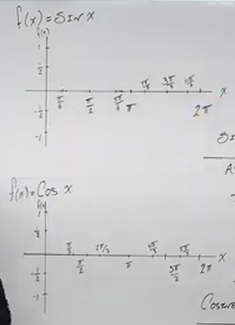
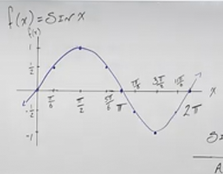
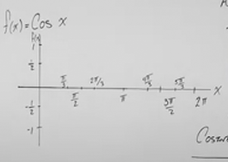
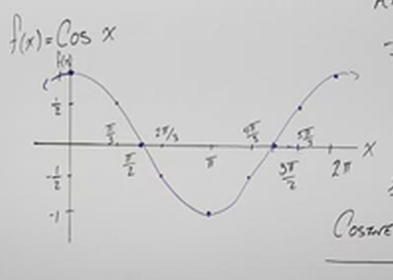

# The Graphs of Sine and Cosine (Precalculus - Trigonometry 11)

[Video](https://www.youtube.com/watch?v=3HHgZopzL_s)

---

Students often get confused when we get to the concept of Graphing Trigonmetric
Functions. This is due oftentimes to the confusion between the $x$ and $y$ axis
as it relates the Unit Circle, and the $x$ and $y$ axis when we actually graph
the inputs and outputs of Trigonmetric Functions.

But really the concepts around Graphing Trigonmetric Functions remain the same
as when we Graph any other function, and we're going to show some of the key
points, features, and general shape of both sine and cosine in this lecture.

---

## The General Look of Sine and Cosine Graphs

Before we begin, just consider the following graphs:

In these two graphs, the input would be what we have been referring to as
$\theta$, our _angle_, and the output would be the output of the Trigonometric
Function.

Recall that inputs are always put in as $x$ and the outputs are output as $y$.
Thusly:

$$
\begin{align*}
x = \theta \\
y = \sin\theta \\
\end{align*}
$$

---

## Graphing Sine

If we fill in some points from our Unit Circle into the graph, we get an
oscillating shape:

Let's now define some Properties of our Graph:

Note that our domain is _All Real Numbers_:

$$ \text{Domain: } \left\{x | x \in \mathbb{R} \right\} $$

Also denoted as:

$$ x \in (-\infty, \infty) $$

And our Range is between, and including $-1$ and $1$:

$$ \sin x \in [-1, 1] $$

We also know from the previous section that $\sin\theta$ is an _odd_ function.
But let's also consider what we know about graphs, that a function is _odd_ if
is symmetrical around the $x$-axis$. If we were to reflect our graph along the
origin, would we would get the same graph if the function is _odd_. In this case
it is the same if we reflect the graph is rotated along the origin 180 degrees,
and so yes, it is indeed an _odd_ function.

Our _Period_ for $\sin\theta$ is $2\pi$.

Our graph crosses the $x$-axis, _i.e._ has $x$-intercepts every $\pi$ radians.
Thusly Our $x$-intercepts occur every $k$, where $k$ is the variable number of
times the function $\sin x$ returns $0$. Thusly $x$-intercepts occur $k\pi$
times.

Note this as this will come up again later:

> sine _crosses_ $x$-axis at the _Ends_ and _Center_ of Periods _and_ _peaks_ at
> _Quarters_ of _Period_.

Some key points for sine to remember are:

$$ (0, 0) $$

$$ \left(\frac{\pi}{2}, 1\right) $$

$$ (\pi, 0) $$

$$ \left(\frac{3\pi}{2}, -1\right) $$

$$ (1\pi, 0) $$

---

## Graphing Cosine

Consider our starting Graph for Cosine:

Notice that our inputs are different from when we graphed sine. This is because
we wish to keep things simple and not graph with square roots in our numerators.

We start at the input of our angle $0 \text{ radians}$, which outputs the
$x$-coordinate of $1$, then we go to $\dfrac{\pi}{3} \text{ radians}$. This
yields the $x$-coordinate of $\dfrac{1}{2}$ and so on, when we finish our graph
it looks like so:

Our Domain is, like sine, all real numbers:

$$ \text{Domain: } \left\{x | x \in \mathbb{R} \right\} $$

Also denoted as:

$$ x \in (-\infty, \infty) $$

Also, our Range is like cosine in that it oscillates between $-1$ and $1$
inclusive.

$$ \cos x \in [-1, 1] $$

All cosine functions are _Even_. We could "fold" this graph along the $y$-axis
and get the exact same graph.

The period is $2\pi$.

And that the $x$-intercepts occur at every $\dfrac{\pi}{2} + k\pi$ intervals.
This might look awkward, what this means is that our first $x$-intercept doesn't
occur at $0$ (like in sine), but rather at $\dfrac{\pi}{2}$, and then repeats
every $\pi$ after that.

> Cosine _crosses_ the $x$-axis at _Quarter_ Period _and_ peaks at _Ends and
> Center_ of the _Period_.

Key Points For cosine are:

$$ (0, 1) $$

$$ \left(\frac{\pi}{2}, 0\right) $$

$$ (\pi, -1) $$

$$ \left(\frac{3\pi}{2}, 0\right) $$

$$ (2\pi, 1) $$
