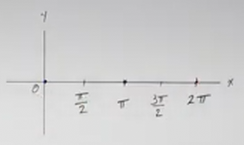
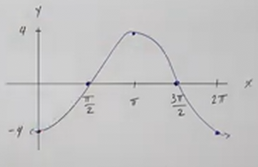

# Graphing Transformations with Sine and Cosine (Precalculus - Trigonometry 12)

[Video](https://www.youtube.com/watch?v=dyXT5KMCrPk)

---

Much like transformations on our other common graphs, Trigonometric functions
can be shifted, reflected, and "stretched"/"compressed" depending (_i.e._
Adjusting the _amplitude_) on how you modify the original Trigonometric
Function.

---

Consider the following expressions:

$$ y = A\sin(\omega x) + B $$

$$ y = A\cos(\omega x) + B $$

The following are the definitions of what is most important to evaluating
Sine/Cosine Trigonometric Functions and their Transformations:

1. _Period_: $T = \dfrac{2\pi}{\omega}$

2. $B = \text{Vertical Shift}$

3. Mark the $x$-intercepts

4. Multiply key points by $A$:

   - $|A| = \text{Amplitude}$

The most important step in evaluating Trigonometric Functions when graphing is
finding the _Period_.

The _Period_ is first determined with $2\pi$, which is the original period
(sine/cosine repeat every $2\pi$ intervals). It is divided by "omega", denoted
with the greek letter, $\omega$. $\omega$ represents the _angular frequency_,
which essentially is a ratio that represents how quickly an angle changes over
time. We'll get more into the aspects of $\omega$ in future lectures, but for
now, simply know that $\omega$ is a number that helps us determine the _Period_.

The other points will become clear as we explore a few examples.

---

Consider the following expression

$$ y = 3\sin x $$

1. _Period_: $T = \dfrac{2\pi}{\omega}$

Let's graph this. As mentioned above, we'll first need to determine the
_Period_:

$$ T = \frac{2\pi}{\omega} $$

Now, $\omega$ in this case is $1$. How do we know that? Well we determine
$\omega$ by whatever number is being multiplied by $x$. Consider that we rewrite
our original expression like so:

$$ y = 3\sin(1x) $$

Therefore, our _Period_ is:

$$ T = \frac{2\pi}{1} = 2\pi $$

We then mark the _Period_ on our $x$-axis as an ending interval:

Then establish intervals at half and quarters along the $x$-axis:

2. $B = \text{Vertical Shift}$

Now, we've established our _Period_ on our graph. We now need to determine $B$,
our _Vertical Shift_, but in this case there is none:

$$ y = 3\sin x + 0 $$

There is no value after our Trigonometric Function, so $B = 0$. If we did, we
would treat this like any other Graphical Vertical Shift, shifting our entire
graph up or down along the $y$-axis and redrawing where our graph interacts with
a sort of "fake" $x$-axis.

3. Mark the $x$-intercepts

In a future lecture, we will talk about Horizontal Shifts, which in the parlance
of talking about Trigonometric Functions, we refer to this as a _Phase Shift_.
For now, know that the $x$-intercepts occur at the ends and center of the
_Period_.

Since there is no _Phase Shift_, we know that for Sine, our $x$-intercepts occur
at $0$, $\pi$, and $2\pi$:

4. Multiply key points by $A$:

   - $|A| = \text{Amplitude}$

Now, recall that our key points for a generic sine function are:

$$ \left(\frac{\pi}{2}, 1 \right) $$

$$ \left(\frac{3\pi}{2}, -1 \right) $$

This is where we get into stretching or compressing our graph though. Recall
from previous lectures on graphing transformations that the number here
represented by $A$ relates to our _Amplitude_ of our function. If $A > 1$, this
will "stretch" our graph upwards and downwards, creating a more dramatic wave
form to our graph. If $A < 1$, this will "compress" our graph, and create a more
subtle variation of the wave(s) in our graph.

In this case, our amplitude is $A$, $A = 3$. This changes our keypoints to:

$$ \left(\frac{\pi}{2}, 3\right) $$

$$ \left(\frac{3\pi}{2}, -3 \right) $$

Note that we only applied the _Amplitude_ to the outputs, not the input.

---

Let's now move onto a cosine function. We'll step a bit quicker through this
one.

$$ y = -4\cos x $$

1. _Period_: $T = \dfrac{2\pi}{\omega}$

$$ T = \frac{2\pi}{1} = 2\pi $$

2. $B = \text{Vertical Shift}$

$$ B = 0 $$

3. Mark the $x$-intercepts

4. Multiply key points by $A$:

   - $|A| = \text{Amplitude}$

Note that our key points for cosine without adjusting for Amplitude are:

$$ (0, 1) $$

$$ (\pi, -1) $$

$$ (2\pi, 1) $$

And now we can adjust the output by the Amplitude.

$$ (0, -4) $$

$$ (\pi, 4) $$

$$ (2\pi, -4) $$

Note that this reflects and stretches our standard cosine graph:

---

$$ y = \sin(3x) $$

1. _Period_: $T = \dfrac{2\pi}{\omega}$

$$ T = \frac{2\pi}{3} $$

2. $B = \text{Vertical Shift}$

3. Mark the $x$-intercepts

$x$-intercepts occur at:

$$ 0 \text{, } \frac{\pi}{3} \text{, } \frac{2\pi}{3} $$

4. Multiply key points by $A$:

   - $|A| = \text{Amplitude}$

$$ A = 1 $$

---

$$ y = \cos(-2x) $$

Now, recall that cosine is an _even_ function. Therefore the inverse function of
a negative argument to cosine simply returns the same output as it's inverse:

$$ \cos(-\theta) = \cos\theta $$

Therefore we can rewrite this as:

$$ y = \cos(2x) $$

> As an aside, if this had been a sine function, that would have been an _odd_
> function:
>
> $$ \sin(-\theta) = -\sin\theta $$
>
> This would have put a $-1$ as our _Amplitude_ had this been a sine function
> (essentially reflecting the standard sine function).

We can now move on with our regular scheduled programming:

1. _Period_: $T = \dfrac{2\pi}{\omega}$

$$ T = \frac{2\pi}{2} = \pi $$

2. $B = \text{Vertical Shift}$

$$ B = 0 $$

3. Mark the $x$-intercepts

Cosine always has $x$-intercepts at the _Quarters_. In this case that is:

$$ \frac{\pi}{4} \text{, } \frac{3\pi}{4} $$

4. Multiply key points by $A$:

   - $|A| = \text{Amplitude}$

Our key points for cosine are at the _End_ Points. Ini ths case this would be
at:

$$ (0, 1) \text{, } \left(\frac{\pi}{2}, -1\right) \text{, } (\pi, 1) $$

Our Amplitude is $1$:

$$ A = 1 $$

and therefore our graph does not look any different than a standard cosine
function, except that it's $\omega$ of $-2$ has changed the _angular frequency_
a period occurs, it is essentially going "faster".

---

$$ y = -2\sin\left(\frac{x}{8}\right) $$

1. _Period_: $T = \dfrac{2\pi}{\omega}$

$$ T = \frac{2\pi}{\left(\dfrac{1}{8}\right)} $$

$$ T = 16\pi $$

2. $B = \text{Vertical Shift}$

B = 0

3. Mark the $x$-intercepts

$x$-intercepts for sine occur at the _end_ points:

$$ 0 \text{, } 8\pi \text{, } 16\pi $$

4. Multiply key points by $A$:

   - $|A| = \text{Amplitude}$

Key points for sine occur at _Quarters_:

$$ (4\pi, 1) \text {, } (12\pi, -1)$$

Multiplying the outputs by Amplitude of $-2$:

$$ (4\pi, -2) \text {, } (12\pi, 2)$$

Just for a reference and point of interest, consider this in the context of the
standard sine function superimposed on this graph:

---

$$ 3\cos(4x) + 1 $$

Here we finally have a Vertical Shift, recall that from previous sections
covering Vertical Shifts on graphs, this means that we move our standard graph
vertically along the $y$-axis, and draw a dotted line horizontally along it.
This acts as a sort of "fake" $x$-axis for the rest of our evaluation of the
function.

Simply make sure when establishing your graph to allow enough Vertical space to
accommodate for this shift.

That doesn't change our order of operations though, so let's do that:

1. _Period_: $T = \dfrac{2\pi}{\omega}$

$$ T = \frac{2\pi}{4} = \frac{\pi}{2} $$

We'll draw our vertical shift before putting our intervals on it. We'll do the
same for the $x$-axis for clarity's sake.

2. $B = \text{Vertical Shift}$

B = 1

3. Mark the $x$-intercepts

Cosine has $x$-intercepts at the _Quarters_. Due to the shift, these points
don't acctually occur on the real $x$-axis, but on the "fake" $x$-axis we
created with the _Vertical Shift_. These intercepts occur at:

$$ \frac{\pi}{8} \text{, } \frac{3\pi}{8} $$

And specifically along the fake $x$-axis they occur at:

$$ \left(\frac{\pi}{8}, 1\right) \text{, } \left(\frac{3\pi}{8}, 1\right) $$

4. Multiply key points by $A$:

   - $|A| = \text{Amplitude}$

The key points for cosine occur at the _End_ points. If this did not have a
vertical shift and a change in Amplitude, these would occur at:

$$ (0, 1) \text{, } \left(\frac{\pi}{4}, -1\right) \text{, } \left(\frac{\pi}{2}, 1\right) $$

Now we apply the _Amplitude_ to our outputs:

$$ A = 3 $$

$$ (0, 3) \text{, } \left(\frac{\pi}{4}, -3\right) \text{, } \left(\frac{\pi}{2}, 3\right) $$

But we have a _Vertical Shift, as well, so these actually occur $1$ up the
$y$-axis. Essentially adding $1$ to our outputs:

$$ (0, 4) \text{, } \left(\frac{\pi}{4}, -2\right) \text{, } \left(\frac{\pi}{2}, 4\right) $$

---

$$ y = 4\sin\left(\frac{\pi}{2}x\right) - 2 $$

1. _Period_: $T = \dfrac{2\pi}{\omega}$

$$ T = \frac{2\pi}{\left(\dfrac{\pi}{2}\right)} $$

$$ T = \frac{2\pi}{\left(\dfrac{\pi}{2}\right)} \rightarrow \frac{2\pi}{1} \cdot \frac{2}{\pi} = \frac{4\pi}{\pi} = 4 $$

$$ T = 4 $$

2. $B = \text{Vertical Shift}$

$$ B = -2 $$

3. Mark the $x$-intercepts

$x$-intercepts for sin occur at the _End_ points. Without any vertical shifts,
these would occur at:

$$ (0, 0) \text{, } (0, 2) \text{, } (0, 4) $$

With the vertical shift, these occur at:

$$ (-2, 0) \text{, } (-2, 2) \text{, } (-2, 4) $$

4. Multiply key points by $A$:

   - $|A| = \text{Amplitude}$

Our key points for cosine occur at the _Quarters_. Without the vertical shift,
these would be:

$$ (1, 1) \text{, } (3, -1) $$

We now apply the _Amplitude_ to the outputs:

$$ A = 4 $$

$$ (1, 4) \text{, } (3, -4) $$

We then apply the Vertical Shift of $-2$:

$$ (1, 2) \text{, } (3, -6) $$

---

$$ y = -3\cos\left(\frac{\pi}{4}\right) + 2 $$

1. _Period_: $T = \dfrac{2\pi}{\omega}$

$$ T = \frac{2\pi}{\left(\dfrac{\pi}{4}\right)} = \frac{2\pi}{1} \cdot \frac{4}{\pi} = \frac{8\pi}{1} = 8\pi $$

$$ T = 8\pi $$

2. $B = \text{Vertical Shift}$

$$ B = 2 $$

3. Mark the $x$-intercepts

$x$-intercepts for cosine occur at the _Quarters_. Prior to the _Vertical
Shift_, these would occur at:

$$ (2, 0) \text{, } (6, 0) $$

With the _Vertical Shift_, this becomes:

$$ (2, 2) \text{, } (6, 2) $$

4. Multiply key points by $A$:

   - $|A| = \text{Amplitude}$

The key points for cosine occur at the _Ends_. Prior to applying the _Amplitude_
and the _Vertical Shift_, these would occur at:

$$ (0, 1) \text{, } (4, -1) \text{, } (8, 1) $$

We then apply the _Amplitude_:

$$ A = -3 $$

$$ (0, -3) \text{, } (4, 3) \text{, } (8, -3) $$

And then the _Vertical Shift:

$$ B = 2 $$

$$ (0, -1) \text{, } (4, 5) \text{, } (8, -1) $$

