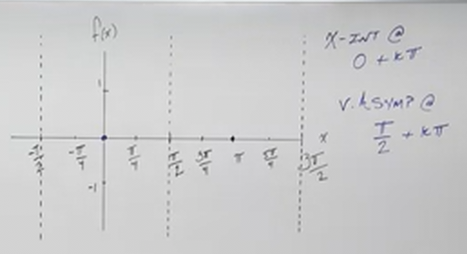
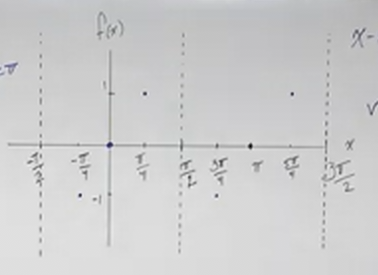
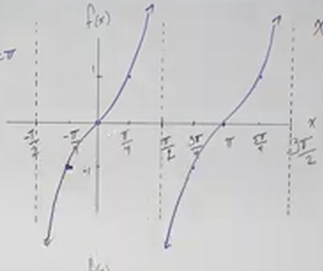
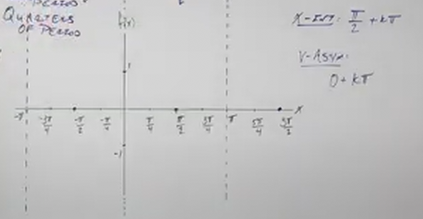
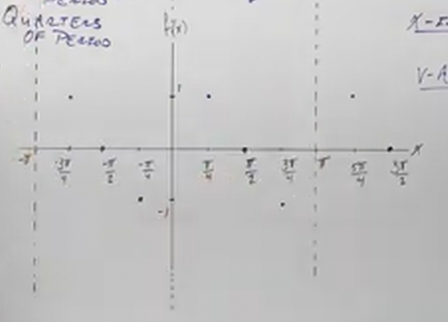
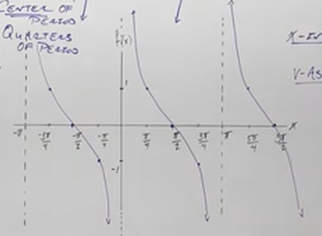

# How to Graph Tangent and Cotangent (Precalculus - Trigonometry 13)

[Video](https://www.youtube.com/watch?v=8eMEBrPYJ0I)

---

Much like our previous lectures on Graphing Sine/Cosine and how to graph
transformations of those Trigonometric Functions, in this lecture and the
following we will complete this set of lectures by showing you how to Graph
Tangent/Cotangent and how to transform them.

---

Recall that Tangent and Cotangent are just ratios, like any other Trigonometric
Function. Unlike Sine and Cosine, however, Tangent is a ratio comparing two
other Trigonmetric Functions.

Recall that:

$$ \tan\theta = \frac{y}{x} $$

Tangent can also be expressed as:

$$ \tan\theta = \frac{\sin\theta}{\cos\theta} $$

Cotangent is just the reciprocal of Tangent:

$$ \cot\theta = \frac{x}{y} $$

$$ \cot\theta = \frac{\cot\theta}{\sin\theta} $$

Recall also that we do indeed have Domain restrictions as the denominator cannot
be $0$. This means that we will have a _Vertical Asymptote_ wherever this
occurs, as those values cannot be defined graphically (or at all for that
matter).

---

## Graphing Tangent

Note that wherever $y = 0$, (_i.e._ $\sin\theta = 0$), then Tangent will also be
$0$.

Essentially, if $\sin\theta = 0$, then $\tan\theta = 0$.

This occurs in two points along the _Unit Circle_, one at $0$, and another at
$\pi$.

These indicate where we will have two starting $x$-intercepts. In this case we
will have two points:

$$ (0, 0) \text{, } (\pi, 0) $$

For every multiple of $\pi$, we will have an $x$-intercept. For every
$0 + k\pi$, where $k$ represents the multiple. Notice also that $\pi$ is the
Period for Tangent (and Cotangent).

Now, we did mention earlier that we would get a series of _Vertical Asymptotes_
in Graphing Tangent. This occurs whenever $x = 0$ (_i.e._ $\cos\theta = 0$). On
the _Unit Circle_, this occurs at $(0, 1)$ and $(0, -1)$. This occurs at the
angles, $\dfrac{\pi}{2}$ and $\dfrac{3\pi}{2}$.

This means we will have _Vertical Asymptotes_ along the $x$-axis at these
angles, at every Period of $\dfrac{\pi}{2} + k\pi$. Notice again, we are
incrementing by the _Period_ for Tangent ($\pi$).

You can set up _Vertical Asymptotes_ to be graphed as we have done in the past
by using Vertical dotted lines along the graph:

Let's define the _Domain_:

$$ \text{Domain: } \left\{ x \in \mathbb{R} \mid x \ne \frac{\pi}{2} + k\pi,\; k \in \mathbb{Z} \right\} $$

Or in interval notation as:

$$ \text{Domain: } \bigcup_{k \in \mathbb{Z}} \left( \frac{\pi}{2} + k\pi,\; \frac{3\pi}{2} + k\pi \right)
$$

Let's now define the _Range_:

Because of the _Vertical Asymptotes_, this should be an indicator of what the
Range is. _Vertical Asymptotes_ indicate that the outputs go all the way to
negative and positive infinity, as they approach (but never reach) the undefined
value of the _Vertical Asymptote_. Thusly The Range is:

$$ \text{Range: } \left\{x \mid x \in \mathbb{R} \right\} $$

Or in interval notation as:

$$ \text{Range: } (-\infty, \infty) $$

Let's now consider some key points where the outputs equal $1$. As you may
recall, $\tan\theta = -1$ when $\theta = -\dfrac{\pi}{4}$, and $\theta =
\dfrac{3\pi}{4}$. You'll also recall that $\tan\theta = 1$ when $\theta =
\dfrac{\pi}{4}$ and when $\theta = \dfrac{5\pi}{4}$.

When we plot these points on the graph, along with the _Vertical Asymptotes_,
you'll start to notice a pattern:

The graph of $\tan x$ starts off from $-\infty$ as it leaves the _Vertical
Asymptotes_, and veers off towards $\infty$ as it approaches the next _Vertical
Asymptote_. These _Vertical Asymptotes_ occur ever $\pi$ interval, every
_Period_.

Unlike Sine and Cosine, the _Period_ of Tangent occurs every $\pi$, _not_ every
$2\pi$. This is because the sine changes, when applied to a ratio, cancel,
causing us to have "quicker" occurrences (the _Period_ is halved) of the same
values for evaluations of Tangent.

When we finally complete the graph by drawing our lines, we can see that the
graph of Tangent almost looks like a series of cubic functions:

Note also, as discussed in a previous lecture, that Tangent is an _Odd_
Function, in that it is Symmetric about the _Origin_. Thusly if we rotate our
graph 180 degrees, it should be the same graph, which the graph of Tangent
demonstrates.

A few things to note:

_Vertical Asymptotes_ occur at the _End_ of each _Period_.

$x$-intercepts occur in the _Center_ of each _Period_.

Lastly, our graph will intersect $y = -1$ and $y = 1$ at the _Quarters_ of each
_Period_.

---

## Graphing Cotangent

Recall once again that:

$$ \cot\theta = \frac{x}{y} $$

$$ \cot\theta = \frac{\cos\theta}{\sin\theta} $$

In essence, our graph for Cotangent will look strikingly similar to our graph
for Tangent, but where we had $x$-intercepts, we will have _Vertical
Asymptotes_, and where we had a _Vertical Asymptotes_, we will have
$x$-intercepts.

We will now have _Vertical Asymptotes_ wherever on the _Unit Circle_ that $y =
0$, or $\sin\theta = 0$. These occur along the _Unit Circle_ at the angles
$\theta = 0$ and at $\theta = \pi$.

This means we have a _Vertical Asymptote_ at every $0 + k\pi$, where $k$ simply
represents the multiple at which we want to graph.

We will also have $x$-intercepts wherever $y = 0$, wherever $\sin\theta = 0$.
These occur on the _Unit Circle_ at $\theta = \dfrac{\pi}{2}$ and at $\theta =
\dfrac{3\pi}{2}$.

This means we will have an $x$-intercept at every $\dfrac{\pi}{2} + k\pi$.

When we graph both our _Vertical Asymptotes_ and our $x$-intercepts, we get the
beginnings of our graph:

Now, the occurrences of $y = -1$ and $y = 1$ are on the same _Quarters_, they
just occur opposite to that of Tangent, so each period starts off at $\infty$,
descending down, crossing the $x$-intercept at every $\dfrac{\pi}{2}$, and then
descending further, passing down through $y = -1$ every $\dfrac{\pi}{4}$, and
then descending off towards $-\infty$ as it approaches the next _Vertical
Asymptote_:

And when filled in, the similarities/differences to Tangent become apparent:

Let's now quickly define the Domain, Range, Even/Odd Property, and the Period:

Let's define the _Domain_:

$$ \text{Domain: } \left\{ x \in \mathbb{R} \mid x \ne 0 + k\pi,\; k \in \mathbb{Z} \right\} $$

Or in interval notation as:

$$ \text{Domain: } \bigcup_{k \in \mathbb{Z}} \left( 0 + k\pi,\; \pi + k\pi \right)
$$

Let's now define the _Range_:

$$ \text{Range: } \left\{x \mid x \in \mathbb{R} \right\} $$

Or in interval notation as:

$$ \text{Range: } (-\infty, \infty) $$

Cotangent is an _Odd_ Function, in that it is Symmetric about the _origin_, and
will be the same graph if rotatated 180 degrees.

Like Tangent, the _Period_ occurs every $\pi$.

The _Vertical Asymptotes_ occur at the _End_ of each _Period_.

The $x$-intercepts occur at the _Center_ of each _Period_.

And $y = -1$ and $y = 1$, occur at every _Quarter_ (just in the opposite
ordering of Tangent).
