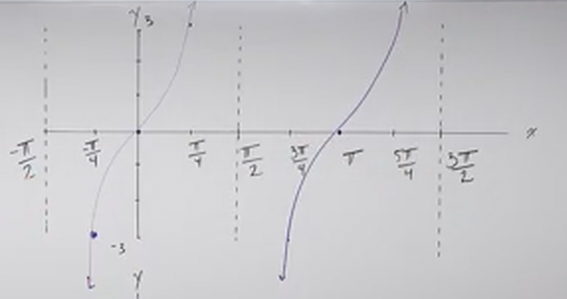

# Graphing Transformations with Tangent and Cotangent (Precalculus - Trigonometry 14)

[Video](https://www.youtube.com/watch?v=i4rr_J1VbkY)

---

In this lecture, we're going to complete our introduction to Graphing
Tangent/Cotangent by looking at the standard transformations we are familiar
with in most graphing. We're goint to look at Vertical Shifts,
Stretching/Compressing, Reflection, and more. This lecture will be very similar
to our lecture on Graphing Transformations with Sine and Cosine in how we
approach these ideas.

---

Consider the following list of properties of Tangent/Cotangent Graphs as they
pertain to Transformations:

$$ y = A\tan(\omega x) + B $$

$$ y = A\cot(\omega x) + B $$

$$ B = \text{ Vertical Shift} $$

$$ \text{Period: } T = \frac{\pi}{\omega} $$

- Tangent has $0$ in the Center of the Period.

- Cotangent "Starts" at $0$.

- There are _Vertical Asymptotes at the ends of each _Period_.

- There are $x$-intercepts at the Center.

_Key Points_ for Tangent include

$y = -1$ and $y = 1$ at the first and third _Quarters_.

_Key Points_ for Cotangent include

$y = 1$ and $y = -1$ at the first and third _Quarters_.

Alot of this will become more familiar as we explore it through examples, so
let's get started.

---

**Examples**

$$ y = 3\tan x $$

Let's first look for a _Vertical Shift_, we don't have one.

$$ B = 0 $$

So now let's look at our _Period_:

We get $\omega = 1$ from whatever coefficient precedes $x$.

$$ T = \frac{\pi}{1} \rightarrow \pi $$

We start by first setting up half our _Period_ along the $x$-axis of our graph.
We therefore set up a unit demarcation tick at $\dfrac{\pi}{2}$ and also at
$-\dfrac{\pi}{2}$:

This is where we set up our first set of _Vertical Asymptotes_. We'll also set
up our first $x$-intercept at $(0, 0)$:

We then find our _Quarters_, and demarcate them. In this case that is pretty
easy.

This allows us to easily find our set of Key Points at the _Quarters_:

$$ \left(-\frac{\pi}{4}, -1\right) \text{ and } \left(\frac{\pi}{4}, 1\right) $$

We then apply $A$, our _amplitude_ to the outputs:

$$ A = 3 $$

$$ \left(-\frac{\pi}{4}, -3\right) \text{ and } \left(\frac{\pi}{4}, 3\right) $$

This has essentially "stretched" our graph. If we plot our points, we can
already see what the graph will look like at the end:

And completing the Graph yields a very skinny Graph of Tangent.

Usually with Tangent/Cotangent Graphs we expand it to show that the Graph
repeats every period:

---

Let's now do the same with a Tangent Function that has a few more
transformations to it:

$$ y = -2\tan(3x) + 1 $$

Here, we do have a _Vertical Shift_:

$$ B = 1 $$

This will be a simple one, we simply adjust all of our $y$ values by $+1$,
setting up a "fake" $x$-axis at $y = 1$.

We also have $\omega = 3$, which will _Horizontally_ Compress our graph.

And lastly we also have $A = -2$, which "Stretches" our graph and reflects it.
Let's now set this Graph of Tangent with Transformations up:

Let's first address the _Vertical Shift_ by setting up our "fake" $x$-axis:

Let's now determine our Period:

$$ T = \frac{\pi}{3} $$

Because our first _Period_ is _Centered_ at $0$. If we then take half of our
period we get $\dfrac{\pi}{6}$, we can set up on our "fake" $x$-axis two
demarcations at $-\dfrac{\pi}{6}$ and $\dfrac{\pi}{6}$.

We now Find the _Quarters_, which lie at $-\dfrac{\pi}{12}$ and
$\dfrac{\pi}{12}$:

We now can set up _Vertical Asymptotes_ along each _Period_ and also set up our
first "$x$-intercept" along the "fake" $x$-axis. This would lie at $(0, 1)$:

Our Key Points lie at:

$$ \left(\frac{-\pi}{12}, -1\right) \text{ and } \left(\frac{\pi}{12}, 1\right) $$

We then adjust our outputs by the _Amplitude_:

$$ A = -2 $$

$$ \left(\frac{-\pi}{12}, 2\right) \text{ and } \left(\frac{\pi}{12}, -2\right) $$

And then apply our _Vertical Shift_:

$$ B = 1 $$

$$ \left(\frac{-\pi}{12}, 3\right) \text{ and } \left(\frac{\pi}{12}, -1\right) $$

And these are our final Key Points that we can plot:

And from here, we can simply complete the Graph, we'll expand it out one more
Period to be very clear:

---

Let's now look at a couple examples of Cotangent.

$$ y = 3\cot\left(\frac{1}{2}x\right) - 2 $$

We have a _Vertical Shift_ downwards of $-2$:

$$ B = -2 $$

Let's just set up a "fake" $x$-axis on our Graph right away:

We have a Period of:

$$ T = \frac{\pi}{\left(\dfrac{1}{2}\right)} \rightarrow 2\pi $$

This has essentially _Horizontally_ "Stretched" our graph.

Unlike Tangent, but like Sine and Cosine, Cotangent's Period "Starts" at
$(0, 0)$ on a standard Cotangent graph. This means we can simpy go from $0$ and
go out our period of $2\pi$. And in this case setting up our halves and
_Quarters_ is very easy:

The Center here occurs at our Half Point, and is our first $x$-intercept. It
occurs normally at at $(\pi, 0)$, but of course, adjusted for our _Vertical
Shift_, setting it at $(\pi, -2)$.

Our normal Key Points for Cotangent for this would be:

$$ \left(\frac{\pi}{2}, 1\right) \text{ and } \left(\frac{3\pi}{2}, -1\right) $$

But we have to apply our _Amplitude_ to our output:

$$ A = 3 $$

$$ \left(\frac{\pi}{2}, 3\right) \text{ and } \left(\frac{3\pi}{2}, -3\right) $$

And we also have to apply our _Vertical Shift_:

$$ B = -2 $$

$$ \left(\frac{\pi}{2}, 1\right) \text{ and } \left(\frac{3\pi}{2}, -5\right) $$

And now we can set up plot our points and graph:

In this case, we won't graph another cycle, we graphed it this way just to
demonstrate the effects of $A$, $\omega$, and $B$ on the standard Cotangent
graph.

---

$$ y = -\cot\left(\frac{\pi}{4}x\right) + 1 $$

$$ B = 1 $$

$$ T = \frac{\pi}{\left(\dfrac{\pi}{4}\right)} \rightarrow 4 $$

Key Points:

$$ (1, 1) \text{ and } (3, -1) $$

$$ A = -1 $$

$$ (1, -1) \text{ and } (3, 1) $$

$$ B = 1 $$

$$ (1, 0) \text{ and } (3, 2) $$

