# How to Graph Cosecant and Secant (Precalculus - Trigonometry 15)

[Video](https://www.youtube.com/watch?v=kYIKNTXaf_E)

---

This will be a relatively short lecture. We're going to cover how to Graph
Cosecant and Secant. The reason for the brevity of this lecture is because
Cosecant and Secant are simply Reciprocal Trigonometric Functions of Sine and
Cosine respectively, and will have similar properties.

---

## Graphing Cosecant

Recall that Cosecant is the Reciprocal Trigonometric Function of Sine.

Consider the following graph of a standard Sine function, note that the graph of
Sine is denoted by the dotted line.

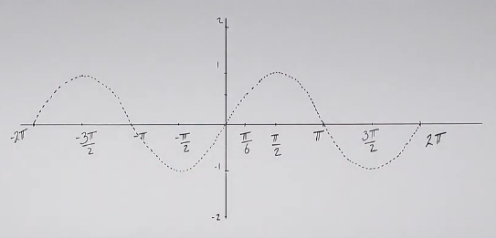

Because Cosecant is the Reciprocal Trigonometric Function of Sine, let's now
take a look at some of the Reciprocals of some o fhte values we encounter on a
standard Sine function:

Consider these following points:

$$ \left(-\frac{3\pi}{2}, 1\right) \text{ and } \left(\frac{\pi}{2}, 1\right) $$

The reciprocal of the outputs remains the same ($1$). Also Consider these
following points:

$$ \left(-\frac{\pi}{2}, -1\right) \text{ and } \left(\frac{3\pi}{2}, -1\right) $$

The reciprocal of the outputs also remains the same ($-1$). We can plot these
points for our standard Cosecant graph:

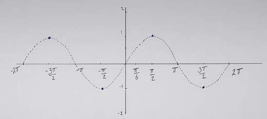

Now, the interesting thing happens where we have Domain issues, recall that
since we are taking the reciprocal, we can run into a situation where
$\sin\theta = 0$. Recall:

$$ \csc\theta = \frac{1}{\sin\theta} $$

So what happens when Cosecant hits a point where Sine equals $0$? Well...we get
a _Vertical Asymptote_. Everywhere we have an $x$-intercept for Sine, we're
going to have a _Vertical Asymptote_ for Cosecant:

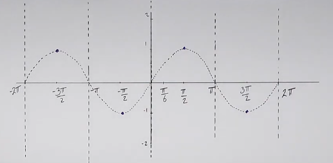

Now, let's consider a few points to understand how else Cosecant graphs
differently. Consider:

$$ \csc\left(\frac{\pi}{6}\right) = \frac{1}{\left(\dfrac{1}{2}\right)} = 2 $$

This means that the peak of our Sine Half-Periods becomes the Valleys of our
Cosecant Half-Periods. In other words, it turns Upwards within the confines of
it's _Vertical Asymptotes. This creates a series of graphs similar to Parabolas:

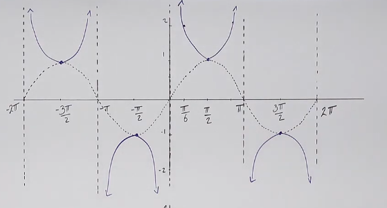

Let's define the _Domain_:

$$ \text{Domain: } \left\{ x \in \R \mid x \neq 0 + k\pi, k \in \Z \right\} $$

Or in interval notation as:

$$ \text{Domain: } \bigcup_{n \in \Z} \left(\left(k\pi, (k + 1)\pi \right)\right)$$

Let's also define our _Range_:

$$ \text{Range: } \left\{x \in \R \mid x \leq -1 \text{ or } x \geq 1\right\} $$

Or in interval notation as:

$$ \text{Range: } (-\infty, -1] \cup [1, \infty) $$

Let's define the Period:

$$ T = 2\pi $$

Let's define some Key Points:

_Vertical Asymptotes_ at All $x$-intercepts of $\sin x$.

---

## Graphing Secant

$$ y = \sec x $$

Similar to before, we have a standard Cosine Graph dotted for demonstration
purposes:

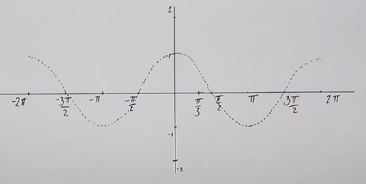

Now, recall that Secant is the Reciprocal Trigonometric Function Of Cosine:

$$ \sec\theta = \frac{1}{\cos\theta} $$

If we take some key points like:

$$ \cos\pi = -1 $$

Then:

$$ \sec\pi = \frac{1}{-1} = -1 $$

So, much like Sine/Cosecant, the same reciprocal of Cosine/Secant hold true for
these points.

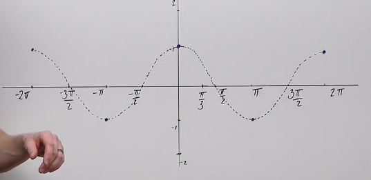

Also like Sine/Cosecant, the points where there is an $x$-intercept for Cosine
will become Vertical Asymptotes for Secant, as that means there is a $0$ on the
denominator, and is undefined:

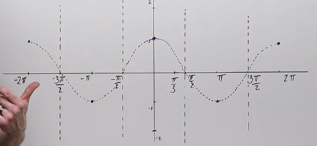

Also similar to Sine/Cosine, if we now take key points, like:

$$ \cos\left(\frac{\pi}{3}\right) = \frac{1}{2} $$

Then the secant would be:

$$ \sec\left(\frac{\pi}{3}\right) = 2 $$

And therefore we would have, once again, Parabola like graphs every Half-Period:

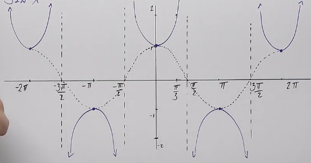

Let's define the _Domain_:

$$ \text{Domain: } \left\{ x \in \R \mid x \ne \frac{\pi}{2} + k\pi,\; k \in \Z \right\} $$

Or in interval notation as:

$$ \text{Domain: } \bigcup_{k \in \Z} \left( \frac{\pi}{2} + k\pi,\; \frac{3\pi}{2} + k\pi \right)
$$

Let's also define our _Range_:

$$ \text{Range: } \left\{x \in \R \mid x \leq -1 \text{ or } x \geq 1\right\} $$

Or in interval notation as:

$$ \text{Range: } (-\infty, -1] \cup [1, \infty) $$

Let's define the Period:

$$ T = 2\pi $$

Let's define some Key Points:

_Vertical Asymptotes_ at All $x$-intercepts of $\cos x$.

---

## Transformations With Secant

$$ y = 4\sec\left(\frac{1}{2}x\right) $$

The method that Professor Leonard uses is to pretend the above expression is
simply a cosine version, then at the end, they follow the methods mentioned
above to reciprocate it.

Let's draw the following graph as a dotted line:

$$ y = 4\cos\left(\frac{1}{2}x\right) $$

Vertical Shift:

$$ B = 0 $$

$$ T = \frac{2\pi}{\left(\dfrac{1}{2}\right)} = 4\pi $$

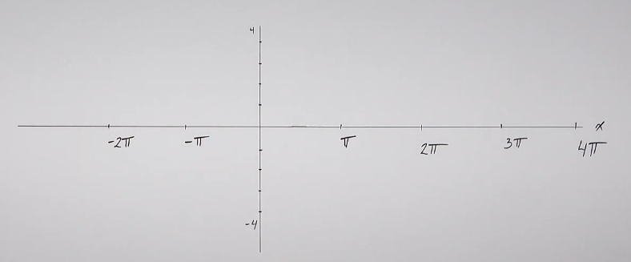

Key points for Cosine are $x$-intercepts at the _Quarters_:

$$ (0, 1) \text{, } (2\pi, -1) \text{, } (4\pi, 1) $$

Apply Amplitude:

$$ A = 4 $$

$$ (0, 4) \text{, } (2\pi, -4) \text{, } (4\pi, 4) $$

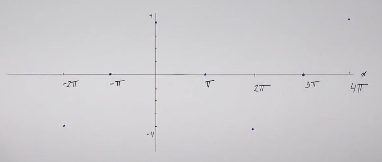

And now we simply graph it using a dotted line:

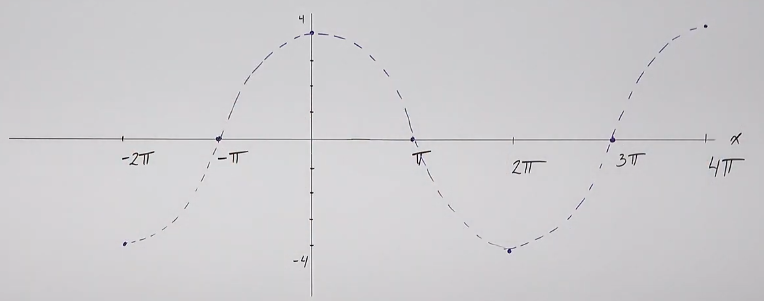

Now all we have to do is apply _Vertical Asymptote_ at our $x$-intercepts:

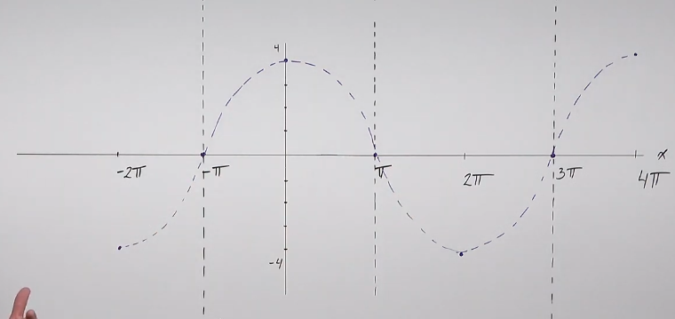

And draw our Parabola shapes at the peaks and valleys:

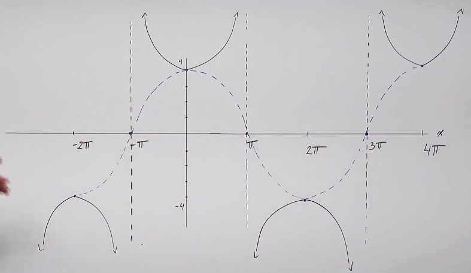

---

## Transformations With Cosecant

$$ y = -2\csc\left(\frac{2\pi}{3}x\right) - 2 $$

Change to Sine:

$$ y = -2\sin\left(\frac{2\pi}{3}x\right) - 2 $$

Vertical Shift:

$$ B = -2 $$

Period:

$$ T = \frac{2\pi}{\left(\dfrac{2\pi}{3}\right)} \rightarrow \frac{2\pi}{1} \cdot \frac{3}{2\pi} \rightarrow  3 $$

The $x$-intercepts for Sine occur at the _Beginning_, _Middle_, and _End_, of
each _Period_:

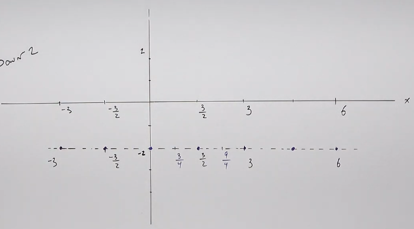

Key Points for Standard Sine occur at quarters: for this would be:

$$ \left(\frac{3}{4}, 1\right) \text{ ,} \left(\frac{9}{4}, -1\right) $$

Apply $A$:

$$ A = -2 $$

$$ \left(\frac{3}{4}, -2\right) \text{ ,} \left(\frac{9}{4}, 2\right) $$

Apply $B$:

$$ \left(\frac{3}{4}, -4\right) \text{ ,} \left(\frac{9}{4}, 0\right) $$

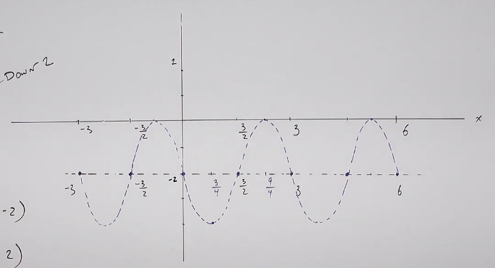

And now, wherever Sine's $x$-intercepts are, we draw _Vertical Asymptotes_. And
wherever the key points are, we create Parabola like graphs to give us the
Cosecant graph:

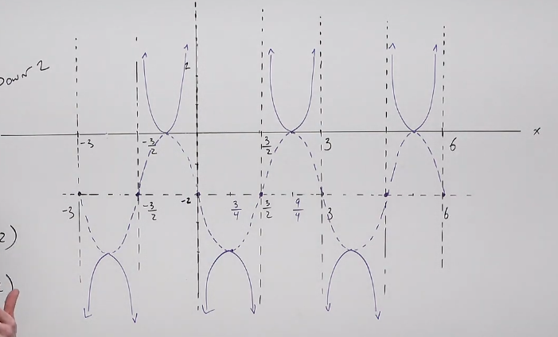
