# How to Graph Phase Shifts of Trigonometric Functions (Precalculus - Trigonometry 16)

[Video](https://www.youtube.com/watch?v=bE5PFI-ibT8)

---

A Phase Shift is a term specifically referring to a _Horizontal Shift_ along the
$x$-axis when graphing Trigonometric Functions. We can determine this shift by
any addition or subtraction to the $x$ variable within the input/argument to our
Trigonometric Functions.

---

Recall that shifting along the $x$-axis in our previous discussions on graphs is
counterintuitive in regards to it's direction. In other words, seeing _Addition_
means we _Shift Left_, and seeing _Subtraction_ means we _Shift Right_.

$$ f(x - h) \dots \text{ Shift Right} $$

$$ f(x + h) \dots \text{ Shift Left} $$

---

Here are the new adjusted steps that we should follow when evaluating/graphing
Trogonometric Functions, including the _Phase Shift_:

**Steps:**

1. Vertical Shift

2. Phase Shift (Coefficient of $x$ _must_ be $1$)

3. Period (Add to _Phase Shift_)

4. Key Points

Let's now practice with some examples:

---

**Examples**

---

$$ y = 3\sin(2x - \pi) $$

1. Vertical Shift

$$ B = 0 $$

2. Phase Shift

We can get the coefficient of $x$ to be $1$ by factoring out a $2$:

$$ y = 3\sin\left[2\left(x - \frac{\pi}{2}\right)\right]$$

Thusly we have a Subtraction, this means we have a Horzontal Shift to the
_Right_. If you have to write it out, do it:

_Horizontal Shift_ to the _Right_ by $\dfrac{\pi}{2}$ units.

3. Period

$$ T = \frac{2\pi}{\omega} $$

But what is $\omega$ in this case? Well we factored out $2$, which is what we
will input for $\omega$:

$$ T = \frac{2\pi}{2} = \pi $$

Now, this is the part where we cover something new. In order to find the end of
our first Period of the Graph, we'll want to add this Period to the Phase Shift.
This can get confusing at first, because we set up our Phase Shift at $x =
\dfrac{\pi}{2}$, not $-\dfrac{\pi}{2}$. If we draw our Phase shift on our graph,
this becomes easier to visualize:

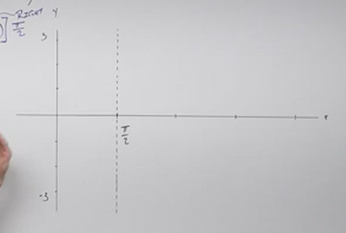

And then we just add our _Period_ onto it:

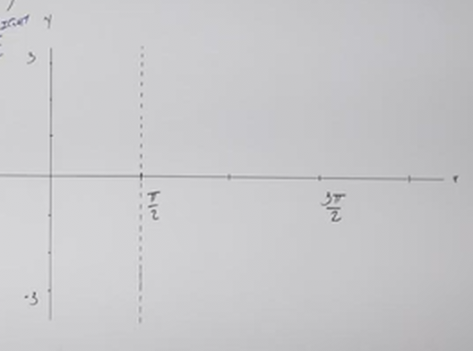

Recall that with Sine, our $x$-intercepts occur at the _Beginning_, _Middle_,
and _End_ of our _Period_:

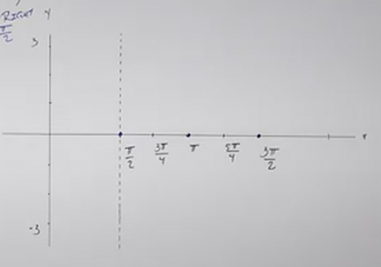

Our key points where we have local Maxima and Minima are on a standard Sine
function in this case would be:

$$ \left(\frac{3\pi}{4}, 1\right) \text{, } \left(\frac{5\pi}{4}, -1\right) $$

And then we apply our Amplitude:

$$ A = 3 $$

$$ \left(\frac{3\pi}{4}, 3\right) \text{, } \left(\frac{5\pi}{4}, -3\right) $$

And then we plot and graph like a standard Sine Function:

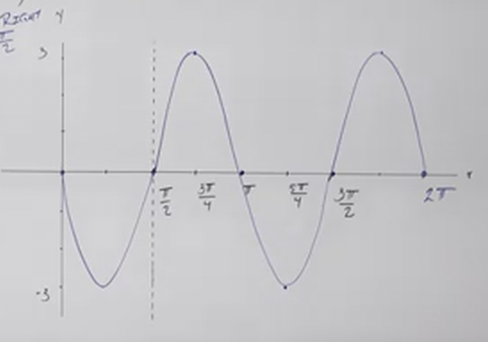

---

$$ y = 2\cos(4x + 3\pi) + 1 $$

Vertical Shift:

$$ B = 1 $$

Phase Shift:

$$ y = 2\cos\left[4\left(x + \frac{3\pi}{4}\right)\right] + 1 $$

_Horizontal Shift_ to the _Left_ by $\dfrac{3\pi}{4}$

Period:

$$ T = \frac{2\pi}{\omega} $$

$$ T = \frac{2\pi}{4} = \frac{\pi}{2} $$

When graphing add the Phase Shift to the Period:

$$ \frac{\pi}{2} + \left(-\frac{3\pi}{4}\right) = -\frac{\pi}{4} $$

We then establish our _Quarters and _Center_:

$$ \text{Center: } \left(-\frac{\pi}{2}\right) $$

$$ \text{Quarters: } \left(-\frac{5\pi}{8}\right) \text{ and } \left(-\frac{3\pi}{8}\right) $$

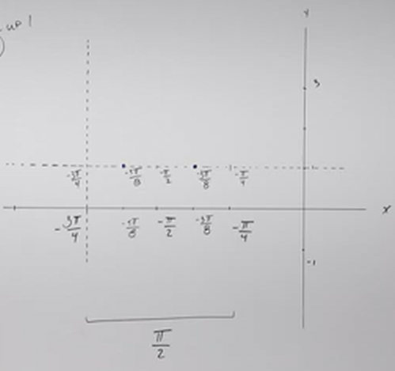

Our $x$-intercepts occur on Cosine at the _Quarters_. In this case they occur
at:

$$ \left(-\frac{5\pi}{8}, 1\right) \text{, } \left(-\frac{3\pi}{8}, 1\right) $$

For the Key Points of Cosine, they occur at the _Beginning_, Center_, And
_Ends_:

$$ \left(-\frac{3\pi}{4}, 1\right) \text{, } \left(-\frac{\pi}{2}, -1\right) \text{, } \left(-\frac{\pi}{4}, 1\right) $$

We then multiply the outputs by the Amplitude:

$$ A = 2 $$

$$ \left(-\frac{3\pi}{4}, 2\right) \text{, } \left(-\frac{\pi}{2}, -2\right) \text{, } \left(-\frac{\pi}{4}, 2\right) $$

And we add the Vertical Shift:

$$ B = 1 $$

$$ \left(-\frac{3\pi}{4}, 3\right) \text{, } \left(-\frac{\pi}{2}, -1\right) \text{, } \left(-\frac{\pi}{4}, 3\right) $$

Now, we just plot and graph:

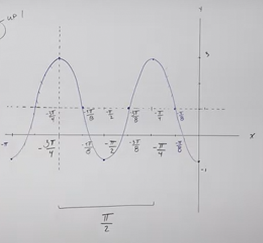

---

$$ y = -3\sin\left(-2x + \frac{\pi}{2}\right) $$

Vertical Shift:

$$ B = 0 $$

Phase Shift:

$$ y = -3\sin\left[-2\left(x - \frac{\pi}{4}\right)\right] $$

Because Sine is an _Odd_ Function, we can change the Sine since it's argument
has negative coefficient.

Recall that

$$ \sin(-\theta) = -\sin\theta $$

Thusly we can change this:

$$ y = -3\sin\left[-2\left(x - \frac{\pi}{4}\right)\right] $$

To this:

$$ y = 3\sin\left[2\left(x - \frac{\pi}{4}\right)\right] $$

Our Phase Shift is a _Horizontal Shift_ to the _Right_ by $\dfrac{\pi}{4}$:

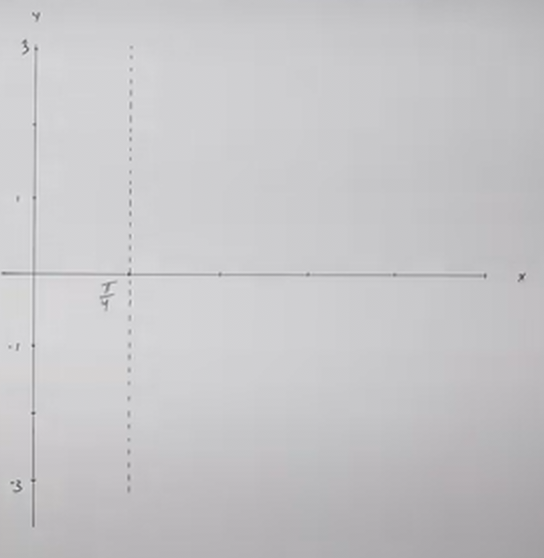

Period:

$$ T = \frac{2\pi}{\omega} $$

$$ T = \frac{2\pi}{2} = \pi $$

In order to find the _End_ of our first period, we can simply add the _Period_
to the _Phase Shift_:

$$ \pi + \frac{\pi}{4} = \frac{5\pi}{4} $$

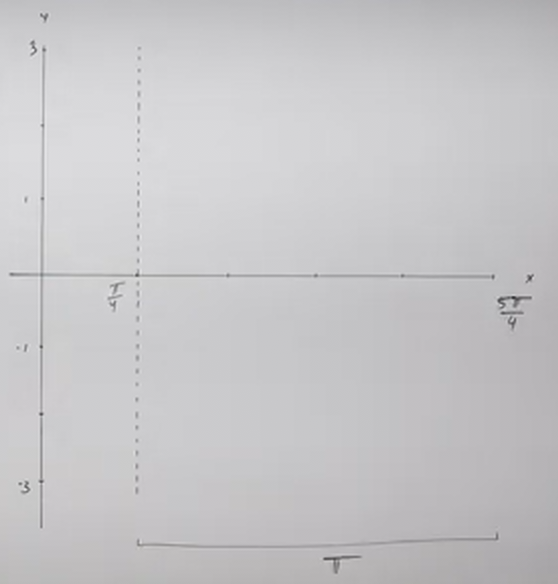

We can now find our _Center_ and _Quarters_:

Our Center is at $\dfrac{3\pi}{4}$.

And our Quarters are at $\dfrac{\pi}{2}$ and $\pi$:

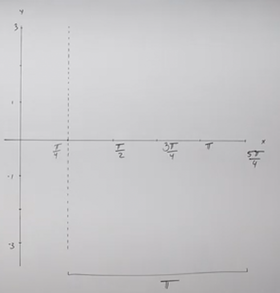

Sine has $x$-intercepts at the _Beginning_, _Middle_ and _End_ of each _Period_:

$x$-intercepts occur at $\dfrac{\pi}{4}$, $\dfrac{3\pi}{4}$, and
$\dfrac{5\pi}{4}$:

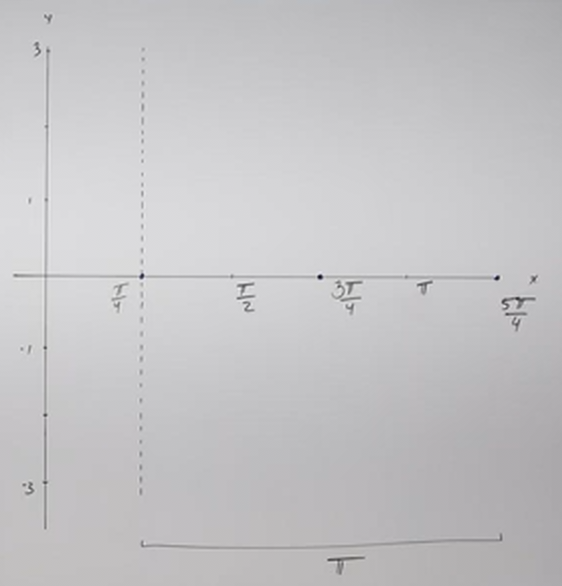

Our Key Points For Sine occur at the _Quarters_:

$$ \left(\frac{\pi}{2}, 1\right) \text{, } (\pi, -1) $$

Now we apply $A$:

$$ A = 3 $$

Note that the sign for this changed due to our manipulation of Sine, this is
important to note as the sign of $\omega$ allowed us to do this and see that our
Sine does _not_ have a Reflection!

Let's apply $A$ to our key points' outputs:

$$ \left(\frac{\pi}{2}, 3\right) \text{, } (\pi, -3) $$

Now, we just plot and graph:

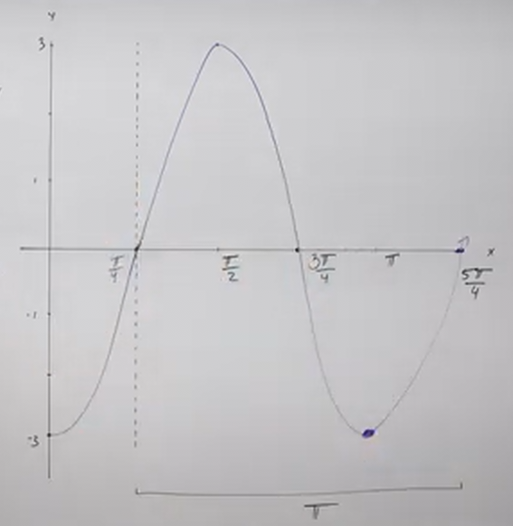

---

$$ y = 2\cos(-2\pi x - 4) + 3 $$

Vertical Shift:

$$ B = 3 $$

Phase Shift:

$$ y = 2\cos\left[-2\pi\left(x + \frac{4}{2\pi}\right)\right] + 3 $$

$$ y = 2\cos\left[-2\pi\left(x + \frac{2}{\pi}\right)\right] + 3 $$

This Phase Shift of $\left(\dfrac{2}{\pi}\right)$ is a bit perplexing, but using
a calculator will get us an idea of how to plot it (generally).

Note that like before, we have a negative coefficient prior to our Phase Shift
argument, we'll want to make that positive. Recall that because Cosine is an
_Even_ Function, one of its properties can be expressed as follows:

$$ \cos(-\theta) = \cos\theta $$

This means that we can take this:

$$ y = 2\cos\left[-2\pi\left(x + \frac{2}{\pi}\right)\right] + 3 $$

And rewrite it as:

$$ y = 2\cos\left[2\pi\left(x + \frac{2}{\pi}\right)\right] + 3 $$

Let's now explicitly define our Shifts.

We have a _Vertical Shift_ of _Up_ $3$ units:

$$ B = 3 $$

And we have a _Horizontal Shift_ _Left_ by $\dfrac{2}{\pi}$ units.

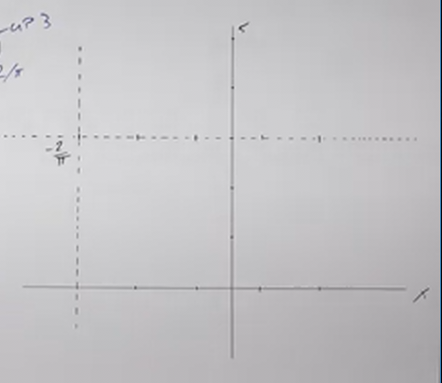

Period:

$$ T = \frac{2\pi}{\omega} $$

$$ T = \frac{2\pi}{2\pi} = 1 $$

Now we add that to whatever our Phase shift is to find the _End_ of our First
_Period_:

$$ 1 - \frac{2}{\pi} \approx 0.36 $$

We can actually leave the demaracation as $1 - \dfrac{2}{\pi}$.

We can now find our _Half_ and _Quarters_ of our First Periods. This might seem
daunting but it's not as bad as it may seem.

Our _Half_ is simply $\dfrac{1}{2} - \dfrac{2}{\pi}$

And our _Quarters_ are $\dfrac{1}{4} - \dfrac{2}{\pi}$, and
$\dfrac{3}{4} - \dfrac{2}{\pi}$.

Cosine has $x$-intercepts at the _Quarters_.

Putting them on the fake $x$-axis, and putting these points at:

$$ \left(\frac{1}{4} - \frac{2}{\pi}, 3\right) \text{, } \left(\frac{3}{4} -\frac{2}{\pi}, 3\right) $$

Cosine has Key Points at the _Beginning_, _Middle_, and _End_ of the _Period_:

$$ \left(-\frac{2}{\pi}, 1\right) \text{, } \left(\frac{1}{2} - \frac{2}{\pi}, -1\right) \text{, } \left(1 - \frac{2}{\pi}, 1\right) $$

We then multiply the outputs by $A$:

$$ A = 2 $$

$$ \left(-\frac{2}{\pi}, 2\right) \text{, } \left(\frac{1}{2} - \frac{2}{\pi}, -2\right) \text{, } \left(1 - \frac{2}{\pi}, 2\right) $$

And then add our _Vertical Shift_:

$$ B = 3 $$

$$ \left(-\frac{2}{\pi}, 5\right) \text{, } \left(\frac{1}{2} - \frac{2}{\pi}, 1\right) \text{, } \left(1 - \frac{2}{\pi}, 5\right) $$

And then we just plot and graph:

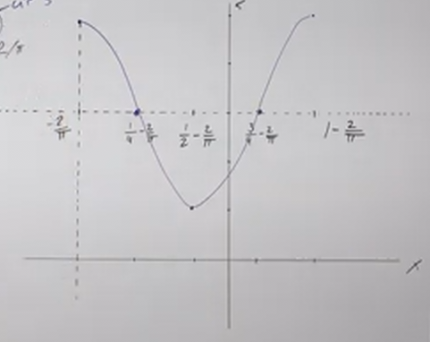
