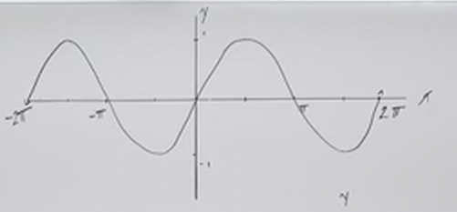
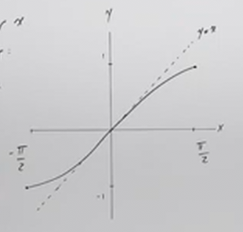
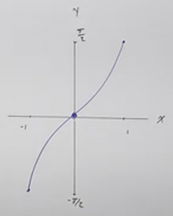
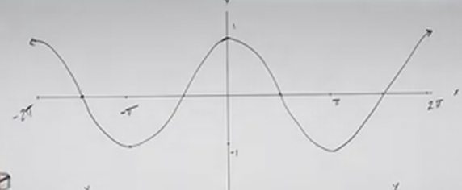
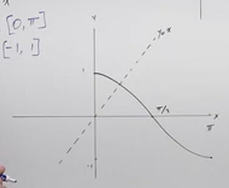
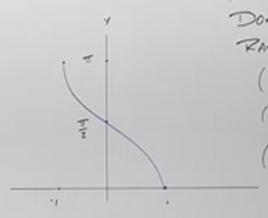
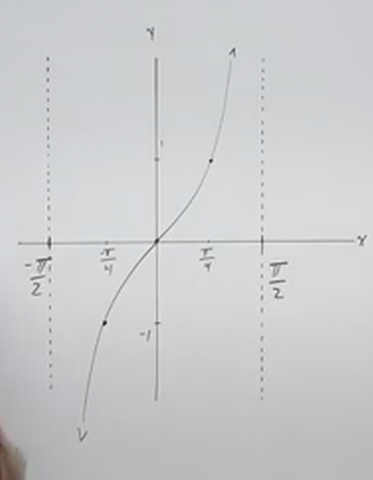
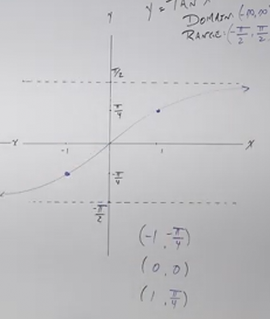

# Introduction to Inverse Trigonometric Functions (Precalculus - Trigonometry 17)

[Video](https://www.youtube.com/watch?v=ih01YszlraY)

---

_Inverse Trigonometric Functions_ are a useful tool for solving other
problems/functions, much like standard inverse functions.

Let's say we wish to solve for $\sin x$, in that we wish to discover what the
angel $x$ is. We aren't able to simply divide by $\sin$, because $\sin$ is a
function itself. This is where _Inverse Trigonometric Functions_ come in.

In regards to Standard Inverse Functions, recall that:

> A Function has an Inverse if and only if it is a One-To-One Function (_i.e._
> it is forwards and backwards mappable. One input gives you one _unique_
> output).

---

## ArcSine

Now, this is important to note because not all Trigonometric Functions are
One-To-One. For example, take $\sin\left(\dfrac{\pi}{6}\right)$ and
$\sin\left(\dfrac{5\pi}{6}\right)$. Both give us the output of $\dfrac{1}{2}$.
Thusly if we want to find an Inverse of this Trignometric Function, we will have
to restrict its input, in order to find its Inverse.

This is easier to understand if we look at a standard Sine function on a Graph:

Now, if you recall from our lectures on Inverse Functions, you can easily
determine a section of a graph that is one to one by using the _Horizontal Line
Test_. If you draw a horizontal line across your graph and it intersects two
points along the graph, then that section is not One-To-One.

Notice in the above graph that we can't just go from $0$ to $\pi$ along the
$x$-axis, because the curve shows we would get two outputs for a single input.

But if we cut the graph from $-\dfrac{\pi}{2}$ to $\dfrac{\pi}{2}$, we indeed
get a section of the graph where there is always one _unique_ output for every
input. This restricted Domain and Range indicates where we have a One-To-One
function.

Let's zoom in on this section to get a clearer idea of what we're looking at.

Because we can only create an _Inverse Function_ from this section of the Sine
Graph, this means that we have to explicitly say what are _Domain_ is where this
is true:

$$ \text{Domain: } \left\{x \in \R \mid -\frac{\pi}{2} \leq x \leq \frac{\pi}{2} \right\} $$

Or in interval notation:

$$ \text{Domain: } \left[-\frac{\pi}{2}, \frac{\pi}{2} \right]$$

Our Range remains the same:

$$ \text{Range: } \left\{x \in \R \mid -1 \leq x \leq 1 \right\} $$

$$ \text{Range: } [-1, 1] $$

Recall that inverses switch inputs and outputs:

$$ \left(-\frac{\pi}{2}, -1\right) \rightarrow \left(-1, -\frac{\pi}{2}\right) $$

This means we are going to reflect along the exact horizontal graph $y = x$ and
get a graph that looks like this:

This also means our Range and Domain for our inverse switch:

$$ \text{Domain: } \left\{x \in \R \mid -1 \leq x \leq 1 \right\} $$

$$ \text{Domain: } [-1, 1] $$

$$ \text{Range: } \left\{x \in \R \mid -\frac{\pi}{2} \leq x \leq \frac{\pi}{2} \right\} $$

$$ \text{Range: } \left[-\frac{\pi}{2}, \frac{\pi}{2} \right]$$

---

Let's cover how to write an Invserse Sine Function:

$$ y = \sin x $$

$$ x = \sin y $$

$$ \sin^{-1}x = \sin^{-1}(\sin y) $$

$$ \sin^{-1}x = y $$

$$ y = \sin^{-1}x $$

Inverse sine is also known as ArcSine, $\arcsin\theta$.

$$ y = \arcsin x $$

Note that in this case, we are no longer using a Trigonmetric Function that
takes an _Angle_ and yields a _Point_, instead we have an Inverse Trigonmometric
Function taking a _Point_ that yields an _Angle_.

---

## ArcCosine

We'll now go much quicker through ArcCosine and ArcTangent as they are very
similar in principles.

Let's start by taking a look at the standard Cosine Graph:

As before, we will need to take a "slice" of this Graph where there are no
repeated outputs in order to find an Inverse. This occurs between $0$ and $\pi$
along the $x$-axis.

Let's now find the Domain and Range:

$$ \text{Domain: } \left\{x \in \R \mid 0 \leq x \leq \pi \right\} $$

$$ \text{Domain: } [0, \pi] $$

$$ \text{Range: } \left\{x \in \R \mid -1 \leq x \leq 1 \right\} $$

$$ \text{Range: } [-1, 1] $$

Our Keypoints within this Range are:

$$ (0, 1) \text{, } \left(\frac{\pi}{2}, 0\right) \text{, } (\pi, -1) $$

These Key points are inverted for ArcCosine:

$$ (1, 0) \text{, } \left(0, \frac{\pi}{2}\right) \text{, } (-1, \pi) $$

And the Domain and Range switch as well:

$$ \text{Domain: } \left\{x \in \R \mid -1 \leq x \leq 1 \right\} $$

$$ \text{Domain: } [-1, 1] $$

$$ \text{Range: } \left\{x \in \R \mid 0 \leq x \leq \pi \right\} $$

$$ \text{Range: } [0, \pi] $$

---

## ArcTangent

ArcTangent is also similar in nature to ArcSine and ArcCosine, with a few extra
caveats as you'll see shortly.

Here is a section of the standard Tangent Function:

Conveninently, this section is indeed a One-To-One Function in that there is
always a _unique_ output for every input. Obviously, these graphs are repeated
after each _Vertical Asymptote_, but we can easily see that our Domain lies
inbetween our two Vertical Asymptotes, but unlike Sine and Cosine, does not
_include_ the values at the edges of the Asymptotes:

$$ \text{Domain: } \left\{x \in \R \mid -\frac{\pi}{2} < x < \frac{\pi}{2} \right\} $$

$$ \text{Domain: } \left(-\frac{\pi}{2}, \frac{\pi}{2}\right) $$

$$ \text{Range: } \left\{x \in \R \right\} $$

$$ \text{Range: } (-\infty, \infty)$$

Key points for Standard Tangent are:

$$ \left(-\frac{\pi}{4}, -1\right) \text{, } (0, 0) \text{, } \left(\frac{\pi}{4}, 1 \right) $$

And we do the usual reversals:

$$ \left(-1 ,-\frac{\pi}{4}\right) \text{, } (0, 0) \text{, } \left(1, \frac{\pi}{4} \right) $$

$$ \text{Domain: } \left\{x \in \R \right\} $$

$$ \text{Domain: } (-\infty, \infty)$$

$$ \text{Range: } \left\{x \in \R \mid -\frac{\pi}{2} < x < \frac{\pi}{2} \right\} $$

$$ \text{Range: } \left(-\frac{\pi}{2}, \frac{\pi}{2}\right) $$

You'll also notice in the graph that follows for ArcTangent that the _Vertical
Asymptotes_ become _Horizontal Asymptotes_:

