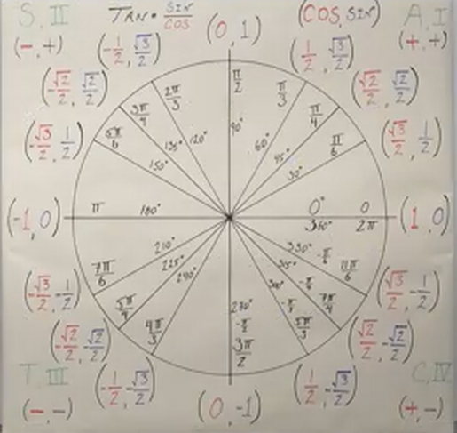
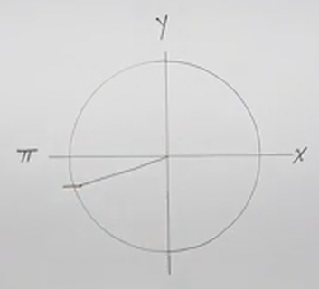
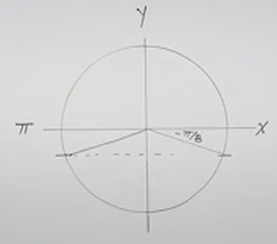

# How to Use Inverse Trigonometric Functions (Precalculus - Trigonometry 18)

[Video](https://www.youtube.com/watch?v=6PB76VMNiX0)

---

With Trigonometric Functions, our input is an Angle, and our output is a Point.
With Inverse Trigonometric FUnctions, our input is a Point, and our output is an
Angle.

**Trigonometric Functions:**

| Point        | Angle                                          |
| ------------ | ---------------------------------------------- |
| $y = \sin x$ | $\left[-\dfrac{\pi}{2}, \dfrac{\pi}{2}\right]$ |
| $y = \cos x$ | $[0, \pi]$                                     |
| $y = \tan x$ | $\left(-\dfrac{\pi}{2}, \dfrac{\pi}{2}\right)$ |

**Inverse Trigonometric Functions:**

| Angle             | Point               |
| ----------------- | ------------------- |
| $y = \sin^{-1} x$ | $[-1, 1]$           |
| $y = \cos^{-1} x$ | $[-1, 1]$           |
| $y = \tan^{-1} x$ | $(-\infty, \infty)$ |

---

In our previous lecture, we discussed that in order for us to find Inverse
Trigonometric Functions, we are require to restrict the Domain of our inputs as
Inverse Functions require their respective Functions to be One-To-One Functions
(_.i.e._ every input provides a _unique_ output).

Also recall the basics of inverse functions in that passing the output of either
a function to its inverse, or passing the output of its inverse to a function,
"cancels" it out, leaving only the initial input. This is demonstrated more
plainly with Mathematical notation:

$$ f\left(f^{-1}(x)\right) = x $$

$$ f^{-1}\left(f(x)\right) = x $$

---

Let's now investigate this basic property of Inverse Functions in the context of
Inverse Trigonometric Functions, keeping in mind the Domain Restrictions
required for Inverse Trigonometric Functions to work.

Consider and evaluate the following examples:

---

$$ \sin^{-1}(\sin x) = \text{ ?} $$

Does this function "cancel" out? Yes, it does, this does equate to $x$, as long
as $x$ is within the domain of $\sin x$.

$$ \sin^{-1}(\sin x) = x $$

But this is only true if it lies within the following Domain:

$$ \text{Domain : } \left\{x \in \R \mid -\frac{\pi}{2} \leq x \frac{\pi}{2} \right\} $$

---

$$ \cos^{-1}(\cos x) = \text{ ?} $$

This is also the same as before, but the Domain restriction is different.

$$ \cos^{-1}(\cos x) = x $$

$$ \text{Domain: } \left\{x \in \R \mid 0 \leq x \leq \pi \right\} $$

---

$$ \tan^{-1}(\tan x) = \text{ ?} $$

$$ \tan^{-1}(\tan x) = x $$

$$ \text{Domain: } \left\{x \in \R \mid -\frac{\pi}{2} < x < \frac{\pi}{2} \right\} $$

---

Now what if we go in the opposite direction?

---

$$ \sin(\sin^{-1} x) = \text{ ?} $$

This will indeed "cancel" out and leave us with the input $x$, but we have to
restrict the Domain of $\sin^{-1}$ when evaluating this in this case. Recall
that the Domain of an Inverse Function is the Range of the Function.

$$ \sin(\sin^{-1} x) = x $$

$$ \text{Domain: } \left\{x \in \R \mid -1 \leq x \leq 1 \right\}$$

---

$$ \cos(\cos^{-1} x) = \text{ ?} $$

$$ \cos(\cos^{-1} x) = x $$

$$ \text{Domain: } \left\{x \in \R \mid -1 \leq x \leq 1 \right\} $$

---

$$ \tan(\tan^{-1} x) = \text{ ?} $$

$$ \tan(\tan^{-1} x) = x $$

$$ \text{Domain: } \left\{x \in \R \mid -\infty < x < \infty \right\} $$

---

Let's now practice afew basic Inverse Trigonometric Functions. Having a diagram
of the Unit Circle will be handy in this case:

---

$$ \sin^{-1}(0) = \text{ ?} $$

Recall that Inverse Trigonoetric Function's outputs are _Angles_.

$$ \sin^{-1}(0) = \theta $$

$$ \sin^{-1}(0) = 0 $$

But also:

$$ \sin^{-1}(0) = \pi $$

But this is a problem, as Inverse Functions need to be One-To-One Functions. So
this demonstrates why we need to restrict the Domain.

This means we must respect the Domain restriction established earlier:

$$ \text{Domain: } \left\{x \in \R \mid -\frac{\pi}{2} \leq x \leq \frac{\pi}{2} \right\} $$

This means along the Unit Circle we are restricted to finding an Angle that
gives a $y$-coordinate of $0$, _but_ only within Quadrants I and Quadrants IV,
as established by the Domain Restriction. Thusly given this understanding, our
answer is:

$$ \sin^{-1}(0) = 0 $$

---

$$ \cos^{-1}(1) = \text{ ?} $$

$$ \cos^{-1}(1) = 0 $$

$$ \text{Domain: } \left\{x \in \R \mid 0 \leq x \leq \pi \right\} $$

---

$$ \tan^{-1}(-1) = \text{ ?} $$

$$ \tan^{-1}(-1) = -\frac{\pi}{4} $$

$$ \text{Domain: } \left\{x \in \R \mid -\frac{\pi}{2} < x < \frac{\pi}{2} \right\} $$

---

$$ \cos{-1}(-1) = \text{ ?} $$

$$ \cos{-1}(-1) = \pi $$

$$ \text{Domain: } \left\{x \in \R \mid 0 \leq x \leq \pi \right\} $$

---

$$ \tan^{-1}(0) = \text{ ?} $$

$$ \tan^{-1}(0) = 0 $$

$$ \text{Domain: } \left\{x \in \R \mid -\frac{\pi}{2} < x < \frac{\pi}{2} \right\} $$

---

$$ \sin^{-1}\left(\frac{\sqrt{2}}{2}\right) = \text{ ?} $$

$$ \sin^{-1}\left(\frac{\sqrt{2}}{2}\right) = \frac{\pi}{4} $$

$$ \text{Domain: } \left\{x \in \R \mid -\frac{\pi}{2} \leq x \leq \frac{\pi}{2} \right\} $$

---

$$ \cos^{-1}\left(-\frac{\sqrt{3}}{2}\right) = \text{ ?} $$

$$ \cos^{-1}\left(-\frac{\sqrt{3}}{2}\right) = \frac{5\pi}{6} $$

$$ \text{Domain: } \left\{x \in \R \mid 0 \leq x \leq \pi \right\} $$

---

$$ \sin^{-1}\left(-\frac{\sqrt{3}}{2}\right) = \text{ ?} $$

$$ \sin^{-1}\left(-\frac{\sqrt{3}}{2}\right) = -\frac{\pi}{3} $$

$$ \text{Domain: } \left\{x \in \R \mid -\frac{\pi}{2} \leq x \leq \frac{\pi}{2} \right\} $$

Notice the use of $-\dfrac{\pi}{3}$ and not $\dfrac{5\pi}{3}$, that is because
our Domain is restricted to this particular part of our Graph
$\left[-\dfrac{\pi}{2}, \dfrac{\pi}{2}\right]$, and the $\dfrac{5\pi}{3}$ lies
much further down the $x$-axis of our graph.

---

$$ \sin^{-1}\left(-\frac{\sqrt{2}}{2}\right) = \text{ ?} $$

$$ \sin^{-1}\left(-\frac{\sqrt{2}}{2}\right) = -\frac{\pi}{4} $$

---

$$ \tan^{-1}\left(\sqrt{3}\right) = \text{ ?} $$

$$ \tan^{-1}\left(\sqrt{3}\right) = \frac{\pi}{3} $$

---

$$ \tan^{-1}\left(\frac{\sqrt{3}}{3}\right) = \text{ ?} $$

$$ \tan^{-1}\left(\frac{\sqrt{3}}{3}\right) = \frac{\pi}{6} $$

---

Let's take some points that don't lie nicely on the Unit Circle.

$$ \sin^{-1}\left(\frac{1}{8}\right) \approx \text{ ?} $$

This may seem difficult, but what we're asking at what angle is our
$y$-coordinate at $\dfrac{1}{8}$ ?

You would want to use your calculator for this (make sure you are in radians
mode). Given a guess, however, we can estimate that it is inbetween $0$, and
$\dfrac{\pi}{6}$. Why? Well because at $\dfrac{\pi}{6}$ we have a $y$-coordinate
of $\dfrac{1}{2}$, which is definitely larger than $\dfrac{1}{8}$, so it's a
safe bet that it lies inbetween those two angles:

$$ \sin^{-1}\left(\frac{1}{8}\right) \approx 0.1253278312 \text{ radians} $$

---

$$ \cos^{-1}\left(\frac{\sqrt{2}}{3}\right) \approx \text{ ?} $$

This, if we think about (albeit a little difficult), would lie inbetween $0$ and
$\dfrac{\pi}{2}$.

$$ \cos^{-1}\left(\frac{\sqrt{2}}{3}\right) \approx 1.079913649 \text{ radians} $$

---

$$ \tan^{-1}(-3) \approx \text{ ?} $$

Our Domain for this is within all Real Numbers, so there's not a solid way of
estimating where this will be without a calculator.

$$ \tan^{-1}(-3) \approx -1.249045772 \text{ radians} $$

---

**Composing Trigonometric/Inverse Trigonometric Functions**

Here we're going to now compose Trigonometric Functions as arguments to Inverse
Trigonometric Functions. This time with specific Angles passed to the
Trigonometric Functions. We'll also find out what happens when they fall outside
of the Domain.

$$ \cos^{-1}\left(\cos\left(\frac{4\pi}{5}\right)\right) = \text{ ?} $$

This will compose, as long as the angle we are passing fits within the Domain.
Recall our domain for Cosine is:

$$ \text{Domain: } \left\{x \in \R \mid 0 \leq x \leq \pi \right\} $$

$\dfrac{4\pi}{5}$ is indeed within the Domain.

$$ \cos^{-1}\left(\cos\left(\frac{4\pi}{5}\right)\right) = \frac{4\pi}{5} $$

---

$$ \sin^{-1}\left(\sin\left(-\frac{3\pi}{7}\right)\right) = \text{ ?} $$

This is within the domain of Sine:

$$ \text{Domain: } \left\{x \in \R \mid -\frac{\pi}{2} \leq x \leq \frac{\pi}{2} \right\} $$

$$ -\frac{3\pi}{7} = -\frac{6\pi}{14} $$

$$ -\frac{\pi}{2} = -\frac{7\pi}{14} $$

$$ -\frac{6\pi}{14} > -\frac{7\pi}{14} $$

$$ \sin^{-1}\left(\sin\left(-\frac{3\pi}{7}\right)\right) = -\frac{3\pi}{7} $$

---

$$ \cos^{-1}\left(\cos\left(-\frac{\pi}{3}\right)\right) = \text{ ?} $$

This is not within our domain. But we can do a couple things. One thing to
recall is that Cosine is an Even Function. One of the properties of an even
function is:

$$ \cos(-\theta) = \cos\theta $$

Thusly, we can change our problem statement to:

$$ \cos^{-1}\left(\cos\left(\frac{\pi}{3}\right)\right) = \text{ ?} $$

And now our input is within the restriction of our Domain:

$$ \cos^{-1}\left(\cos\left(-\frac{\pi}{3}\right)\right) = \frac{\pi}{3} $$

---

$$ \cos^{-1}\left(-\frac{5\pi}{3}\right) = \text{ ?} $$

We could use the same technique as before, but that would fall outside of our
Domain also. So what do we do? In this case consult the Unit Circle, find the
$x$-coordinate of whatever lies at the given angle, in this case, that would be
the same angle as $\dfrac{1}{2}$, and then look for an angle _within_ the
_Domain_ that fits has that point. This will yield you the answer.

$$ \cos^{-1}\left(-\frac{5\pi}{3}\right) = \frac{\pi}{3} $$

---

$$ \sin^{-1}\left(\sin\left(\frac{9\pi}{8}\right)\right) = \text{ ?} $$

Visualizing this, we can understand that this would lie within Quadrant III
($\pi + \dfrac{\pi}{8}$).

Now what we did before is we found the same value related, in this case the same
$y$-value. The $y$-value here would be _negative_, but our domain restricts us
to negative $y$-values within Quadrant IV, thusly we need an equivalent
$y$-value in Quadrant IV. This would therefore lie at $-\dfrac{\pi}{8}$:

$$ \sin^{-1}\left(\sin\left(-\frac{\pi}{8}\right)\right) = -\frac{\pi}{8} $$

---

$$ \tan^{-1}\left(\tan\left(\frac{4\pi}{5}\right)\right) = \text{ ?} $$

The angle $\dfrac{4\pi}{5}$ lies within Quadrant II, but our Domain for Tangent
restricts us to Qudarants I and IV, so we have to find a ratio equivalent that
lies within those Quadrants. We can ascertain therefore, that our Angle would
lie within Quadrant IV, as the ratio's sign of negative would be the same.
Simply drawing a line through our circle from this angle will yield us
$180\degree$ or $\pi radians$ from our original angle, yielding us
$-\dfrac{\pi}{5}$.

$$ \tan^{-1}\left(\tan\left(-\frac{\pi}{5}\right)\right) = -\frac{\pi}{5} $$

---

What happens if we go backwards?

---

$$ \sin\left(\sin^{-1}\left(\frac{1}{4}\right)\right) = \text{ ?} $$

Now, in this situation, if it doesn't fit the Domain, we simply cannot do the
operation.

This lies within the Domain as it lies inbetween $-1$ and $1$ inclusive.

$$ \sin\left(\sin^{-1}\left(\frac{1}{4}\right)\right) = \frac{1}{4} $$

---

$$ \cos\left(\cos^{-1}\left(-\frac{2}{3}\right)\right) = \text{ ?} $$

This also lies between the Domain of $-1$ and $1$ inclusive.

$$ \cos\left(\cos^{-1}\left(-\frac{2}{3}\right)\right) = -\frac{2}{3} $$

---

$$ \tan\left(\tan^{-1}(-2)\right) = \text{ ?} $$

This lies inbetween the Domain of $-\infty$ and $\infty$ noninclusive.

$$ \tan\left(\tan^{-1}(-2)\right) = -2 $$

---

$$ \sin\left(\sin^{-2}(-2)\right) = \text{ ?} $$

This does _not_ lie in the Domain of $-1$ and $1$ inclusive.

$$ \sin\left(\sin^{-2}(-2)\right) = \text{ undefined} $$

---

$$ \cos\left(\cos^{-1}(1.3)\right) = \text{ ?} $$

This also does _not_ lie within the Domain of $-1$ and $1$ inclusive.

$$ \cos\left(\cos^{-1}(1.3)\right) = \text{ undefined} $$
