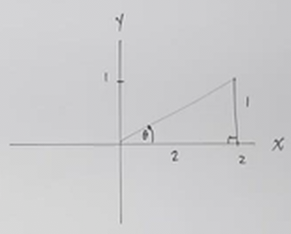
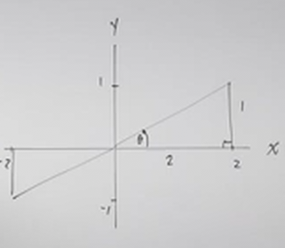

# An Indepth Look at Using Inverse Trig Functions (Precalculus - Trigonometry 21)

[Video](https://www.youtube.com/watch?v=1f6BhHlkgy4)

---

In this lecture, we will go into depth on how we can utilize these Inverse
Trigonometric Functions in order to solve certain problems.

Consider the following:

$$ \sin\theta = y \leftrightarrow \sin^{-1} y = \theta $$

$$ \text{Domain: } \left\{\theta \in \R \mid -\frac{\pi}{2} \leq \theta \frac{\pi}{2} \right\} $$

$$ \cos\theta = y \leftrightarrow \cos^{-1} y = \theta $$

$$ \text{Domain: } \left\{\theta \in \R \mid 0 \leq \theta \leq \pi \right\}$$

$$ \tan\theta = \frac{y}{x} \leftrightarrow \tan^{-1}\left(\frac{y}{x}\right) = \theta $$

$$ \text{Domain: } \left\{\theta \in \R \mid -\frac{\pi}{2} < \theta < \frac{\pi}{2} \right\} $$

To recap, as long as we restrict the Domain of the Angle, we can find an Inverse
Trigonometric Function of any Trigonometric Function. Specifically, we are
always restricting the Domain to two Quadrants on the Unit Circle.

Now, in this lecture, we'll start by exploring how the Reciprocal Trigonometric
Functions, $\csc$, $\sec$, and $\cot$ all have similar Inverses that line up
pretty well in terms of these Domain/Range Restrictions.

In Fact, consider that when we take the inverse of Cosecant, our Domain is the
same as the Inverse Sine Function:

$$ \csc^{-1}\left(\frac{1}{y}\right) = \theta $$

This has the same Domain restrictions, as sine inverse:

$$ \text{Domain: } \left\{\theta \in \R \mid -\frac{\pi}{2} \leq \theta \frac{\pi}{2} \right\} $$

The samea actually applies to Secant, which has the same Domain as Inverse
Cosine:

$$ \sec^{-1}\left(\frac{1}{x}\right) = \theta $$

$$ \text{Domain: } \left\{\theta \in \R \mid 0 \leq \theta \leq \pi \right\}$$

The only one that is different is Cotangent, but if you think on this, it makes
sense. Recall that Tangent Inverse is very Similar to the Domain Restriction of
Sine Inverse, only Tangent is _Non-Inclusive_. Now, Cotangent Inverse will have
a similar Domain Restriction to Cosine Inverse, except that it will be
_Non-Inclusive_:

$$ \cot^{-1}\left(\frac{x}{y}\right) = \theta $$

$$ \text{Domain :} \left\{\theta \in \R \mid 0 < \theta < \pi \right\} $$

---

$$ \sin^{-1}\left(\frac{\sqrt{2}}{2}\right) $$

Consider again that Sine Inverse takes a $y$-coordinate as an input and gives
you the Angle as the output:

$$ \sin^{-1}\left(\frac{\sqrt{2}}{2}\right) = \theta $$

$$ \sin^{-1}\left(\frac{\sqrt{2}}{2}\right) = \frac{\pi}{4} $$

Now, sometimes you will be given something a bit more complicated, consider:

$$ \cos\left(\sin^{-1}\left(\frac{\sqrt{2}}{2}\right)\right) $$

But if you understand that Inverse Trigonometric Functions Give you Angles, and
Trigonometric Functions Give you Coordinates, than you can see that all we're
doing is saying "Use The Inverse Sine Function to find the Angle at this
$y$-coordinate, and then use The Cosine Function to find the $x$-coordinate at
that Angle."

$$ \cos\left(\sin^{-1}\left(\frac{\sqrt{2}}{2}\right)\right) = \cos\left(\frac{\pi}{4}\right) $$

$$ \cos\left(\sin^{-1}\left(\frac{\sqrt{2}}{2}\right)\right) = \cos\left(\frac{\pi}{4}\right) = \frac{\sqrt{2}}{2} $$

---

$$ \tan\left(\cos^{-1}\left(-\frac{\sqrt{3}}{2}\right)\right) $$

$$ \tan\left(\frac{5\pi}{6}\right) $$

$$ \tan\left(\frac{5\pi}{6}\right) = \frac{\dfrac{1}{2}}{-\dfrac{\sqrt{3}}{2}} $$

$$ \tan\left(\frac{5\pi}{6}\right) = \frac{1}{2} \cdot \left(-\frac{2}{\sqrt{3}}\right)$$

$$ \tan\left(\frac{5\pi}{6}\right) = -\frac{1}{\sqrt{3}} $$

$$ \tan\left(\frac{5\pi}{6}\right) = -\frac{\sqrt{3}}{3} $$

$$ \boxed{\tan\left(\cos^{-1}\left(-\frac{\sqrt{3}}{2}\right)\right) =-\frac{\sqrt{3}}{3}} $$

---

$$ \sec\left(\sin^{-1}\left(-\frac{1}{2}\right)\right) $$

$$ \sec\left(-\frac{\pi}{6}\right) $$

One might think that we have to restrict the Domain of Secant to that of Cosine,
but we don't have to, we only have to restrict the Domain of Sine.

$$ \sec\left(-\frac{\pi}{6}\right) = \frac{1}{\dfrac{\sqrt{3}}{2}} $$

$$ \sec\left(-\frac{\pi}{6}\right) = \frac{2}{\sqrt{3}} $$

$$ \sec\left(-\frac{\pi}{6}\right) = \frac{2\sqrt{3}}{3} $$

$$ \boxed{\sec\left(\sin^{-1}\left(-\frac{1}{2}\right)\right) = \frac{2\sqrt{3}}{3}} $$

---

$$ \csc\left(\tan^{-1}\sqrt{3}\right) $$

$$ \csc\left(\frac{\pi}{3}\right) = \frac{1}{\dfrac{\sqrt{3}}{2}} $$

$$ \csc\left(\frac{\pi}{3}\right) = \frac{2}{\sqrt{3}} $$

$$ \csc\left(\frac{\pi}{3}\right) = \frac{2\sqrt{3}}{3} $$

$$ \boxed{\csc\left(\tan^{-1}\sqrt{3}\right) = \frac{2\sqrt{3}}{3}} $$

---

$$ \cot\left(\cos^{-1}\left(-\frac{1}{2}\right)\right) $$

$$ \cot\left(\frac{2\pi}{3}\right) $$

$$ \cot\left(\frac{2\pi}{3}\right) = \frac{-\dfrac{1}{2}}{\dfrac{\sqrt{3}}{2}} $$

$$ \cot\left(\frac{2\pi}{3}\right) = -\frac{1}{2} \cdot \frac{2}{\sqrt{3}} $$

$$ \cot\left(\frac{2\pi}{3}\right) = -\frac{1}{\sqrt{3}} $$

$$ \cot\left(\frac{2\pi}{3}\right) = -\frac{\sqrt{3}}{3} $$

$$ \boxed{\cot\left(\cos^{-1}\left(-\frac{1}{2}\right)\right) = -\frac{\sqrt{3}}{3}} $$

---

What if we have a point that passed to an Inverse Function that isn't on the
Unit Circle?

$$ \sin\left(\tan^{-1}\left(\frac{1}{2}\right)\right) $$

$$ \tan^{-1}\left(\frac{1}{2}\right) = \theta $$

This does _not_ lie on the Unit Circle.

Also note though that the above also mean:

$$ \tan\theta = \frac{1}{2} $$

We can actually take a step back further from the Unit Circle, and simply plot
this as a triangle, recall that all Tangent is is:

$$ \tan\theta = \frac{y}{x} $$

This just creates a simple triangle on a graph:

If we think on it, we could use the negative coordinates:

But in actuality, we cannot use these negative coordinates due to our domain
restrictions for Tangent when finding its Inverse:

$$ \text{Domain: } \left\{\theta \in \R \mid -\frac{\pi}{2} < \theta < \frac{\pi}{2} \right\} $$

This restricts our Domain to Quadrant I and Quadrant IV, and as we can see from
our Graph that we are within Quadrant I.

We can now use the Pythagorean Theorem to find the length of the
Radius/Hypotenuse:

$$ a^2 + b^2 = r^2 $$

$$ (2)^2 + (1)^2 = r^2 $$

$$ 4 + 1 = r^2 $$

$$ 5 = r^2 $$

$$ r = \sqrt{5} $$

Now, we don't have Unit Circle with a radius of $\sqrt{5}$ written out, but
recall that any of our Trigonometric Functions like Sine:

$$ \sin\theta = y $$

But what this really means is:

$$ \sin\theta = \frac{y}{1} $$

And this really means:

$$ \sin\theta = \frac{y}{r} $$

Where $r$ is the radius of the Circle. Since we aren't using the Unit Circle, we
can rewrite this as:

$$ \sin\theta = \frac{1}{\sqrt{5}} $$

And if we rationalize the denominator, we get:

$$ \sin\theta = \frac{\sqrt{5}}{5} $$

And actually, this is our answer, because we originally were just asking what
the sine of this angle was:

$$ \boxed{\sin\left(\tan^{-1}\left(\frac{1}{2}\right)\right) = \frac{\sqrt{5}}{5}} $$

---

$$ \tan\left(\sin^{-1}\left(\frac{1}{3}\right)\right) $$

$$ \sin^{-1}\left(\frac{1}{3}\right) = \theta $$

$$ \sin\theta = \frac{1}{3} $$

$$ \sin\theta = \frac{y}{r} $$

$$ y^2 + x^2 = r^2 $$

$$ 1^2 + x^2 = 3^2 $$

$$ 1 + x^2 = 9 $$

$$ x^2 = 8 $$

$$ x = \sqrt{8} $$

$$ x = 2\sqrt{2} $$

$$ \tan\theta = \frac{y}{x} $$

$$ \tan\left(\sin^{-1}\left(\frac{1}{3}\right)\right) = \frac{1}{2\sqrt{2}} $$

$$ \tan\left(\sin^{-1}\left(\frac{1}{3}\right)\right) = \frac{1}{2\sqrt{2}} \cdot \frac{\sqrt{2}}{\sqrt{2}} $$

$$ \boxed{\tan\left(\sin^{-1}\left(\frac{1}{3}\right)\right) = \frac{\sqrt{2}}{4}} $$

---

$$ \cot\left(\cos^{-1}\left(-\frac{\sqrt{3}}{3}\right)\right) $$

$$ \cos^{-1}\left(-\frac{\sqrt{3}}{3}\right) $$

$$ \cos\theta = -\frac{\sqrt{3}}{3} $$

$$ \cos\theta = \frac{x}{r} $$

$$ x^2 + y^2 = r^2 $$

$$ (-\sqrt{3})^2 + y^2 = 3^2 $$

$$ 3 + y^2 = 9 $$

$$ y^2 = 6 $$

$$ y = \sqrt{6} $$

$$ \cot\theta = \frac{x}{y} $$

$$ \cot\left(\cos^{-1}\left(-\frac{\sqrt{3}}{3}\right)\right) = -\frac{\sqrt{3}}{\sqrt{6}} $$

$$ \cot\left(\cos^{-1}\left(-\frac{\sqrt{3}}{3}\right)\right) = -\sqrt{\frac{1}{2}} $$

$$ \boxed{\cot\left(\cos^{-1}\left(-\frac{\sqrt{3}}{3}\right)\right) = -\frac{\sqrt{2}}{2}} $$

---

$$ \sin\left(\tan^{-1}(-3)\right) $$

$$ \tan^{-1}{-3} = \theta $$

$$ \tan\theta = -3 $$

$$ \tan\theta = \frac{y}{x} $$

$$ x^2 + y^2 = r^2 $$

$$ (1)^2 + (-3)^2 = r^2 $$

$$ 1 + 9 = r^2 $$

$$ 10 = r^2 $$

$$ r = \sqrt{10} $$

$$ \sin\theta = \frac{y}{r} $$

$$ \sin\theta = \frac{(-3)}{\sqrt{10}} $$

$$ \sin\theta = -\frac{-3}{\sqrt{10}} \cdot \frac{\sqrt{10}}{\sqrt{10}} $$

$$ \boxed{\sin\left(\tan^{-1}(-3)\right) = -\frac{-3\sqrt{10}}{10}} $$

---

Now let's do the opposite, where we find the Inverse Trigonometric Function of a
Different Standard Trignometric Function:

---

$$ \cos^{-1}\left(\sin\left(\frac{5\pi}{4}\right)\right) $$

Note we only have to worry about DomaiN Restrictions for the Inverse
Trigonometric Function, not the Standard Trigonometric Function.

$$ \sin\left(\frac{5\pi}{4}\right) = -\frac{\sqrt{2}}{2} $$

$$ \cos^{-1}\left(\frac{\sqrt{2}}{2}\right) = \frac{3\pi}{4} $$

$$ \boxed{\cos^{-1}\left(\sin\left(\frac{5\pi}{4}\right)\right) = \frac{3\pi}{4}} $$

---

$$ \tan^{-1}\left(\cot\left(\frac{2\pi}{3}\right)\right) $$

$$ \cot\left(\frac{2\pi}{3}\right) = \frac{-\dfrac{1}{2}}{\dfrac{\sqrt{3}}{2}} $$

$$ \cot\left(\frac{2\pi}{3}\right) = -\frac{1}{\sqrt{3}} $$

$$ \cot\left(\frac{2\pi}{3}\right) = -\frac{\sqrt{3}}{3} $$

$$ \tan^{-1}\left(-\frac{\sqrt{3}}{3}\right) = \theta $$

$$ \tan\theta = -\frac{\sqrt{3}}{3} $$

$$ \theta = -\frac{\pi}{6} $$

$$ \boxed{\tan^{-1}\left(\cot\left(\frac{2\pi}{3}\right)\right) = -\frac{\pi}{6}} $$

---

$$ \sin^{-1}\left(\cos\left(-\frac{7\pi}{6}\right)\right) $$

$$ \cos\left(-\frac{7\pi}{6}\right) $$

Since cosine is an even function:

$$ \cos(-\theta) = \cos\theta $$

We can find thte same angle as:

$$ \cos\left(\frac{7\pi}{6}\right) = -\frac{\sqrt{3}}{2} $$

$$ \sin^{-1}\left(-\frac{\sqrt{3}}{2}\right) = -\frac{\pi}{3} $$

$$ \boxed{\sin^{-1}\left(\cos\left(-\frac{7\pi}{6}\right)\right) = -\frac{\pi}{3}} $$

---

What about Inverse Reciprocal Trigonometric Functions?

$$ \csc^{-1}\left(\frac{-2\sqrt{3}}{3}\right) $$

Because the Domain of Cosecant matches the Domain of ArcSine (Inverse Sine), we
can actually use a simple technique to change this expression into a Sine.

Consider that this Cosecant statement yields us an Angle:

$$ \csc^{-1}\left(\frac{-2\sqrt{3}}{3}\right) = \theta $$

$$ \csc\theta = \frac{-2\sqrt{3}}{3} $$

And therefore:

$$ \sin\theta = \frac{3}{-2\sqrt{3}} $$

$$ \sin\theta = \frac{3}{-2\sqrt{3}} \cdot \frac{\sqrt{3}}{\sqrt{3}} $$

$$ \sin\theta = -\frac{\sqrt{3}}{2} $$

$$ \theta = -\frac{\pi}{3} $$

$$ \boxed{\csc^{-1}\left(\frac{-2\sqrt{3}}{3}\right) = -\frac{\pi}{3}} $$

---

$$ \sec^{-1}(-2) = \text{ ?} $$

$$ \sec^{-1}(-2) = \theta $$

$$ \sec\theta = -2 $$

$$ \cos\theta = -\frac{1}{2} $$

$$ \theta = \frac{2\pi}{3} $$

$$ \boxed{\sec^{-1}(-2) = \frac{2\pi}{3}} $$

---

What if these don't lie on the Unit Circle? Well use your calculator, but not in
the way you'd think.

---

$$ \sec^{-1}(-3) = \text{ ?} $$

$$ \sec^{-1}(-3) = \theta $$

$$ \sec\theta = -3 $$

$$ \cos\theta = -\frac{1}{3} $$

There isn't an easy way for us to plug this into _most_ calculators (Qalculator
actually does, lol, you can type in arcsecant, etc.). But we can express this
as:

$$ \cos^{-1}\left(-\frac{1}{3}\right) = \theta $$

Which if plugged into a calculator yields:

$$ \theta \approx 1.910633236 \text{ radians} $$

---

$$ \csc^{-1}(-4) = \text{ ?} $$

$$ \csc^{-1}(-4) = \theta $$

$$ \csc\theta = -4 $$

$$ \sin\theta = -\frac{1}{4} $$

$$ \sin^{-1}\left(-\frac{1}{4}\right) = \theta $$

$$ \sin^{-1}\left(-\frac{1}{4}\right) \approx -0.2526802551 \text{ radians} $$

$$ \boxed{\csc^{-1}(-4) \approx -0.2526802551 \text{ radians}} $$

---

Cotangent doesn't quite work the same way.

$$ \cot^{-1} \sqrt{3} = \text{ ?} $$

Because of the Domain Restrictions of both Tangent and Inverse Cotangent, we can
only ever have values that are within Quadrant I.

$$ \cot^{-1} \sqrt{3} = \theta $$

$$ \cot\theta = \sqrt{3} $$

As long as $\cot\theta$ is _Positive_, this will mean our angle is within
Quadrant I and is Defined. Any _Negative_ results for this will indicate that
our Angle will NOT be defined.

$$ \cot\theta = \sqrt{3} $$

$$ \theta = \frac{\pi}{6} $$

$$ \cot^{-1} \sqrt{3} = \frac{\pi}{6} $$

---

$$ \cot^{-1}(-2) = \text{ ?} $$

$$ \cot^{-1}(-2) = \theta $$

$$ \cot\theta = -2 $$

$$ \cot\theta = \frac{-2}{1} $$

This lies within Quadrant II ($x = -2$, and $y = 1$). We cannot simply use
Tangent to find this. Because the Domain of Cotangent Inverse is almost the same
as the Domain of Cosine, we can use Cosine to express it. We'll draw a triangle
on our Graph and use that to find the value for our radius:

$$ (-2)^2 + 1^2 = r^2 $$

$$ 4 + 1 = r^2 $$

$$ r = \sqrt{5} $$

$$ \cos\theta = \frac{x}{r} $$

$$ \cos\theta = \frac{-2}{\sqrt{5}} $$

$$ \cos^{-2}\left(\frac{-2}{\sqrt{5}}\right) = \theta $$

$$ \boxed{\cos^{-2}\left(\frac{-2}{\sqrt{5}}\right) \approx 2.677945045 \text{ radians}} $$
