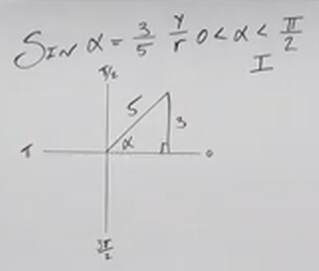
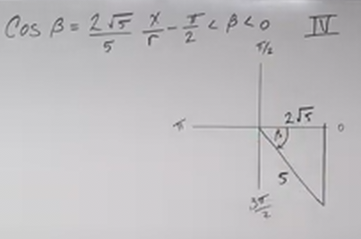

# Using Sum and Difference Formulas in Trigonometry (Precalculus - Trigonometry 26)

[Video](https://www.youtube.com/watch?v=xw4HLT3TmIU)

---

In this lecture, we're going to continue covering the topic of Sum and
Difference Formulas For some of our Common Trigonometric Functions.

As a brief review, recall that our Sum/Difference Formulas for our Common
Trigonometric Functions are as follows:

$$ \cos(\alpha \pm \beta) = \cos\alpha\cos\beta \mp \sin\alpha\sin\beta $$

$$ \sin(\alpha \pm \beta) = \sin\alpha\cos\beta \pm \cos\alpha\sin\beta $$

$$ \tan(\alpha \pm \beta) = \frac{\tan\alpha \pm \tan\beta}{1 \mp \tan\alpha\tan\beta} $$

Note the inversion of $\pm$ and $\mp$ in both Cosine and the denominator of the
Tangent Sum/Difference Formulas.

---

Now, consider we are given the following pieces of information:

$$ \sin\alpha = \frac{3}{5} $$

And we are also given the Domain for $\alpha$:

$$ 0 < \alpha < \frac{\pi}{2} $$

This tells us that $\alpha$ lies within Quadrant I. It is important when
utilizing Sum/Difference Formula that we know which Quadrant our Angle lies in,
as otherwise we could get answers that are the wrong sign.

We also know that Sine is simply the $y$-coordinate over the radius:

$$ \sin\theta = \frac{y}{r} $$

We can draw this out in a Unit Circle style representation (note: not actually a
unit circle since $r \neq 1$).

We can therefore easily solve for the $x$-coordinate via the Pythagorean
Theorem:

$$ y^2 + x^2 = r^2 $$

$$ 3^2 + x^2 = 5^2 $$

$$ 9 + x^2 = 25 $$

$$ x^2 = 16 $$

$$ \sqrt{x^2} = \pm \sqrt{16} $$

$$ x = \pm 4 $$

But, because we know that we are in Quadrant I, we know that the $x$-coordinate
must be positive:

$$ x = 4 $$

And we can therefore determine $\cos\alpha$:

$$ \cos\theta = \frac{x}{r} $$

$$ \cos\alpha = \frac{4}{5} $$

Likewise we know Tangent as well:

$$ \tan\theta = \frac{y}{x} $$

$$ \tan\alpha = \frac{3}{4} $$

Note that throughout this, we never actually figure out the value of $\alpha$.
We could plug it into our calculator, but it is unlikely that we'll get an exact
answer, and we don't need to. This is solely so we can use these values when
evaluating a Sum/Difference Trigonometric Formula between $\alpha$ and some
other angle, as we'll see shortly.

---

Let's now do the same for another angle, $\beta$:

$$ \cos\beta = \frac{2\sqrt{5}}{5} $$

We also have a Domain restriction for $\beta$:

$$ -\frac{\pi}{2} < \beta < 0 $$

This tells us that $\beta$ lies within Quadrant IV.

Let's now evaluate for $\sin\beta$ and $\tan\beta$:

We know that Cosine is just:

$$ \cos\theta = \frac{x}{r} $$

Therefore:

$$ x = 2\sqrt{5} $$

$$ r = 5 $$

We can solve for our $y$-coordinate using the Pythagorean Theorem:

$$ y^2 + x^2 = r^2 $$

$$ y^2 + (2\sqrt{5})^2 = 5^2 $$

$$ y^2 + (4 \cdot 5) = 5^2 $$

$$ y^2 + 20 = 25 $$

$$ y^2 = 5 $$

$$ \sqrt{y^2} = \pm \sqrt{5} $$

$$ y = \pm \sqrt{5} $$

And because we know that our point is within Quadrant IV, we know that the
$x$-coordinate is positive, while the $y$-coordinate is negative:

$$ y = -\sqrt{5} $$

Because of this we know that the Sine is:

$$ \sin\theta = \frac{y}{r} $$

$$ \sin\beta = -\frac{\sqrt{5}}{5} $$

And our Tangent is:

$$ \tan\theta = \frac{y}{x} $$

$$ \tan\beta = -\frac{\sqrt{5}}{2\sqrt{5}} $$

$$ \tan\beta = -\frac{1}{2} $$

---

Now that we've found the Trigonometric Function values of both $\alpha$ and
$\beta$, we can actually solve some Sum/Difference Formulas involving these two
angles (despite not knowing the actual degrees or radians of the angles
themselves).

$$ \sin(\alpha + \beta) = \text{ ?} $$

$$ \sin(\alpha + \beta) = \sin\alpha\cos\beta + \cos\alpha\sin\beta $$

$$ \sin(\alpha + \beta) = \left(\frac{3}{5}\right)\left(\frac{2\sqrt{5}}{5}\right) + \left(\frac{4}{5}\right)\left(-\frac{\sqrt{5}}{5}\right)$$

$$ \sin(\alpha + \beta) = \frac{6\sqrt{5}}{25} - \frac{4\sqrt{5}}{25} $$

$$ \sin(\alpha + \beta) = \frac{2\sqrt{5}}{25} $$

---

$$ \cos(\alpha + \beta) = \text{ ?} $$

$$ \cos(\alpha + \beta) = \cos\alpha\cos\beta - \sin\alpha\sin\beta $$

$$ \cos(\alpha + \beta) = \left(\frac{4}{5}\right)\left(\frac{2\sqrt{5}}{5}\right) - \left(\frac{3}{5}\right)\left(-\frac{\sqrt{5}}{5}\right) $$

$$ \cos(\alpha + \beta) = \frac{8\sqrt{5}}{25} + \frac{3\sqrt{5}}{25} $$

$$ \cos(\alpha + \beta) = \frac{11\sqrt{5}}{25} $$

---

$$ \tan(\alpha - \beta) = \text{ ?} $$

$$ \tan(\alpha - \beta) = \frac{\tan\alpha - \tan\beta}{1 + \tan\alpha\tan\beta} $$

$$ \tan(\alpha - \beta) = \frac{\left(\dfrac{3}{4}\right) - \left(-\dfrac{1}{2}\right)}{1 + \left(\dfrac{3}{4}\right)\left(-\dfrac{1}{2}\right)} $$

$$ \tan(\alpha - \beta) = \frac{\dfrac{5}{4}}{\dfrac{5}{8}} $$

$$ \tan(\alpha - \beta) = \frac{5}{4} \cdot \frac{8}{5} $$

$$ \tan(\alpha - \beta) = \frac{40}{20} $$

$$ \tan(\alpha - \beta) = 2 $$

---

Let's now work on another set of angles and sum/difference problems to solve:

$$ \sin\alpha = \frac{5}{13} $$

$$ -\frac{3\pi}{2} < \alpha < -\pi $$

If we think on this, $-\dfrac{3\pi}{2}$ is just $90\degree$, and $-\pi$ is
$180\degree$. This means we are in Quadrant II.

$$ \sin\theta = \frac{y}{r} $$

$$ y = 5 $$

$$ r = 13 $$

$$ y^2 + x^2 = r^2 $$

$$ 5^2 + x^2 = 13^2 $$

$$ 25 + x^2 = 169 $$

$$ x^2 = 144 $$

$$ \sqrt{x^2} = \pm \sqrt{144} $$

$$ x = \pm 12 $$

Because we are in Quadrant II, we know that the $x$-coordinate must be negative:

$$ x = -12 $$

$$ \cos\theta = \frac{x}{r} $$

$$ \cos\alpha = -\frac{12}{13} $$

$$ \tan\theta = \frac{y}{x} $$

$$ \tan\alpha = -\frac{5}{12} $$

---

$$ \tan\beta = -\sqrt{3} $$

$$ \frac{\pi}{2} < \beta < \pi $$

We know that $\beta$ is in Qudrant II.

Now, we know that:

$$ \tan\theta = \frac{y}{x} $$

So we might think:

$$ \tan\beta = \frac{-\sqrt{3}}{1} $$

But this isn't right, because in Quadrant II, we can only have positive
$y$-coordinates, and negative $x$-coordinates. Thusly this would be more
correct:

$$ \tan\beta = \frac{\sqrt{3}}{-1} $$

Therefore:

$$ y = \sqrt{3} $$

$$ x = -1 $$

And we can solve for $r$ using the Pythagorean Theorem:

$$ y^2 + x^2 = r^2 $$

$$ (\sqrt{3})^2 + (-1)^2 = r^2 $$

$$ 3 + 1 = r^2 $$

$$ 4 = r^2 $$

$$ \pm \sqrt{4} = \sqrt{r^2} $$

$$ \pm 2 = r $$

If we think on this, taking the negative of $r$ would put is into Quadrant IV,
not in Quadrant II, therefore we want to keep $r$ positive:

$$ r = 2 $$

Now let's solve for $\sin\beta$ and $\cos\beta$:

$$ \sin\theta = \frac{y}{r} $$

$$ \sin\beta = \frac{\sqrt{3}}{2} $$

$$ \cos\theta = \frac{x}{r} $$

$$ \cos\beta = -\frac{1}{2} $$

---

And now we can just fill in our Trigonometric functions into our Sum/Difference
Formulas:

$$ \sin(\alpha + \beta) = \text{ ?} $$

$$ \sin(\alpha + \beta) = \sin\alpha\cos\beta + \cos\alpha\sin\beta $$

$$ \sin(\alpha + \beta) = \left(\frac{5}{13}\right)\left(-\frac{1}{2}\right) + \left(-\frac{12}{13}\right)\left(\frac{\sqrt{3}}{2}\right) $$

$$ \sin(\alpha + \beta) = \frac{-5 - 12\sqrt{3}}{26} $$

---

$$ \cos(\alpha + \beta) = \text{ ?} $$

$$ \cos(\alpha + \beta) = \cos\alpha\cos\beta - \sin\alpha\sin\beta $$

$$ \cos(\alpha + \beta) = \left(-\frac{12}{13}\right)\left(-\frac{1}{2}\right) - \left(\frac{5}{13}\right)\left(\frac{\sqrt{3}}{2}\right)$$

$$ \cos(\alpha + \beta) = \frac{12 - 5\sqrt{3}}{26} $$

---

$$ \tan(\alpha - \beta) = ? $$

$$ \tan(\alpha - \beta) = \frac{\tan\alpha - \tan\beta}{1 + \tan\alpha\tan\beta} $$

$$ \tan(\alpha - \beta) = \frac{\left(-\dfrac{5}{12}\right) - \left(-\sqrt{3}\right)}{1 + \left(-\dfrac{5}{12}\right)\left(-\sqrt{3}\right)} $$

$$ \tan(\alpha - \beta) = \frac{\left(-\dfrac{5}{12}\right) + \dfrac{12\sqrt{3}}{12}}{\dfrac{12}{12} + \left(\dfrac{5\sqrt{3}}{12}\right)} $$

$$ \tan(\alpha - \beta) = \frac{\dfrac{12\sqrt{3} - 5}{12}}{\dfrac{5\sqrt{3} + 12}{12}} $$

$$ \tan(\alpha - \beta) = \frac{12\sqrt{3} - 5}{12} \cdot \frac{12}{5\sqrt{3} + 12} $$

$$ \tan(\alpha - \beta) = \frac{12\sqrt{3} - 5}{5\sqrt{3} + 12} $$

Professor Leonard actually stops here, but here is the rather lengthy
Rationalization:

$$ \tan(\alpha - \beta) = \frac{12\sqrt{3} - 5}{5\sqrt{3} + 12} \cdot \frac{5\sqrt{3} - 12}{5\sqrt{3} - 12} $$

$$ \tan(\alpha - \beta) = \frac{(12\sqrt{3})(5\sqrt{3}) - (5)(5\sqrt{3}) - (12)(12\sqrt{3}) + (5)(12)}{(5\sqrt{3})^2 - 144}$$

$$ \tan(\alpha - \beta) = \frac{(12 \cdot 5 \cdot 3)- (25\sqrt{3})- (144\sqrt{3}) + 60}{(25 \cdot 3) - 144}$$

$$ \tan(\alpha - \beta) = \frac{(180) - (169\sqrt{3}) + 60}{75- 144}$$

$$ \tan(\alpha - \beta) = \frac{240 - 169\sqrt{3}}{-69}$$

---

What if we have Sum/Difference Formulas involving _Inverse Trigonometric
Functions_ ?

$$ \sin(\sin^{-1}\left(\frac{1}{2}\right) + \cos^{-1}(0)) = \text{ ?} $$

Here we can use our knowledge of _Inverse Trigonometric Functions_ to
acknowledge that:

$$ \sin^{-1}\left(\frac{1}{2}\right) = \alpha $$

Which means:

$$ \sin\alpha = \frac{1}{2} $$

If we consult our Unit Circle, we will see that this means
$\alpha = \dfrac{\pi}{6}$

Let's consider the other part of our Sum Formula:

$$ \cos^{-1}0 = \beta $$

This means:

$$ \cos\beta = 0 $$

If we consult our Unit Circle, we find that $\beta = \dfrac{\pi}{2}$.

Therefore our original problem statement:

$$ \sin(\sin^{-1}\left(\frac{1}{2}\right) + \cos^{-1}(0)) = \text{ ?} $$

Is asking:

$$ \sin\left(\frac{\pi}{6} + \frac{\pi}{2}\right) = \text{ ?} $$

We can rewrite this using our Sine Sum Formula:

$$ \sin(\alpha + \beta) = \sin\alpha\cos\beta + \cos\alpha\sin\beta $$

$$ \sin\left(\frac{\pi}{6} + \frac{\pi}{2}\right) = \sin\left(\frac{\pi}{6}\right)\cos\left(\frac{\pi}{2}\right) + \cos\left(\frac{\pi}{6}\right)\sin\left(\frac{\pi}{2}\right) $$

From here, we can just use the Unit Circle for our values:

$$ \sin\left(\frac{\pi}{6} + \frac{\pi}{2}\right) = \left(\frac{1}{6}\right)(0) + \left(\frac{\sqrt{3}}{2}\right)(1) $$

$$ \sin\left(\frac{\pi}{6} + \frac{\pi}{2}\right) = \frac{\sqrt{3}}{2} $$

---

Now, what happens if we have _Inverse Trigonometric Functions_ in a
Sum/Difference Formula that aren't on the _Unit Circle_ ?

$$ \cos\left(\tan^{-1}\left(\frac{4}{3}\right) + \cos^{-1}\left(\frac{5}{13}\right)\right) = \text{ ?} $$

Neither of these can be found on the Unit Circle, we'll have to use the
Pythagorean Theorem, and some graphing to solve these. Firstly though, let's
express these as angles as best we can:

$$ \tan^{-1}\left(\frac{4}{3}\right) = \alpha $$

$$ \tan\alpha = \frac{4}{3} $$

Recall that:

$$ \tan\theta = \frac{y}{x} $$

Recall also that for Inverse Trigonometric Functions, we have specific Domain
Restrictions for Tangent:

$$ -\frac{\pi}{2} \leq \alpha \leq \frac{\pi}{2} $$

And therefore, because $\tan\alpha$ is positive, this means that both $y$ and
$x$ must be positive, and we are in Quadrant I. Tangent technically allows for
both to be negative, but because Inverse of Tangent has a Domain restricited in
this fashion (specifically to Quadrant I and Quadrant IV), this means that
having both $y$ and $x$ be negative is not allowed.

Thusly we know that:

$$ y = 4 $$

$$ x = 3 $$

We can then find out the value of $r$ using the Pythagorean Theorem:

$$ y^2 + x^2 = r^2 $$

$$ 4^2 + 3^2 = r^2 $$

$$ 16 + 9 = r^2 $$

$$ 25 = r^2 $$

$$ \pm 5 = r $$

And we know that $r$ is positive because otherwise it would put us in Quadrant
IV.

$$ r = 5 $$

Let's now find $\sin\alpha$ and $\cos\alpha$:

$$ \sin\theta = \frac{y}{r} $$

$$ \sin\alpha = \frac{4}{5} $$

$$ \cos\theta = \frac{x}{r} $$

$$ \cos\alpha = \frac{3}{5} $$

Let's now move onto our other Inverse Trigonometric Function in our Difference
Formula:

$$ \cos^{-1}\left(\frac{5}{13}\right) = \beta $$

$$ \cos\beta = \frac{5}{13} $$

$$ \cos\theta = \frac{x}{r} $$

$$ x = 5 $$

$$ r = 13 $$

$$ y^2 + x^2 = r^2 $$

$$ y^2 + 5^2 = 13^2 $$

$$ y^2 + 25 = 169 $$

$$ y^2 = 144 $$

$$ y = \pm 12 $$

Now, we know that cosine inverse is restricted in its domain to:

$$ 0 \leq \beta \leq \pi $$

This means that $y$ cannot be negative, and because $x$ is also positive, we
know we are in Quadrant I.

$$ y = 12 $$

We now can find $\sin\beta$ and $\tan\beta$:

$$ \sin\theta = \frac{y}{r} $$

$$ \sin\beta = \frac{12}{13} $$

$$ \tan\theta = \frac{y}{x} $$

$$ \tan\beta = \frac{12}{5} $$

We now have enough data to determine our original Difference Formula with
Inverse Trigonometric Functions. Our original problem statement was:

$$ \cos\left(\tan^{-1}\left(\frac{4}{3}\right) + \cos^{-1}\left(\frac{5}{13}\right)\right) = \text{ ?} $$

For ease of writing let's rewrite this with $\alpha$ and $\beta$:

$$ \cos(\alpha + \beta) = \text{ ?} $$

Recall that this is:

$$ \cos(\alpha + \beta) = \cos\alpha\cos\beta - \sin\alpha\sin\beta $$

Now we just fill it in:

$$ \cos(\alpha + \beta) = \left(\frac{3}{5}\right)\left(\frac{5}{13}\right) - \left(\frac{4}{5}\right)\left(\frac{12}{13}\right) $$

$$ \cos(\alpha + \beta) = \frac{15 - 48}{65} $$

$$ \cos(\alpha + \beta) = -\frac{33}{65} $$

$$ \boxed{\cos\left(\tan^{-1}\left(\frac{4}{3}\right) + \cos^{-1}\left(\frac{5}{13}\right)\right) = -\frac{33}{65}} $$

---

Now let's utilize these Sum/Difference Formulas to demonstrate some essential
Identities about Cosine and Sine, and how Cosine really is just Sine with a
Phase Shift.

---

Consider the following:

$$ \cos\left(\frac{\pi}{2} - \theta\right) $$

This will prove something interesting about Cosine, let's use the Difference
Formula for Cosine:

$$ \cos\left(\frac{\pi}{2} - \theta\right) = \cos\left(\frac{\pi}{2}\right)\cos\theta + \sin\left(\frac{\pi}{2}\right)\sin\theta $$

Well if we consult our Unit Circle, we see that this evaluates to:

$$ \cos\left(\frac{\pi}{2} - \theta\right) = (0)\cos\theta + (1)\sin\theta $$

$$ \boxed{\cos\left(\frac{\pi}{2} - \theta\right) = \sin\theta} $$

This is an Identity that will prove very useful in Calculus and upcoming
lectures.

---

This is another useful Identity. Consider the following:

$$ \sin\left(\frac{\pi}{2} - \theta\right) $$

Let's evaluate this using the Sine Difference Formula:

$$ \sin\left(\frac{\pi}{2} - \theta\right) = \sin\left(\frac{\pi}{2}\right)\cos\theta - \cos\left(\frac{\pi}{2}\right)\sin\theta $$

$$ \sin\left(\frac{\pi}{2} - \theta\right) = (1)\cos\theta - (0)\sin\theta $$

$$ \boxed{\sin\left(\frac{\pi}{2} - \theta\right) = \cos\theta} $$

This also is another Identity that will prove very useful in Calculus and
upcoming lectures.

---

The following are not conventionally taught as much in Precalculus, but
demonstrate that Cosine and Sine are indeed just Phase Shifts of each other by
$\dfrac{\pi}{2}$.

---

Consider the following:

$$ \sin\left(\theta + \frac{\pi}{2}\right) $$

Let's evaluate this using the Sine Sum Formula:

$$ \sin\left(\theta + \frac{\pi}{2}\right) = \sin\theta\cos\left(\frac{\pi}{2}\right) + \cos\theta\sin\left(\frac{\pi}{2}\right) $$

$$ \sin\left(\theta + \frac{\pi}{2}\right) = \sin\theta(0) + \cos\theta(1) $$

$$ \boxed{\sin\left(\theta + \frac{\pi}{2}\right) = \cos\theta} $$

---

And also consider the following:

$$ \cos\left(\theta - \frac{\pi}{2}\right) $$

Let's evaluate this using the Cosine Sum Formula:

$$ \cos\left(\theta - \frac{\pi}{2}\right) = \cos\theta\cos\left(\frac{\pi}{2}\right) + \sin\theta\sin\left(\frac{\pi}{2}\right) $$

$$ \cos\left(\theta - \frac{\pi}{2}\right) = \cos\theta(0) + \sin\theta(1) $$

$$ \cos\left(\theta - \frac{\pi}{2}\right) = \cos\theta(0) + \sin\theta(1) $$

$$ \boxed{\cos\left(\theta - \frac{\pi}{2}\right) = \sin\theta} $$

---

The above demonstrates that both Sine and Cosine are simply Phase Shifts of each
other, using the Sum/Difference Formulas of both Sine and Cosine to prove it.
