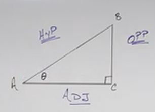
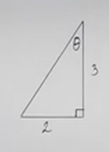

# Introduction to Right Triangle Trigonometry (Precalculus - Trigonometry 30)

[Video](https://www.youtube.com/watch?v=Sy_ZCtD2tWo)

---

Up until now, we have covered Trigonometry mainly as it relates to a Unit
Circle. In this lecture, and many of the lectures going forward, we are going to
now switch gears and investigate Trigonometry as it relates to a Triangle.

---

The following Diagram illustrates many of the fundamental components of
Trigonometric Functions and their respective data points as they relate to the
Unit Circle:

Let's now just focus on the Trianglle itself:

Oftentimes when you see Right Triangles illustrated in teaching Right Triangle
Trigonometry, you will see the Points of the Triangle labled Capital $A$, $B$,
and $C$, and the sides opposite the Angles of those points will be usually be
labled with little $a$, $b$, and $c$.

In order to find the Trignometric functions as we have done before (_i.e._
$\sin\theta$ and so on), then we are going to first need to label our sides
appropriately as hypotenuse, opposite, and adjacent to whatever angle
referenced, in this case that would be $\theta$.

First, just label the hypotenuse (the side opposite the right angle). We will
then label the side opposite the angle we are focused on, as well as the side
adjacent to the angle we are focused on (the adjacent side that is not the
hypotenuse):

Note that these sides change if we are measuring a different angle. Also note
that usually we are not focusing on the $90\degree$ right angle as our angle.

Now we can finally start to write out our Trigonometric Functions:

$$ \sin\theta = \frac{\text{opposite}}{\text{hypotenuse}} $$

$$ \cos\theta = \frac{\text{adjacent}}{\text{hypotenuse}} $$

$$ \tan\theta = \frac{\text{opposite}}{\text{adjacent}} $$

$$ \csc\theta = \frac{\text{hypotenuse}}{\text{opposite}} $$

$$ \sec\theta = \frac{\text{hypotenuse}}{\text{adjacent}} $$

$$ \cot\theta = \frac{\text{adjacent}}{\text{opposite}} $$

This is oftentimes a bit difficult to write out in its entirety, so we abreviate
by writing out the sides as lower case letters which are always opposite their
capital letter counterpart points:

$$ \sin\theta = \frac{a}{c} $$

$$ \cos\theta = \frac{b}{c} $$

$$ \tan\theta = \frac{a}{b} $$

$$ \csc\theta = \frac{c}{a} $$

$$ \sec\theta = \frac{c}{b} $$

$$ \cot\theta = \frac{b}{a} $$

There is a mnemonic device to help us remember this:

$$ \text{SOH-CAH-TOA} $$

Which stands for:

"Sine Opposite Hypotenuse - Cosine Adjacent Hypotenuse - Tangent Opposite
Adjacent".

---

## Pythagorean Theorem

We've seen the Pythagorean Theorem before when calculating lengths of axis or
radius on the Unit Circle, but really to get down to semantics, the Pythagorean
Theorem breaks down to:

$$ \left(\text{LEG}\right)^2 + \left(\text{LEG}\right)^2 = \left(HYP\right)^2 $$

Another semantic way of thinking about it is:

$$ \left(\text{ADJ}\right)^2 + \left(\text{OPP}\right)^2 = \left(HYP\right)^2 $$

And the classic way of expressing the Pythagorean Theorem is to take the lower
case letters which represent the sides/hypotenuse:

$$ a^2 + b^2 = c^2 $$

---

**Exercises**

---

Consider the following Right Triangle:

In order to find our Trigonometric Functions, we'll need all three sides of our
Triangle, whereas right now we only have two, so let's find the third (the
hypotenuse in this case):

$$ a^2 + b^2 = c^2 $$

$$ 3^2 + 2^2 = c^2 $$

$$ 9 + 4 = c^2 $$

$$ 13 = c^2 $$

$$ c = \sqrt{13} $$

We should leave this as an exact answer. Now we can find our Trigonometric
Functions:

$$ \sin\theta = \frac{2}{\sqrt{13}} = \frac{2\sqrt{13}}{13} $$

$$ \cos\theta = \frac{3}{\sqrt{13}} = \frac{3\sqrt{13}}{13} $$

$$ \tan\theta = \frac{2}{3} $$

$$ \csc\theta = \frac{\sqrt{13}}{2} $$

$$ \sec\theta = \frac{\sqrt{13}}{3} $$

$$ \cot\theta = \frac{3}{2} $$

---

Consider the following Right Triangle:

$$ a^2 + b^2 = c^2 $$

$$ a^2 + 3^2 = 4^2 $$

$$ a^2 + 9 = 16 $$

$$ a^2 = 7 $$

$$ a = \sqrt{7} $$

$$ \sin\theta = \frac{3}{4} $$

$$ \cos\theta = \frac{\sqrt{7}}{4} $$

$$ \tan\theta = \frac{3}{\sqrt{7}} = \frac{3\sqrt{7}}{7} $$

$$ \csc\theta = \frac{4}{3} $$

$$ \sec\theta = \frac{4}{\sqrt{7}} = \frac{4\sqrt{7}}{7} $$

$$ \cot\theta = \frac{\sqrt{7}}{3} $$

---

Consider the following Right Triangle:

$$ a^2 + b^2 = c^2 $$

$$ 2^2 + b^2 = (\sqrt{5})^2 $$

$$ 4 + b^2 = 5 $$

$$ b^2 = 1 $$

$$ b = 1 $$

$$ \sin\theta = \frac{1}{\sqrt{5}} = \frac{\sqrt{5}}{5} $$

$$ \cos\theta = \frac{2}{\sqrt{5}} = \frac{2\sqrt{5}}{5} $$

$$ \tan\theta = \frac{1}{2} $$

$$ \csc\theta = \frac{\sqrt{5}}{1} = \sqrt{5} $$

$$ \sec\theta = \frac{\sqrt{5}}{2} $$

$$ \cot\theta = \frac{2}{1} = 2 $$

---

## Complementary Trigonometric Functions

Recall that all angles within any Triangle add up to $180\degree$.

If the Triangle is a _Right Triangle_, that means that one of it's angle is
$90\degree$, that means the other two angles, when added together, equal
$90\degree$.

This is what this means when we say that two Angles are complementary:

$$ A + B = 90\degree $$

This fact creates an Identity for Trigonometric Functions as they relate to
Right Triangles which we will cover shortly.

But first, why are these Trigonometric Functions sometimes prepended with a "co"
prefix?

$$ \text{SINE} \rightarrow \text{COSINE} $$

$$ \text{TANGENT} \rightarrow \text{COTANGENT} $$

$$ \text{SECANT} \rightarrow \text{COSECANT} $$

What this means is that Co-Functions of Complementary Angles are equal. This can
be a bit to wrap your mind around at first, so let's elaborate.

Consider all our Trigionometric Functions:

$$
\begin{align*}
\sin{B} = \\
\cos{B} = \\
\tan{B} = \\
\cot{B} = \\
\csc{B} = \\
\sec{B} = \\
\end{align*}
$$

If we start to fill these out we'll get:

$$
\begin{align*}
\sin{B} = \frac{b}{c}\\
\cos{B} = \frac{a}{c}\\
\tan{B} = \frac{b}{a}\\
\cot{B} = \frac{a}{b}\\
\csc{B} = \frac{c}{b}\\
\sec{B} = \frac{c}{a}\\
\end{align*}
$$

If we then take the "Co"-function of the Complementary angle A, we'll see
something interesting:

$$
\begin{align*}
\sin{B} = \frac{b}{c} \text{, } \cos{A} = \frac{b}{c}\\
\cos{B} = \frac{a}{c} \text{, } \sin{A} = \frac{a}{c} \\
\tan{B} = \frac{b}{a} \text{, } \cot{A} = \frac{b}{a} \\
\cot{B} = \frac{a}{b} \text{, } \tan{A} = \frac{a}{b} \\
\csc{B} = \frac{c}{b} \text{, } \sec{A} = \frac{c}{b} \\
\sec{B} = \frac{c}{a} \text{, } \csc{A} = \frac{c}{a} \\
\end{align*}
$$

Hopefully this illustrates what we described before. Namely, and for
reiteration:

What this means is that Co-Functions of Complementary Angles are equal.

This leads to an Identity for us:

If:

$$ A + B = 90\degree $$

This also means:

$$ A = 90\degree - B $$

This means that:

$$  \sin{B} = \cos{(90\degree - B)}$$

And recall from our Trigonometric Identities in a previous lecture that:

$$ \sin\theta = \cos\left(\frac{\pi}{2} - \theta\right) $$

This is the exact same identity, and is true of all Co-Functions:

$$ \sin{B} = \cos(90\degree - B) $$

$$ \cos{B} = \sin(90\degree - B) $$

$$ \tan{B} = \cot(90\degree - B) $$

$$ \cot{B} = \tan(90\degree - B) $$

$$ \sec{B} = \csc(90\degree - B) $$

$$ \csc{B} = \sec(90\degree - B) $$

Let's practice this briefly:

---

Consider that we were asked to find the Co-Function of the following:

$$ \sin(30\degree) \rightarrow \text{ ?} $$

We could use Sine's Co-Function, Cosine, to express this as:

$$ \sin(30\degree) \rightarrow \cos(90\degree - 30\degree) $$

$$ \sin(30\degree) \rightarrow \cos(60\degree) $$

---

Consider that we were asked to find the Co-Function of the following:

$$ \tan(50\degree) \rightarrow \text{ ?} $$

$$ \tan(50\degree) \rightarrow \cot(90\degree - 50\degree) $$

$$ \tan(50\degree) \rightarrow \cot(40\degree) $$

---

Consider that we were asked to find the Co-Function of the following:

$$ \sec(5\degree) \rightarrow \text{ ?} $$

$$ \sec(5\degree) \rightarrow \csc(90\degree - 5\degree) $$

$$ \sec(5\degree) \rightarrow \csc(85\degree) $$

---

Now consider we were asked to evaluate the following:

$$ \sin(38\degree) - \cos(52\degree) = \text{ ?} $$

We can now use what we know about Co-Functions to change one function into
another and get matching Trigonometric Functions.

$$ \cos(52\degree) = \sin(90\degree - 52\degree) $$

$$ \cos(52\degree) = \sin(38\degree) $$

Now we substitute this in for our Cosine and get:

$$ \sin(38\degree) - \sin(38\degree) = \text{ ?} $$

$$ \sin(38\degree) - \sin(38\degree) = \boxed{0} $$

---

Let's do another:

$$ \tan(20\degree) - \frac{\cos(70\degree)}{\cos(20\degree)} = \text{ ?} $$

Now, we could just convert this into tangent by converting the numerator of our
Cosine fraction:

$$ \cos(70\degree) = \sin(90\degree - 70\degree) $$

$$ \cos(70\degree) = \sin(20\degree) $$

And then we can do:

$$ \tan(20\degree) - \frac{\sin(20\degree)}{\cos(20\degree)} = \text{ ?} $$

$$ \tan(20\degree) - \tan(20\degree) = \text{ ?} $$

$$ \tan(20\degree) - \tan(20\degree) = \boxed{0} $$

---

Consider the following:

$$ \cos(35\degree)\sin(55\degree) + \sin(35\degree)\cos(55\degree) = \text{ ?} $$

We actually could use the Sum to Product Formula here, but let's instead utilize
what is related to this particular lecture and solve this. If we can convert
these into squares of sine and cosine, we can set this equal to $1$:

$$ \cos(35\degree) = \sin(90\degree - 35\degree) = \sin(55\degree) $$

$$ \sin(55\degree)\sin(55\degree) + \sin(35\degree)\cos(55\degree) = \text{ ?} $$

$$ \sin(35\degree) = \cos(90\degree - 35\degree) = \cos(55\degree) $$

$$ \sin(55\degree)\sin(55\degree) + \cos(55\degree)\cos(55\degree) = \text{ ?} $$

$$ \sin^2(55\degree) + \cos^2(55\degree) = \boxed{1} $$

---

Consider the following:

$$ 1 + \tan^2(5\degree) - \csc^2(85\degree) = \text{ ?} $$

Here we'll probably need to use a known Identity from a previous lecture:

$$ 1 + \tan^2\theta = \sec^2\theta  $$

$$ \sec^2(5\degree) - \csc^2(85\degree) = \text{ ?} $$

And now we can convert Cosecant to Secant:

$$ \csc^2(85\degree) = \sec^2(90\degree - 85\degree) = \sec^2(5\degree) $$

$$ \sec^2(5\degree) - \sec^2(5\degree) = \text{ ?} $$

$$ \sec^2(5\degree) - \sec^2(5\degree) = \boxed{0} $$
