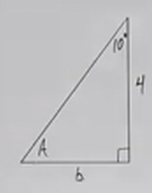
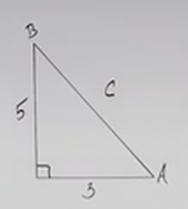
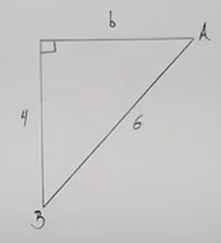
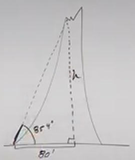

# Finding Sides and Angles with Right Triangle Trigonometry (Precalculus - Trigonometry 31)

[Video](https://www.youtube.com/watch?v=OHiZDKUwlQ4)

---

In this lecture, we're going to continue with what we've learned about Right
Angle Trigonometry. We will specifically learn how to solve for missing angles
and missing sides on a Right Triangle.

Before moving on though, it's important that we remember to keep things simple.
Oftentimes when we get into the weeds on things like Trigonometry, we forget
that sometimes the very basic pieces of information can lead us to an answer,
so:

1. Find the "easy" things first.

2. Use the Interior Angle Sum & the Pythagorean Theorem before using
   Trigonometric Formulas/Identities.

---

Consider the following Right Triangle:

First and foremost, ensure this is a Right Triangle, a lot of the
functions/formulas we have covered thus far will not work if the Triangle is not
a Right Triangle.

Next, label the hypotenuse to be clear (always the side opposite the right
angle).

If we are then asked to find the missing angle $A$, we should know that the
angles of any Triangle always add up to $180\degree$. Well we know that Angle
$B$ (angle opposite side $b$), is $10\degree$, and we have a $90\degree$ angle
by virtue of this being a Right Triangle. Thusly our angle $A$ must be
$80\degree$:

$$ A + B = 90\degree $$

$$ A + 10\degree = 90\degree $$

$$ A = 80\degree $$

Now we'll need to find our missing sides, $b$. We can't just use the Pythagorean
Theorem on this, because that requires at least two sides to be known. But we do
know angle $A$, and the side $a$:

$$ A = 80\degree \text{, } a = 4 $$

This means that if we take the Tangent of $A$, and set it to $4$ over the
hypotenuse $b$:

$$ \tan(80\degree) = \frac{4}{b} $$

And we can find $b$ by first multiplying by $b$:

$$ b\tan(80\degree) = 4 $$

$$ b\tan(80\degree) = 4 $$

Now we can find $b$ by dividinginby $\tan(80\degree)$:

$$ b = \frac{4}{\tan(80\degree)} $$

This is an _Exact_ Answer. We can get an Approximate answer using our
calculator:

$$ b \approx 0.71 $$

Now, if we were now asked to find the Hypotenuse, we would want to avoid using
this approximation if possible, as using an approximation further dilutes the
exactness of any answers derived from this approximation.

Instead of using the approximation for $b$ to solve for the hypotenuse, $c$
(using the Pythagorean Theorem), we could do the following:

$$ \sin(80\degree) = \frac{4}{c} $$

And we would evaluate this in a similar fashion:

$$ c\sin(80\degree) = 4 $$

$$ c = \frac{4}{\sin(80\degree)} $$

$$ c \approx 4.06 $$

---

Consider the following Right Angle Triangle:

Here we can use the Pythagorean Theorem to solve for the hypotenuse, $c$:

$$ a^2 + b^2 = c^2 $$

$$ 3^2 + 5^2 = c^2 $$

$$ 9 + 25 = c^2 $$

$$ 34 = c^2 $$

$$ c = \sqrt{34} $$

Now we can solve for the angle $A$ using our given sides $a$ and $b$:

$$ \tan A = \frac{5}{3} $$

We can now solve for $A$ using Inverse Tangent (Arctangent):

$$ \tan^{-1}(\tan A) = \tan^{-1}\left(\frac{5}{3}\right) $$

$$ A = \tan^{-1}\left(\frac{5}{3}\right) $$

We can get an approximation of this using our calculator:

$$ A \approx 59.0\degree $$

Note: When rounding an approximation, make sure to at least use one decimal
place (hence the $.0$ here).

Now, contrary to what you might think, you could just put this angle on your
Triangle for angle $A$, and use it in subtraction from $180\degree$ to find your
other angle $B$. The reason this works is because the approximation you'd get
from any other calculation using Trigonometric Functions will yield the same
result.

$$ A + B = 90\degree $$

$$ 59.0\degree + B \approx 90\degree $$

$$ B \approx 31.0\degree $$

Now, if you needed an exact answer, then yes, you'd have to use a Trigonometric
Function to find that:

$$ \tan B = \frac{3}{5} $$

$$ B = \tan^{-1}\left(\frac{3}{5}\right) $$

And this would be our _Exact_ Answer.

For curiousity, let's plug this into our calculator:

$$ B \approx 31.0\degree $$

This just demonstrates that we get the same approximation as we did from the Sum
of Angle Formula.

---

Let's find all our missing sides and angles.

Easiest one is to solve for side $b$:

$$ a^2 + b^2 = c^2 $$

$$ 4^2 + b^2 = 6^2 $$

$$ 16 + b^2 = 36 $$

$$ b^2 = 20 $$

$$ b = \sqrt{20} $$

$$ b = 2\sqrt{5} $$

Let's now solve for angle $A$:

$$ \sin A = \frac{4}{6} $$

$$ A = \sin^{-1}\left(\frac{4}{6}\right) $$

$$ A \approx 41.8\degree $$

We could just use the Sum of Angles Formula to find the rest:

$$ A + B = 90\degree $$

$$ 41.8\degree + B \approx 90\degree $$

$$ 41.8\degree + B \approx 90\degree $$

$$ B \approx 48.2\degree $$

Let's confirm with an exact answer for angle $B$:

$$ \cos B = \frac{4}{6} $$

$$ B = \cos^{-1}\left(\frac{4}{6}\right) $$

$$ B \approx 48.2\degree $$

---

Let's investigate a more real world example. Let's say we wanted to find the
height of something really tall?

Consider the following illustration of a Volcano:

We know that the distance from a base point at the bottom of the volcano to the
center of the volcano is $80 \text{ ft}$, and that from that same point, the
angle to the top of the volcano is $85.4\degree$, can we find the height, $h$ of
the volcano?

Sure, using the methods we have utilized thus far we can:

$$ \tan(85.4\degree) = \frac{h}{80} $$

$$ 80\tan(85.4\degree) = h $$

$$ h = 80\tan(85.4\degree) $$

Now, this is an exact answer, but since this is a real world example, we want to
get a usable approximation using our calculator:

$$ h \approx 994.31\text{ ft} $$
