# How to Use the Law of Sines in Trigonometry (Precalculus - Trigonometry 32)

[Video](https://www.youtube.com/watch?v=-izzbKILEM0)

---

In this lecture we are going to cover a Principle in Trigonometry called the Law
of Sines. This principle is usefully applied when solving problems involving
Non-Right Triangles, otherwise known as an _Oblique_ Triangle.

In Triangles, there are really only three states that a Triangle can be in in
regards to its angles:

**Right Triangle:**

1. It has one Right Angle and two Acute (less than $90\degree$) angles.

**Oblique Triangle:**

2. It has three Acute (less than $90\degree$) angles.

3. It has one Obtuse (greater than $90\degree$) angle and two Acute (less than
   $90\degree$) angles.

Right Angle Trigonometry is the subject we have been covering for the majority
of this lecture series.

Oblique Triangle Problems cannot be solved using Right Angle Trigonometry,
thusly we need methods like those defined using the Law of Sines to solve them.

---

## When To Use The Law Of Sines

The Law Of Sines is useful in four different problem scenarios:

1. You know 2 Angles & 1 Side:

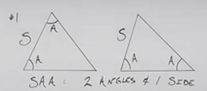

2. You know 2 Sides & 1 Angle that _is not_ between the 2 Sides:

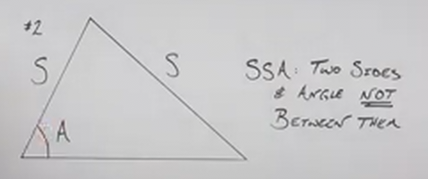

3. You know 2 Sides & 1 Angle that _is_ between the 2 Sides:

4. You know all 3 Sides:

The Law Of Sines is applied _only in the first two cases above_! The Law Of
Cosines, which will be covered in the subsequent lecture, is applied _only in
the latter two cases above_!

---

## The Law Of Sines

Consider the following Oblique Triangle:

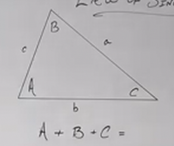

We know that for any Triangle, if you add up all their angles, you will get
$180\degree$.

$$ A + B + C = 180\degree $$

This is what is known as the _Interior Angle Sum_.

The Law Of Sines basically says that the Sine of Any Angle divided by its
opposite side will equal the Sine of Any Other Angle divided by its opposite
side:

$$ \frac{\sin A}{a} = \frac{\sin B}{b} = \frac{\sin C}{c} $$

Don't use all three in practice, this is just demonstrating a proportion.

If we simplify this as:

$$ \frac{\sin A}{a} = \frac{\sin B}{b} $$

We know that if we know 3 of these terms, we can find the 4th through
cross multiplication.

---

**Examples**

---

Consider the following Oblique Triangle:

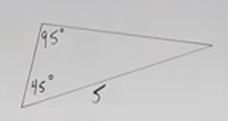

We can see that this is _not_ a Right Triangle. This means our thinking should
shift from Right Triangle Trigonometry to Oblique Triangle Trigonometry, and we
should be considering how to solve this using either the Law of Sines or the Law
of Cosines.

This is an example of being given a Triangle where we know 2 Angles and 1 Side
(an example of type 1 for a Law of Sines solution). Let's write out a generic
Law of Sines equality/proportion:

$$ \frac{\sin}{} = \frac{\sin}{} $$

Additionally, we should probably just fill in the missing angle via the Interior
Angle Sum Principle:

$$ A + B + C = 180\degree $$

$$ A + 95 + 45 = 180\degree $$

$$ A + 140\degree = 180\degree $$

$$ A = 40\degree $$

And now we can use the Law Of Sines Proportion to find the two unknown sides:

$$ \frac{\sin(95\degree)}{5} = \frac{\sin(40\degree)}{a} $$

And just cross multiply as per standard Algebra:

$$ a\sin(95\degree) = 5\sin(40\degree) $$

$$ a = \frac{5\sin(40\degree)}{\sin(95\degree)} $$

This is the exact solution, but we will use our calculator to approximate:

$$ a \approx  3.23 $$

It's important to note that you _cannot_ use the Pythagorean Theorem here, as we
are not working with a Right Triangle. Additionally, one of our side
measurements is an _approximation_, and will thusly dilute the exactness of any
other solutions derived from this approximate measurement.

Let's now solve for our last remaining side:

$$ \frac{\sin(95\degree)}{5} = \frac{\sin(45\degree)}{b} $$

$$ b\sin(95\degree) = 5\sin(45\degree) $$

$$ b = \frac{5\sin(45\degree)}{\sin(95\degree)} $$

$$ b \approx 3.55 $$

---

Consider the following Oblique Triangle:

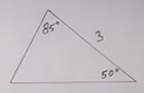

This is obviously not a Right Triangle. We are given 2 Angles and 1 Side (an
example of type 1 for problems to be solved using Law of Sines).

Let's first fill in the third angle using the Interior Angle Sum property:

$$ A + B + C = 180\degree $$

$$ A + 85\degree + 50\degree = 180\degree $$

$$ A + 135\degree = 180\degree $$

$$ A = 45\degree $$

Now let's find our other two sides using the Law Of Sines:

$$ \frac{\sin(45\degree)}{3} = \frac{\sin(50\degree)}{b} $$

$$ b\sin(45\degree) = 3\sin(50\degree) $$

$$ b = \frac{3\sin(50\degree)}{\sin(45\degree)} $$

$$ b \approx 3.25 $$

$$ \frac{\sin(45\degree)}{3} = \frac{\sin(85\degree)}{c} $$

$$ c\sin(45\degree) = 3\sin(85\degree) $$

$$ c = \frac{3\sin(85\degree)}{\sin(45\degree)} $$

$$ c \approx 4.23 $$

And these are our missing Angles/Sides:

Exact Solution:

$$ \boxed{A = 45\degree \text{, } b = \frac{3\sin(50\degree)}{\sin(45\degree)} \text{, } c = \frac{3\sin(85\degree)}{\sin(45\degree)}} $$

Approximate Solution:

$$ \boxed{A = 45\degree \text{ , } b \approx 3.25 \text{, } c \approx 4.23} $$

---

Let's now move onto the other scenario (type 2) where the Law Of Sines can be
used. Note that due to there being four different ways to solve this particular
type of problem, this is a more complicated/difficult problem to solve.

Consider the following Triangle:

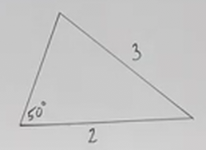

In this we are given Two Sides and One Angle (type 2 problem for solving with
Law Of Sine).

Note that because we don't know what the other two angles are, we actually don't
yet know if this Triangle is a Right Angle Triangle or an Oblique Angle
Triangle.

Note that you might accidentally use the Law Of Cosines here, but remember:

- We use the Law Of Sines when you have Two Sides with an Angle that _is not_
  between them.

- We use the Law Of Cosines when you have Two Sides with an Angle that _is_
  between them.

In this case, we have Two Sides with an Angle that _is not_ between them, and
thusly it calls for solving using the Law Of Sines:

$$ \frac{\sin(50\degree)}{3} = \frac{\sin B}{2} $$

And now we just cross multiply:

$$ 3\sin B = 2\sin(50\degree) $$

And then divide:

$$ \sin B = \frac{2\sin(50\degree)}{3} $$

Now here you take the Inverse Sine (Arcsine) of both sides. Now, recall that on
the Unit Circle that a Single Angle can give two equal outputs. This is where
one of our multiple options for solving this problem can occur.

$$ \sin^{-1}(\sin B) = \sin^{-1}\left(\frac{2\sin(50\degree)}{3}\right) $$

$$ B = \sin^{-1}\left(\frac{2\sin(50\degree)}{3}\right) $$

Now we approximate using our calculator:

$$ B \approx 30.7\degree $$

Now, recall that this angle gives us a positive $y$-coordinate on the Unit
Circle, but it does _not_ tell us whether that angle is within Quadrant I or
Quadrant II, this means that along the Unit Circle, this also would give us the
same point at $180\degree - 30.7\degree$.

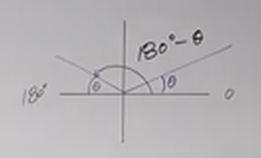

Thusly we have two _Potential_ Measurements for angle $B$, we'll need to make
note of this. Let's subscript two potential measurements for $B$ using
subscripts, and denote our two potential measurements like so:

$$ B_1 \approx 30.7\degree \quad B_2 \approx 180\degree - 30.7\degree $$

Which when evaluated for $B_2$ is:

$$ B_1 \approx 30.7\degree \quad B_2 \approx 149.3\degree $$

Now, look at our original Triangle and think if this makes sense, if we now
think on the Interior Angle Sum Principle, we realize that only one of our
angles makes sense:

$$ A + B + C = 180\degree $$

$$ 50\degree + 30.7\degree + C \approx 180\degree $$

$$ 80.7\degree + C \approx 180\degree $$

$$ C \approx 99.3\degree $$

Yes, this makes sense. This means that $B_1$ is a valid potential solution for
angle $B$. But what about $B_2$ ?

$$ 50\degree + 149.3\degree + C \approx 180\degree $$

$$ 199.3\degree + C \approx 180\degree $$

$$ C \approx -19.3\degree $$

This doesn't make sense as that means that $C$ would have a negative angle value
and we wouldn't have a Triangle then. Therefore $B_2$ is _not_ a valid solution.

We can now rewrite $B_1$ as the only valid solution for $B$, and therefore:

$$ B \approx 30.7\degree $$

And we also know that $C \approx 99.3\degree$.

We still have one last missing side to find, side $c$. Remember that we need to
avoid using approximations whenever possible, but in this case it's not
possible. At least not without getting very very complicated because we would
have to use the exact solution for $B$, subtract it $180\degree - 50\degree$,
and then use that as Angle $C$ instead of its approximation.

As an aside, this is how that would look:

$$ C = 180\degree - 50\degree - \sin^{-1}\left(\frac{2\sin(50\degree)}{3}\right) $$

$$ C = 130\degree - \sin^{-1}\left(\frac{2\sin(50\degree)}{3}\right) $$

And then we would use this in place for Angle $C$ within the Law Of Sines:

$$ \frac{\sin(50\degree)}{3} = \frac{\sin\left(130\degree - \sin^{-1}\left(\dfrac{2\sin(50\degree)}{3}\right)\right)}{c} $$

$$ c\sin(50\degree) = 3\sin\left(130\degree - \sin^{-1}\left(\dfrac{2\sin(50\degree)}{3}\right)\right) $$

$$ c = \frac{3\sin\left(130\degree - \sin^{-1}\left(\dfrac{2\sin(50\degree)}{3}\right)\right)}{\sin(50\degree)} $$

And the approximation for this complicated mess would be:

$$ c \approx 3.86 $$

Now, let's see how close we'd get to this approximation using the simpler Law Of
Sines method using the approximation for angle $B$:

$$ \frac{\sin(50\degree)}{3} \approx \frac{\sin(99.3\degree)}{c} $$

$$ c\sin(50\degree) \approx 3\sin(99.3\degree) $$

$$ c \approx \frac{3\sin(99.3\degree)}{\sin(50\degree)} $$

$$ c \approx 3.86 $$

As you can see, we get the same approximation, so for practical purposes, going
through the simpler Law Of Sines method gets us to an approximate answer faster.

That said, if you needed to know how to get an _Exact_ soltuion for $c$, we have
covered that somewhat complicated process here.

For clarity, here are our final answers:

Exact Answers:

$$ \boxed{B = \sin^{-1}\left(\frac{2\sin(50\degree)}{3}\right) \text{, } C = 130\degree - \sin^{-1}\left(\frac{2\sin(50\degree)}{3}\right) \text{, } c = \frac{3\sin\left(130\degree - \sin^{-1}\left(\dfrac{2\sin(50\degree)}{3}\right)\right)}{\sin(50\degree)}} $$

Approximate Answers:

$$ \boxed{B \approx 30.7\degree \text{, } C \approx 99.3\degree \text{, } c \approx 3.86} $$

Note that one way of double checking your work is to look at the Triangle you
drew. The Largest angle will always lie opposite the largest side, the smallest
angle will always lie opposite the smallest side, and the middle angle should
lie opposite a side with measurements that lie inbetween the largest and
smallest sides' measurements.

Lastly, also note that once filled in, the diagram might not look to scale, that
is okay, the diagram is just a _representation_ of a Triangle. If we look at our
final drawing:

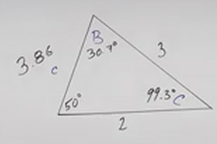

We'll note that $99.3\degree$ is an _Obtuse_ angle, it is greater than
$90\degree$ and our diagram is not visually indicating that. Again, this is
okay, it's just a _representation_ and does _not_ have to be to scale.

---

Consider this Triangle:

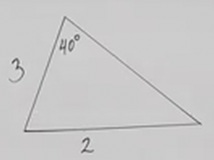

We are given Two Sides and One Angle Where the Angle is _not_ inbetween the two
given sides. This is the case (type 2) where we need to use the Law Of Sines to
solve the remaining Side and two Angles.

Right away, due to knowledge from the previous section and going forward, we
should anticipate that we are going to have two potential options for the first
angle we find.

We should probably label our triangle to start (we have been doing this thus
far, I just haven't been making note of it):

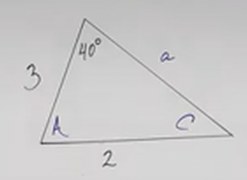

Let's now consider what isn't possible. We can't use any Right Angle
Trigonometry (_i.e._ Pythagorean Theorem) as we don't know if this is a Right
Angle Triangle or not. We also cannot use the Interior Angle Sum Property as we
don't know two of our three angles. Thusly we are left with the Law of Sines in
this case (again, because the angle given does _not_ lie inbetween the two given
sides, if it did, we would use the Law Of Cosines).

$$ \frac{\sin(40\degree)}{2} = \frac{\sin C}{3} $$

$$ 2\sin C = 3\sin(40\degree) $$

$$ \sin C = \frac{3\sin(40\degree)}{2} $$

$$ C = \sin^{-1}\left(\frac{3\sin(40\degree)}{2}\right) $$

$$ C \approx 74.6\degree $$

Again, we have to subscript $C$ into two possible solutions, as this could be
two angles along the Unit Circle. This means that $C$ could be $74.6\degree$
_or_ $180\degree - 74.6\degree$. Let's subscript $C$ into $C_1$ and $C_2$ as two
_potential_ solutions, and then use the Interior Angle Sum Formula to see if one
or both angles make sense:

$$ C_1 \approx 74.6\degree \quad C_2 \approx 180\degree - 74.6\degree $$

$$ C_1 \approx 74.6\degree \quad C_2 \approx 105.4\degree $$

Both degrees make sense given that neither, when added to $40\degree$ exceeds
the $180\degree$ limit for Triangles. This now splits off two possible solutions
for angle $A$ then:

$$ A_1 \approx 180\degree - 40\degree - 74.6\degree $$

$$ A_1 \approx 65.4\degree $$

$$ A_2 \approx 180\degree - 40\degree - 105.4\degree $$

$$ A_2 \approx 34.6\degree $$

And now we use the Law Of Sines on each of these to get an approximation for
side $a$, which we'll also subscript:

Let's start with $a_1$:

$$ \frac{\sin(40\degree)}{2} \approx \frac{\sin(65.4\degree)}{a_1} $$

$$ a_1\sin(40\degree) \approx 2\sin(65.4\degree) $$

$$ a_1 \approx \frac{2\sin(65.4\degree)}{\sin(40\degree)} $$

$$ a_1 \approx 2.83 $$

And now for $a_2$:

$$ \frac{\sin(40\degree)}{2} \approx \frac{\sin(34.6\degree)}{a_2} $$

$$ a_2\sin(40\degree) \approx 2\sin(34.6\degree) $$

$$ a_2 \approx \frac{2\sin(34.6\degree)}{\sin(40\degree)} $$

$$ a_2 \approx 1.77 $$

Again, we double check our work by making sure that the scales of our sides
correspond to the scales of our angles (largest angle opposite largest side,
smallest angle opposite smallest side, etc.)

Our final approximate answers are:

$$ a_1 \approx 2.83 $$

$$ a_2 \approx 1.77 $$

$$ \boxed{C_1 \approx 74.6\degree \text{, } C_2 \approx 105.4\degree \text{, } A_1 \approx 65.4\degree \text{, } A_2 \approx 34.6\degree \text{, } a_1 \approx 2.83 \text{, } a_2 \approx 1.77} $$

---

Consider the following Triangle:

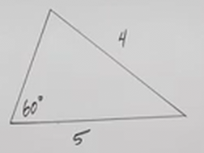

Let's go through the process again to really hammer it home.

We have Two Sides and a Single Angle. The Angle does _not_ lie inbetween the two
given sides, thusly we'll likely need to use the Law Of Sines (and _not_ the Law
of Cosines) to solve for our remaining side and two angles.

Let's label our triangle:

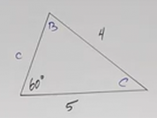

And now let's solve for angle $B$:

$$ \frac{\sin(60\degree)}{4} = \frac{\sin B}{5} $$

$$ 4\sin B = 5\sin(60\degree) $$

$$ \sin B = \frac{5\sin(60\degree)}{4} $$

$$ B = \sin^{-1}\left(\frac{5\sin(60\degree)}{4}\right) $$

If we plug this into our calculator, it is likely we'll get an error or a
complex number answer. If that is the case, then our answer for angle $B$ is
$\text{undefined}$.

But why?

Let's go backwards step by step. Prior to taking the inverse sine for $B$, let's
evaluate what $\sin B$ would be then. Plug the following into our calculator:

$$ \frac{5\sin(60\degree)}{4} \approx \text{ ?} $$

This gives us an approximation of:

$$ \frac{5\sin(60)}{4} \approx 1.08 $$

But if we think on this, the Range of Sine on the Unit Circle is between $0$ and
$1$ inclusive. We cannot go below $0$ or above $1$ !

And recall that the Domain of the Inverse Sine(Arcsine) is the Range of Sine,
therefore, by breaking the Domain Restriction for Inverse Sine, we have a
complex output that is, within this context, meaningless.

Again, this means that our final answer for all angles and sides for this
problem are undefined.

$$ \boxed{B = \text{undefined, } C = \text{undefined, } c = \text{undefined}} $$

Or, more succinctly, there is no solution:

$$ \boxed{\emptyset} $$

---

## Real World Example

Suppose that you are standing a certain distance away from a Volcano:

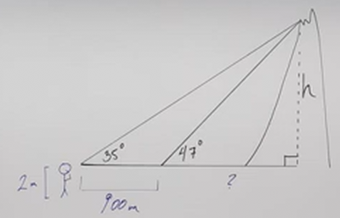

You measure at a _certain distance_ from the center of the Volcano, that the
angle from your _line of sight_ (this will become important at the end) to the
_top_ of the Volcano is $47\degree$.

**Can you still determine the height of the volcano if all you know is this
angle?**

Maybe, let's say we stood a further distance away, a _known_ distance of
$900\text{ meters}$ away from your original distance, and then were able to
determine that the angle between you and the _top_ of the Volcano was now
$35\degree$. Now you have a known distance, and two angles... starting to sound
familiar?

This is a two part process, we are first going to use the Law Of Sines to
determine the distance from your original position ($47\degree$) to the _top_ of
the volcano, and then use Right Triangle Trigonometry to determine the height of
the volcano.

Firstly if we'll need to get one of the sides in our Oblique Triangle. We can
find an Angle easily by subtracting: $180\degree - 47\degree = 133\degree$. This
is the angle next to the $35\degree$ angle. We can now separate out our Oblique
Triangle to gain a slightly clearer picture:

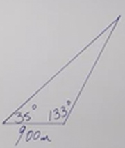

We know Two Angles, and a Side. This is type 1 of the problem types we are
supposed to look for when determining if we should use Law Of Sines.

First though, we should use the Interior Angle Sum Formula to determine our
third angle:

$$ 180\degree - 35\degree - 133\degree = c $$

$$ c = 12\degree $$

We can now use this third angle against our known distance of
$900\text{ meters}$ with one of our angles to determine another side, let's go
for the interior side (either one will work as we'll be using this as the
hypotenuse for some Right Triangle Trigonometry):

$$ \frac{\sin(35\degree)}{b} = \frac{\sin(12\degree)}{900} $$

$$ b\sin(12\degree) = 900\sin(35\degree) $$

$$ b = \frac{900\sin(35\degree)}{\sin(12\degree)} $$

$$ b \approx 2482.88 \text{ meters} $$

While not ideal, We can then use this approximation to ultimatley find the
height of the volcano.

Now we're in the realm of Right Angle Trigonometry.

Which Trigonometric Function will we use?

Let's consider the classic acronym $SOH \text{ - } CAH \text{ - } TOA$.

In determining which side we don't care about, we really don't care about the
Adjacent Side (the bottom side), as we're not trying to determine the distance
of us from the center of the Volcano, but rather the height of the Volcano.

Let's therefore use Sine to figure out our height. Briefly recall that:

$$ \sin\theta = \frac{\text{opposite}}{\text{hypotenuse}} $$

$$ \sin(47\degree) \approx \frac{h}{2482.88} $$

$$ h \approx 2482.88\sin(47\degree) $$

$$ h \approx 1815.86 \text{ meters} $$

Also note in our diameter, that we have to incorporate our own height of about
$2\text{ meters}$, so we add $2$ to our answer:

$$ h \approx 1815.86 \text{ meters} + 2\text{ meters} $$

$$ \boxed{h \approx 1817.86 \text{ meters}} $$
