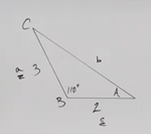

# How to Use the Law of Cosines in Trigonometry (Precalculus - Trigonometry 33)

[Video](https://www.youtube.com/watch?v=HOI_PnFG67Q)

---

In our previous lecture, we introduced and explroed the Law Of Sines and how
they can be utilized to solve for unknown Sides and Angles of Oblique Triangles.

Recall, however, that there were two cases that we alluded to where the Law Of
Sines could not be applied:

3. You know 2 Sides & 1 Angle that _is_ between the 2 Sides:

4. You know all 3 Sides:

We mentioned that the Law Of Sines could not be used to solve these kinds of
problems, and instead the Law Of Cosines would have to be used to solve these.

This lecture will explore the Law Of Cosines in depth so that you have a fuller
repetoire of tools at your disposal for solving these Oblique Triangle
Trigonometry Problems.

---

Consider we have an example Triangle like so:

Like the Law Of Sines, the Law Of Cosines establishes a relationship between the
angles and the sides that can be evaluated to find other angles/sides. The form
it takes looks rather different however:

$$ c^2 = a^2 + b^2 - 2ab\cos C $$

This works for finding the value of side $c$, which lies opposite angle $C$.

But we can utilize this for any side for which we know the angle:

$$ b^2 = a^2 + c^2 - 2ac\cos B $$

$$ a^2 = b^2 + c^2 = 2bc\cos A $$

And if we know all three sides, then we are solving for the angle, in which case
we would need to isolate $\cos A$ and then take the inverse of cosine (Arccos).

Let's do this now:

$$ c^2 = a^2 + b^2 - 2ab\cos C $$

$$ c^2 - a^2 - b^2 = -2ab\cos C $$

$$ -c^2 + a^2 + b^2 = 2ab\cos C $$

$$ a^2 + b^2 - c^2 = 2ab\cos C $$

$$ \frac{a^2 + b^2 - c^2}{2ab} = \cos C $$

$$  \cos C = \frac{a^2 + b^2 - c^2}{2ab} $$

$$  C = \cos^{-1}\left(\frac{a^2 + b^2 - c^2}{2ab}\right) $$

As a quick aside, think if the angle we are taking the cosine of is $90\degree$.
The Cosine of $90\degree$ is $0$. If we multiply the term $-2ab$ by $0$, we of
course get $0$, and we are left with:

$$ c^2 = a^2 + b^2 $$

Where $c$ is the hypotenuse, and this is the Pythagorean Theorem!

---

**Examples**

---

Consider the following Triangle:

Is this a right triangle? We don't know given the data we have, so we cannot
assume as such. We also don't know two angles, just one, so we can't use the
Interior Angle Sum Formula to determine our unknown angles (yet).

This means we'll use either the Law Of Sines or the Law Of Cosines to find our
missing angles/side.

We know two sides and one angle, the Angle _is_ inbetween the two given sides,
this means that we use the Law of Cosines (not the Law Of Sines, which would be
done if the given angle _is not_ inbetween the two given sides).

Let's label our triangle:

Note that if you were to try to use the Law Of Sines, you'd quickly find out
that you couldn't do it, as you'd have too many missing pieces of information to
find an angle/side.

The intuition that we should go from here on is to solve for the side that is
opposite the known angle, of which we only have one, angle $A$. Thusly let's
solve for side $a$:

$$ a^2 = b^2 + c^2 - 2bc\cos A $$

$$ a^2 = (4)^2 + (3)^2 - 2(4)(3)\cos(30\degree) $$

$$ a^2 = 16 + 9 - 24\cos(30\degree) $$

$$ a^2 = 25 - 24\cos(30\degree) $$

$$ a = \sqrt{25 - 24\cos(30\degree)} $$

$$ a \approx 2.05 $$

Note here that now we have enough data to solve using the Law Of Sines if we
want to! We also could use the Law Of Cosines, just the other aspect of it where
we take the inverse since we know the lengths of all three sides.

Let's solve for angle $C$:

$$ C = \cos^{-1}\left(\frac{a^2 + b^2 - c^2}{2ab}\right) $$

$$ C \approx \cos^{-1}\left(\frac{(2.05)^2 + (4)^2 - (3)^2}{2(2.05)(4)}\right) $$

$$ C \approx 46.9\degree $$

At this point you could use the Interior Angle Sum Formula to find angle $B$. We
also could use the Law Of Cosines to solve for angle $B$, and better yet, we can
use these two methods to check our work:

Let's first use the Interior Angle Sum Formula to find $B$:

$$ B \approx 180\degree - 30\degree - 46.9\degree $$

$$ B \approx 103.1\degree $$

Let's now double check our work using the Law Of Cosines For angle $B$:

$$ B = \cos^{-1}\left(\frac{a^2 + c^2 - b^2}{2ac}\right) $$

$$ B \approx \cos^{-1}\left(\frac{(2.05)^2 + (3)^2 - (4)^2}{2(2.05)(3)}\right) $$

$$ B \approx 103.1\degree $$

And yes, that verifies the angle we got for $B$ using the Interior Angle Sum
Formula. We are done. Here are our final approximate answers:

$$ \boxed{a \approx 2.05 \text{, } C \approx 46.9\degree \text{, } B \approx 103.1\degree} $$

---

Consider the following Triangle:

We're not sure if its a Right Triangle. In this case we know NO sides, and we
know all 3 sides. This means we only need to use the Law Of Cosines solving for
the Angle, not for the Side.

We have a few options. While you do indeed have to use the Law Of Cosines at
least once the first time, once we have one angle, we can actually use the Law
Of Sines the second time if we want, but because Law Of Sines can sometimes
return multiple answers which we have to check, it is advised that we use the
Law Of Cosines again for each angle.

Let's first label the angle opposite the largest side as $A$:

Okay, but why the angle opposite the largest side? Well, if $A$ is $90\degree$,
we can convert to using the Right Angle Trigonometry which is far easier to
reason about. Also, one of the better scenarios we have for using the Law of
Sines is if we are solving for what is obviously the smallest angle/side, as
that is not going to give us a second (false) answer.

This angle $A$ will be the angle we solve for first.

Let's now label out the rest of our Triangle.

Let's now solve for angle $A$:

$$ A = \cos^{-1}\left(\frac{b^2 + c^2 - a^2}{2bc}\right) $$

$$ A = \cos^{-1}\left(\frac{(5)^2 + (4)^2 - (8)^2}{2(5)(4)}\right) $$

$$ A \approx 125.1\degree $$

Because we now have found the _largest_ angle, we actually can safely use the
Law Of Sines to solve for our _smallest_ angle, which in this case is $C$, as it
lies opposite our smallest side $c = 4$. This is because the smallest angle is
guaranteed to be an acute angle, and the $180\degree - \theta$ rule does not
apply to the Law of Sines in this case as that will undoubtedly result in the
middle angle being negative. Let's take a look:

$$ \frac{\sin(125.1\degree)}{8} = \frac{\sin C}{4} $$

$$  8\sin C = 4\sin(125.1\degree) $$

$$  \sin C = \frac{4\sin(125.1\degree)}{8} $$

$$  C = \sin^{-1}\left(\frac{4\sin(125.1\degree)}{8}\right) $$

$$  C \approx 24.1\degree $$

We could have also used The Law Of Cosines to solve for $C$:

$$ C = \cos^{-1}\left(\frac{a^2 + b^2 - c^2}{2ab}\right) $$

$$ C = \cos^{-1}\left(\frac{(8)^2 + (5)^2 - (4)^2}{2(8)(5)}\right) $$

$$ C \approx 24.1\degree $$

We now can use the Interior Angle Sum Formula to easily solve for $B$:

$$ B \approx 180\degree - 125.1\degree - 24.1\degree $$

$$ B \approx 30.8\degree $$

We can also use the Law Of Cosines to double check for $B$:

$$ B = \cos^{-1}\left(\frac{a^2 + c^2 - b^2}{2ac}\right) $$

$$ B = \cos^{-1}\left(\frac{(8)^2 + (4)^2 - (5)^2}{2(8)(4)}\right) $$

$$ B \approx 30.8\degree $$

We also can double check by making sure that largest angle corresponds with
largest side, smallest angle with smallest side, etc.

Our final approximations are:

$$ \boxed{A \approx 125.1\degree \text{, } C \approx 24.1\degree \text{, } B \approx 30.8\degree} $$

---

Consider the following Triangle:

This cannot be a Right triangle, as $90\degree + 110\degree$ exceeds
$180\degree$. We have a given angle _inbetween_ two given sides, which means we
should use the Law Of Cosines to solve for our unknown side and angles.

Let's label our Triangle:

We have to find a side first, and the only one we can solve for is $b$. Let's do
that:

$$ b^2 = a^2 + c^2 - 2ac\cos B $$

$$ b^2 = (3)^2 + (2)^2 - 2(3)(2)\cos(110\degree) $$

$$ b^2 = 9 + 4 - 12\cos(110\degree) $$

$$ b^2 = 13 - 12\cos(110\degree) $$

$$ b = \sqrt{13 - 12\cos(110\degree)} $$

$$ b \approx 4.14 $$

You can now use either the Law Of Sines or the Law Of Cosines now. Which should
you use? Well Law Of Sines can give us two different answers if we were not
given the largest angle, but we were. In that case, it is advised that we can
use the Law of Sines to solve for the _smallest_ angle, as it is guaranteed to
only be the return value of the inverse Sine (ArcSine) function. We also could
use Law Of Cosines again.

Let's solve using both for demonstration purposes, starting with the Law Of
Sines:

$$ \frac{\sin(110\degree)}{4.14} \approx \frac{\sin C}{2} $$

$$ 4.14\sin C \approx 2\sin(110\degree) $$

$$ \sin C \approx \frac{2\sin(110\degree)}{4.14} $$

$$ C \approx \sin^{-1}\left(\frac{2\sin(110\degree)}{4.14}\right) $$

$$ C \approx 27.0\degree $$

Let's now see if we get the same answer using the Law Of Cosines:

$$ C = \cos^{-1}\left(\frac{a^2 + b^2 - c^2}{2ab}\right) $$

$$ C \approx \cos^{-1}\left(\frac{(3)^2 + (4.14)^2 - (2)^2}{2(3)(4.14)}\right) $$

$$ C \approx 27.0\degree $$

At this point it's probably worth noting that if you can use the Law Of Cosines
to solve for these sorts of problems, do so. The fact that there isn't a
potential for a second answer as there is with the Law Of Sines is a big
deciding factor in the thinking here.

At this point, we can use the Interior Angle Sum to find our last angle $A$:

$$ A \approx 180\degree - 110\degree - 27.0\degree $$

$$ A \approx 43.0\degree $$

Of course, we can use the Law Of Cosines to double check our approximation for
$A$:

$$ A = \cos^{-1}\left(\frac{b^2 + c^2 - a^2}{2bc}\right) $$

$$ A \approx \cos^{-1}\left(\frac{(2)^2 + (4.14)^2 - (3)^2}{2(2)(4.14)}\right) $$

$$ A \approx 43.0\degree $$

Our final approximate answers are:

$$ \boxed{b \approx 4.14 \text{, } C \approx 27.0\degree \text{, } A \approx 43.0\degree} $$

---

## Real World Example

Let's say you are flying from city $A$ to city $B$. Let's say we are traveling
at $220 \text{ mph}$. Let's also say that the distance between city $A$ and city
$B$ is $330 \text{ mi}$.

Let's say that after $15 \text{ minutes}$, the pilot discovered that they have
been traveling $10\degree$ off course.

**What Course Correction does the pilot have to make at 15 minutes after he left
city $A$ in order to reorient course back towards city $B$**

And:

**At What Speed Does The Pilot have to make in order to get to city $B$ in a 90
minutes?**

Now, it initially looks like we cannot solve this problem using the
Trigonometric Methods we have on hand (or at all for that matter). We need at
least two angles and a side, or at least two sides and an angle (or all three
sides, or all three angles), to solve these sorts of problems. We only have one
angle and one side of our triangle here.

But we were given other information. We know that we are traveling at $220
\text{ mph}$ and that we have been traveling for $15 \text{ minutes}$ so far.
That is $\dfrac{1}{4} \text{ hour}$.

If we recall the Distance formula:

$$ \text{DISTANCE} = \text{RATE} \cdot \text{TIME} $$

Then we can plug that in to discover the distance we have traveled so far and
fill in one of the sides of our given triangle diagram:

$$ D = R \cdot T $$

$$ D = 220\text{ mph} \cdot \frac{1}{4} \text{ hours} $$

$$ D = 55 \text{ miles} $$

Now we know the miles we've travelled off course:

Now we have enough information to solve using one of our Trigonometric Methods.
Is this a Right Triangle? We Don't know, so we can't use any Right Triangle
Trigonometry.

Can we use the Law Of Sines, well the Law Of Sines requires us to know an angle
that _does not_ lie inbetween two given sides, we don't.

We only have an angle that lies _inbetween_ two given sides, this means we need
to use the Law Of Cosines to solve for our remaining side (the distance it will
take us to get to city $B$), and the angle ($180\degree$ minus the angle we'll
need to Course Correct).

Let's label the sides of our Triangle for clarity:

Let's first solve for side $a$ (which will be the distance we'll need to travel
to get to city $B$).

$$ a^2 = b^2 + c^2 - 2bc\cos A $$

$$ a^2 = (55)^2 + (330)^2 - 2(55)(330)\cos(10\degree) $$

$$ a^2 = 3025 + 108900 - 36300\cos(10\degree) $$

$$ a^2 = 111925 - 36300\cos(10\degree) $$

$$ a = \sqrt{111925 - 36300\cos(10\degree)} $$

$$ a \approx 276.0 \text{ miles} $$

Now, we'll want to solve for angle $C$ so that we can subtract it from
$180\degree$ to find the angle we need to course correct for.

We could use the Law Of Sines to solve for $C$, but it would be ill advised.
Why? Well because $C$ is going to be our largest angle as indicated by the
longest distance being opposite it ($330 \text{ miles}$). $C$ is an _Obtuse_
angle and thusly we would have to consider the fact that the Inverse Sine
(Arcsine) Function could return us two different answers. We don't want to risk
getting that big of an incorrect answer, so we'll use the Law Of Cosines
instead:

$$ C = \cos^{-1}\left(\frac{a^2 + b^2 - c^2}{2ab}\right) $$

$$ C \approx \cos^{-1}\left(\frac{(276.0)^2 + (55)^2 - (330)^2}{2(276.0)(55)}\right) $$

$$ C \approx 168.0\degree $$

Now, this is not our Course Correct, our course Correction, which we'll just
label as $D$, is approximately $180\degree - 168.0\degree$:

$$ D \approx 180\degree - 168.0\degree $$

$$ D \approx 12.0\degree $$

Now, the last part of our question asks how fast will the pilot have to travel
if he still wants to arrive at city $B$ in $90 \text{ minutes}$ ?

Keep in mind that we already traveled for $15 \text{ minutes}$ !

This means that we have our remaining distance of $276.0 \text{ miles}$ to
travel in $90 \text{ minutes} - 15 \text{ minutes}$.

We can still use our Distance formula to find the speed, we just have to adjust
this accordingly:

$$ D = R \cdot T $$

$$ 276\text{ miles} = R \text{ mph} \cdot \frac{75}{60} \text{ hours} $$

$$ 276 = R \cdot \frac{75}{60} $$

$$ R = 276\left(\frac{60}{75}\right) $$

$$ R \approx 220.8 \text{ mph} $$

So again, the Course Correction the Pilot will have to make is:

$$ \boxed{D \approx 12.0\degree} $$

And the speed at which he will have to travel in order to still get to city $B$
in $90 \text{ minutes}$ is:

$$ \boxed{R \approx 220.8 \text{ mph}} $$
