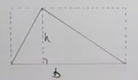

# How to Find the Area of a Triangle with Trigonometry (Precalculus - Trigonometry 34)

[Video](https://www.youtube.com/watch?v=_i9t-ldjG7o)

---

In this lecture, we are going to cover how to find the area of a Triangle. One
might think one already knows how to do this, and that's true, but given our
understanding of other Trigonometric Properties now, we actually have the tools
to determine the Area of a Triangle even if we are missing some data like the
height.

This is possible if we know two sides of a Triangle and the angle between them,
or if we know all three sides. This sounds a lot like the Law Of Cosines, which
we covered in the previous lecture. And that is because the same known points
needed to solve for the angle and sides of a triangle in the Law Of Cosines are
the same properties needed to be known to solve for the Area of a Triangle
without knowing the height.

Specifically, we need to know two sides, and the angle that lies between them.

---

**How To Find The Area Of A Triangle**

Let's review how you find the Area Of A Triangle. The simple idea behind finding
the Area of a Triangle is extrapolating upon how to find the area of a
Rectangle.

The entire area of the outlined rectangle would simply be the base $b$
multiplied by the height $h$.

$$ A = b \cdot h $$

And since we doubled up on the sub-triangles within this rectangle, we can
simply divide the area by $2$ to get the area for the whole triangle, which
we'll reference using the variable $k$:

$$ k = \frac{1}{2}b \cdot h $$

---

**Finding The Area Of A Triangle Given 2 Sides And An Angle Between Them (no
height)**

Now, let's say we have no knowledge of what the height, $h$ is? Can we still
figure out the area of a Triangle?

If the answer was no, there wouldn't be a lecture on it, so of course, there is.

Let's start with our classic area of a triangle formula:

$$ k = \frac{1}{2}b \cdot h $$

If we take the left hand slice of our triangle from the right angle along the
dotted line, we can identify the standard hypotenuse, adjacent, and opposite
sides:

This means we can use the Sine property of Right Angle Triangles to create a
formula to find our height:

$$ \sin\theta = \frac{\text{opposite}}{\text{hypotenuse}} $$

$$ \sin C = \frac{h}{a} $$

And this means we can find the height with:

$$ h = a\sin C $$

And we could substitute this into our original triangle area formula:

$$ k = \frac{1}{2}b\left(a\sin C\right) $$

We can rewrite this as:

$$ k = \frac{1}{2}ab\sin C $$

Note here that we still don't know the height $h$, we just know a formula to
find it based off what we do know.

In order for this to work, we have to know the length of sides $a$ and $b$, as
well as the angle between them, angle $C$.

These can work regardless of which sides you know, again, as long as there is a
known angle between them:

$$ k = \frac{1}{2}ab\sin C $$

$$ k = \frac{1}{2}bc\sin A $$

$$ k = \frac{1}{2}ac\sin B $$

---

**Example**

---

Consider the following Triangle:

We don't know if this is a Right Triangle, we don't know much about it save for
what we need to know to find the area: two sides and the angle between them.

$$ k = \frac{1}{2}ab\sin C $$

$$ k = \frac{1}{2}(3)(4)\sin(30\degree) $$

$$ k = \frac{1}{2}(12)\sin(30\degree) $$

$$ k = 6\sin(30\degree) $$

$$ k = 3 \text{ square units} $$

---

Consider the following Triangle:

This fits perfectly as usual, we know two sides and the angle between:

$$ k = \frac{1}{2}ab\sin C $$

$$ k = \frac{1}{2}(4)(1)\sin(120\degree) $$

$$ k = \frac{1}{2}(4)\sin(120\degree) $$

$$ k = 2\sin(120\degree) $$

$$ k = \sqrt{3} \text{ square units} $$

$$ k \approx 1.73 \text{ square untis} $$

---

**Finding The Area Of A Triangle Given All 3 Sides**

Let's see what happens if we know all three sides, but no angles:

Can we still find the area? Yes we can, using a Formula known as
[Heron's Formula](https://en.wikipedia.org/wiki/Heron%27s_formula).

Essentially Heron's formula calls for a two step process:

1. Add up all your sides and multiply them by $\dfrac{1}{2}$, afterwards which
   take that calculated value and set it equal to a variable called $S$:

   $$ S = \frac{1}{2}(a + b + c) $$

2. You can then use $S$ to calculate for the area of the Triangle, $k$ using the
   following formula:

   $$ k = \sqrt{S(S - a)(S - b)(S - c)} $$

We will not take the time to prove this Formula here, but trust that to solve
the area of a Triangle given only all three sides and no area would require
quite a bit of Trigonometry to find it.

---

**Example**

---

Consider the following Triangle:

Let's use Heron's Formula to figure out the Area of this Triangle:

$$ S = \frac{1}{2}(9 + 6 + 4) $$

$$ S = \frac{1}{2}(19) $$

$$ S = \frac{19}{2} $$

$$ k = \sqrt{\left(\frac{19}{2}\right)\left(\frac{19}{2} - 9\right)\left(\frac{19}{2} - 6\right)\left(\frac{19}{2} - 4\right)} $$

$$ k \approx 9.56 \text{ square units}  $$

---

Consider the following Triangle:

Let's find the area of the Triangle using Heron's Formula:

$$ S = \frac{1}{2}(5 + 9 + 8) $$

$$ S = 11 $$

$$ k = \sqrt{11(11 - 5) (11 - 9)(11 - 8)} $$

$$ k \approx 19.90 \text{ square units} $$
