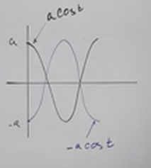
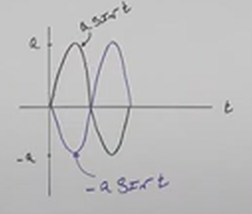

# Simple Harmonic Motion in Trig (Precalculus - Trigonometry 35)

[Video](https://www.youtube.com/watch?v=qTXlBIgny10)

---

In this lecture, we're going to step away from Triangle Trigonometry, and talk
specifically about the graphs of Cosine and Sine again, this time in regards to
a new property of these functions we haven't covered yet. A property called
Simple Harmonic Motion.

---

## What Is Simple Harmonic Motion

Simple Harmonic Motion is a Vibratory Motion that does not lessen over time.
Essentially, you start a process that continues going up and down along a graph,
back and forth forever without "dampening" (lessening in the variation of the
waves of the graph).

Simple Harmonic Motion can be modeled using what is known as the
[Sinusoidal Functions](https://en.wikipedia.org/wiki/Sine_wave). These are very
essentially the Sine And Cosine Functions without being
manipulated/multiplied/shifted. They are simply bounded by an upper and lower
curve.

Consider the following notation that is used to denote these functions:

$$ d = a\cos(\omega t) \text{ or } d = a\sin(\omega t) $$

The variable $d$ stands for the _Displacement From Rest_:

$$ d = \text{Displacement From Rest} $$

This is the amount of distance from its _Resting Postition_ and where the
function currently is over a period of time. We have two functions that are used
to calculate this which we have familiarity with at this point, those of Cosine
and Sine.

We have already seen many of these other factors coming after $d$. We have seen
our _Amplitude_, represented by $a$. The _Amplitude_, $a$, represents how far
away our function gets from the _Resting Position_. In fact the absolute value
of $a$ is all we need to know for the _Amplitude_:

$$ |a| = \text{Amplitude} $$

We know that $\omega$ relates to the Period of our function, and $t$ is time.

We know we can calculate the natural period of Sine/Cosine, which is $2\pi$, by
dividing it by $\omega$, which essentially represents how quickly we cycle
through a single period. With this in mind, we know therefore that the Period of
our function, $d$, can be calculated like so:

$$ T = \frac{2\pi}{\omega} $$

Likewise, we can use the reciprocal of our Period to find out the Frequency,
$f$. $f$ represents how many oscillation per time interval does our function go
through in one period.

$$ f = \frac{\omega}{2\pi} $$

---

**Some Important Points**

- If you are at a Starting Position that is away from your _Rest_, then you will
  use the Cosine variant of this Simple Harmonic Motion Formula.

  

- If you are at a Starting Position that is at your _Rest_, then you will use
  the Sine variant of this Simple Harmonic Motion Formula.

  

---

**Real World Example**

Let's say you have a sign that hangs from a spring. You pull it down
$7 \text{ inches}$ and let it go. It takes $4 \text{ seconds}$ to come back to
where you released it.

In this hypothetical scenario, we have to assume that the motion will go on
forever

If you think about it, we are pulling the spring _down_, this means that the
model that most closely represents this scenario is starting _away_ from our
_Rest_ and in the _negative_ direction.

When we say it takes $4 \text{ seconds}$ for it to come back to where you
released it, what we mean is that it takes $4 \text{seconds}$ for it to return
to the _Rest_ position.

Let's now define some properties given the problem statement. What is our
_Amplitude_, $a$ ?

$$ a = \text{ ?} $$

Well we were given that in the problem statement, the amplitude is $7 \text{
inches}$, specifically we start from $-7 \text{ inches}$:

$$ a = -7 $$

Now, let's find our Period, and we're going to from this find $\omega$.

$$ T = \frac{2\pi}{\omega} $$

But we know our Period actually, it's $4 \text{ seconds}$.

$$ 4 = \frac{2\pi}{\omega} $$

And we can now solve for $\omega$:

$$ 4\omega = 2\pi $$

$$ \omega = \frac{2\pi}{4} $$

$$ \omega = \frac{\pi}{2} $$

And our Frequency, $f$, is just the reciprocal of our Time:

$$ f = \frac{\omega}{2\pi} $$

$$ f = \frac{\dfrac{\pi}{2}}{2\pi} $$

$$ f = \frac{\pi}{2} \cdot \frac{1}{2\pi} $$

$$ f = \frac{\pi}{4\pi} $$

$$ f = \frac{1}{4} $$

Very specifically this is our oscillations per second. So our frequency is
$\dfrac{1}{4}$ oscillations per second.

From here, we can now build our _Displacement Formula_, $d$:

Now, which one do we use? Well we are _not_ starting at _Rest_, so we should use
Cosine:

$$ d = a\cos(\omega t) $$

$$ d = -7\cos\left(\frac{\pi}{2}t\right) $$

---

Let's move onto another example.

Let's say we already know we have an Amplitude of some Simple Harmonic Motion.
We know this to be $4$:

$$ |a| = 4 $$

Let's say we also know that it takes $\dfrac{\pi}{2} \text{ seconds}$ for it to
return to _Rest_:

$$ T = \frac{\pi}{2} $$

We have pushed up this Harmonic Motion up $4 \text{ feet}$ and then let go.

In this, we have a pretty complete picture of our displacement already. In fact,
we know that at the beginning, when $t = 0$, we already have a displacement
value of $4$:

$$ d = 4 \text{ at } t = 0 $$

When we "let it go", the displacement is already at $4$, and our time is $0$. As
soon as we let it go, the time increases while the displacement starts to
decrease. At some point, because this is a Harmonic motion, the displacement,
$d$, will start to "rebound" and start to increase, only to continually decrease
and increase forever.

So let's review what we know:

$$ a = 4 $$

$$ T = \frac{\pi}{2} $$

From our Period, $T$, we can find our $\omega$ and our frequency:

$$ T = \frac{2\pi}{\omega} $$

$$ \frac{\pi}{2} = \frac{2\pi}{\omega} $$

$$ \frac{\pi}{2}\omega = 2\pi $$

$$ \omega = 2\pi \cdot \frac{2}{\pi} $$

$$ \omega = \frac{4\pi}{\pi} $$

$$ \omega = 4 $$

And our frequency is just the reciprocal of our Period:

$$ f = \frac{\omega}{2\pi} $$

$$ f = \frac{4}{2\pi} $$

$$ f = \frac{2}{\pi} $$

And we can find our Displacement function $d$. Because we are not starting from
_Rest_, we will use the Cosine variation of our Displacement Formula:

$$ d = a\cos(\omega t) $$

$$ d = 4\cos(4t) $$

Let's now double check our work, we know that our starting time is $0$:

$$ t = 0 $$

If we then evaluate our Displacement Function using $t = 0$:

$$ d = 4\cos(4(0)) $$

$$ d = 4\cos(0) $$

$$ d = 4(1) $$

$$ d = 4 $$

And this is how much we pushed up at time $0$, $4 \text{ feet}$.

Now, once we release, which direction will it go? It will fall, positive Cosine
Functions along a Simple Harmonic Motion fall upon release, negative Cosine
Functions along a Simple Harmonic Motion rise upon release. We pushed it up $4
\text{ feet}$ at the start before releasing and therefore it falls.

---

Let's we have a similar problem as the prior, but we _start_ at _Rest_? Let's
say we "hit" some object along a paddle like a ball on a string, and we aim it
upwards, then it reaches a certain limit along the string and it then starts to
fall down, only to go up again after a certain period. How would this adjust our
formula? Well in this case, since we are _starting_ at _Rest_, we would use Sine
in our Displacement formula:

$$ d = a\sin(\omega t) $$

$$ d = 4\sin(4 t) $$

This may not look all that different, but if you think on it, if we start at t =
0$ and take the Sine of that:

$$ t = 0 $$

$$ d = 4\sin(4(0)) $$

$$ d = 4\sin(0) $$

Well the Sine of $0$ is $0$, and our displacemnt also becomes $0$:

$$ d = 4\sin(0) $$

$$ d = 4(0) $$

$$ d = 0 $$

Which makes sense, we started at $0$ and only upon "hitting" the ball did we
start moving time forward and the displacement started to increase. At $T =
\frac{\pi}{2} \text{ seconds}$, the Period has been reached, and the ball
changes direction and starts to fall, at another Period seconds, it will start
to rise again and so on forever.

If our amplitude had been negative:

$$ d = -4\sin(4 t) $$

This simply means that our initial movement would have been downward, as if we
had hit the ball _down_ towards the ground instead of upwards.

---

Let's say we are given the Displacement Function outright for some object:

$$ d = 5\sin(3t) $$

Let's fill out these properties just so we get an idea of what exactly this
means:

$$
\begin{align*}
\text{Motion: } \\
\text{Max Displacement: } \\
\text{Time for 1 oscillation: } \\
\text{Frequency: } \\
d \text{ at } t = 0 \\
\text{Initial Motion at } t = 0 \\
\end{align*}
$$

We haven't covered Damped Harmonic Motion yet, but essentially this is a
Harmonic Motion that decreases over time. It would have an actual decreasing
exponential, $e^{-n}$. We don't see that, so this means that our Graph will
continue to oscillate over and over forever. This means that we have a _Simple
Harmonic Motion_.

What about the Maximum Displacement? How far does our Motion get away from its
_Rest_? Well that is indicated by our _Amplitude_, that would be the number
positive $5$, meaning $5 \text{ units}$.

What about Time for $1$ oscillation? Well this is just another way of asking for
the _Period_, which is represented for both Sine and Cosine as
$\dfrac{2\pi}{\omega}$. We can see in our given formula, $d$, that $\omega = 3$,
so we could represent our period as:

$$ T = \frac{2\pi}{3} $$

Specifically:

$$ T = \frac{2\pi}{3} \text{ seconds} $$

Our Frequency is always the reciprocal of our Period:

$$ f = \frac{3}{2\pi} $$

Specifically:

$$ f = \frac{3}{2\pi} \text{ oscillations per second} $$

What about our displacement at time $0$ ? In this case we actually can fill in
our given displacement function and find out, because this is asking us for $d$
at $t = 0$.

$$ d = 5\sin(3t) $$

$$ d = 5\sin(3(0)) $$

$$ d = 5\sin(0) $$

$$ d = 5(0) $$

$$ d = 0 $$

And this means that the position of our object is at _Rest_ when the
displacement starts.

And finally, what is our Initial Motion at start, at $t = 0$ ?

Well a positive Sine function climbs, as opposed to falling. This is because our
Amplitude is positive. So our function starts to climb rather than fall.

$$
\begin{align*}
\text{Motion: Simple Harmonic Motion} \\
\text{Max Displacement: } 5 \text{ units} \\
\text{Time for 1 oscillation: }  \frac{2\pi}{3} \text{ seconds} \\
\text{Frequency: } \frac{3}{2\pi} \text{ oscillations per second} \\
d \text{ at } t = 0 \text{: } 0 \text{ ... at rest} \\
\text{Initial Motion at } t = 0 \text{: climbing/up} \\
\end{align*}
$$

---

Let's do the same for a few more and get familiar with what we're looking at:

$$ d = -3\sin\left(\frac{1}{2}t\right) $$

$$
\begin{align*}
\text{Motion: } \\
\text{Max Displacement: } \\
\text{Time for 1 oscillation: } \\
\text{Frequency: } \\
d \text{ at } t = 0 \\
\text{Initial Motion at } t = 0 \\
\end{align*}
$$

$$
\begin{align*}
\text{Motion: Simple Harmonic Motion} \\
\text{Max Displacement: }  3 \text{ units} \\
\text{Time for 1 oscillation: } 4\pi \text{ seconds} \\
\text{Frequency: } \frac{1}{4\pi} \text{ oscillations per second} \\
d \text{ at } t = 0 \text{: } 0 \text{ ... at rest} \\
\text{Initial Motion at } t = 0 \text{: down/falling}\\
\end{align*}
$$

---

Let's try one with a Cosine Displacement Function:

$$ d = -2\cos(2t) $$

$$
\begin{align*}
\text{Motion: Simple Harmonic Motion} \\
\text{Max Displacement: } 2 \\
\text{Time for 1 oscillation: } \pi \text{ seconds} \\
\text{Frequency: } \frac{1}{\pi} \text{ oscillations per second} \\
d \text{ at } t = 0 \text{: } -2 \text{ ... units away from rest at } t = 0 \\
\text{Initial Motion at } t = 0 \text{: up/climbing} \\
\end{align*}
$$

Note that specifically for Cosine, when we start at a negative displacement, the
Initial Motion climbs/rises, it is hte inverse of the expectation for Sine.

---

Let's throw you for a bit of a loop now:

$$ d = 6 + 2\cos\left(\frac{\pi}{2}t\right) $$

So what's the deal with the $6$ ?

This is just like any other Vertical Shift if you think about it, since it is
outside of our main Trigonometric Function, we're just starting above $0$ by $6$
units. This would be like us having some object $6$ meters above the ground and
then hitting it upwards or downwards. Instead of driving it "underground" or
something like that, it actually starts "above ground" in a sense.

Note that we are not adjusting our _Rest_, just our starting position. This is
an important distinction as you'll see when we calculate displacement at
$t = 0$.

$$
\begin{align*}
\text{Motion: Simple Harmonic Motion} \\
\text{Max Displacement: } 2 \text{ units} \\
\text{Time for 1 oscillation: } 4 \text{ seconds} \\
\text{Frequency: } \frac{1}{4} \text{ oscillations per second} \\
d \text{ at } t = 0 \text{ : } 2 \text{ ... units away from rest at } t = 0 \\
\text{Initial Motion at } t = 0 \text{: down/falling}\\
\end{align*}
$$

Notice that our Maximum Displacement is not affected by our Vertical Shift, this
is because it is asking our Displacement, not the value of where the object is
actually located, but rather simply how far the object can get from _Rest_. Our
_Rest_ is changed to $6$, but the displacement remains the same as with any
standard Displacement Function.

Also notice that our calculation for Displacement from Rest,
$d \text{ at } t = 0$ does not add the $6$. This is because we are doing
Displacement From Rest, not from Height. This is why our Displacement from Rest
is still $2$ units.
