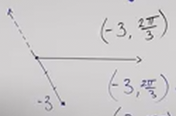

# Introduction to Polar Coordinates (Precalculus - Trigonometry 36)

[Video](https://www.youtube.com/watch?v=Ol_a6LEdo3M)

---

In this lecture we are going to learn about a new coordinate system that
contrasts with the standard $x$/$y$ coordinate system. The reason for a
different coordinate system is that it is oftentimes in certain contexts easier
to solve particular mathematical problems using Polar Coordinates over $x$/$y$
coordinates, such as those we will encounter in Calculus II and Calculus III.

For example, when we need to graph non-functional expressions (mathematical
expressions that don't pass the Vertical Line Test), can be graphed easily using
Polar Coordinates.

Additionally, three-dimensional shapes such as spheres and cones are oftentimes
better expressed using Polar Coordinates, and in fact, are based around the
principles exemplified in Polar Coordinates.

---

## What Are Polar Coordinates?

Polar Coordinates are a way to graph points without using $x$ and $y$ in a
rectangle, but instead an angle and a distance.

Polar coordinates have a point called a "Pole", this acts akin to the origin the
in $x$/$y$ coordinate system. It also has a "Polar Axis", that acts like the
$x$-axis in the $x$/$y$ coordinate system. Like the $x$/$y$ coordinate system,
in the Polar Coordinate System you can go a certain out positively or negatively
from the Polar Axis, and you can go a certain "Distance" to a point along the
Polar Coordinate Graph.

Unlike the $x$/$y$ coordinate system, when we read a "point" along the graph, we
instead reference the "Distance" along the Pole (think of the radius in the Unit
Circle), this is referred to using the variable, $r$. Another terminology for
these lines that create angles on the Polar Coordinate System are "Rays". And
then the second reference is the angle from the Polar Axis, generically referred
to with the greek letter $\theta$.

$$ (r, \theta) $$

Some things to remember about these two points are:

- $\theta (+)$ Counter-Clockwise

- $\theta (-)$ Clockwise

- $r (+)$ Distance From Pole Along $\theta$

- $r (-)$ Distance From The Pole In The Opposite Direction from $r (+)$

---

**Examples**

---

The hardest concept for new students to wrap their mind around when coming from
the $x$/$y$ coordinate system and approaching the Polar Coordinate System is the
way that points are denoted, as they do indeed mean very different things.

Remember that in the Polar Coordinate System, the distance along the Ray is the
first coordinate, $r$, and the second coordinate is the angle itself, $\theta$.

Let's take a look at a few examples to solidify our understanding:

---

$$ \left(2, \frac{\pi}{4}\right) $$

The first thing to think about is simply the angle. $\dfrac{\pi}{4}$ should be
familiar to us as being $45\degree$. This angle should be very familiar to us
and even in the Polar Coordinate System, this looks the same. From the Polar
Axis, we will draw a Ray at a $45\degree$ angle.

After this is done, we now look along our Ray, and for now we will estimate $2$
units along that Ray. This is more exact on a Polar Coordinate Graph, but for
now we will just estimate. Once we have drawn a dot at the $2$ point, we erase
the remainder of our line to make it clear that our Ray is only $2$ units in
length:

---

Now consider if we have a Negative Distance:

$$ \left(-2, \frac{\pi}{4}\right) $$

This can be a bit confusing for new students, but if we think on this, it's not
too bad. We still travel $\dfrac{\pi}{4}$ radians from the Polar Axis (up and
into Quadrant I), but once we do, we then travel through the Pole (the origin)
and reflect our distance on the other side. In essence, we are "flipping" our
point $180\degree$ around the Pole:

---

Now this is where things get interesting in regards to the Polar Coordinate
System. Consider the following point:

$$ \left(2, \frac{5\pi}{4}\right) $$

If we think on this, this is the same point as
$\left(-2, \dfrac{\pi}{4}\right)$. We are traveling $\dfrac{5\pi}{4}$ radians
around the Pole to get the angle we want, which takes us into Quadrant III. Then
we travel $2$ units out along that Ray, and we end up at the same coordinate.

---

## Some Polar Coordinate Properties

What this last example demonstrates is an intersting property about The Polar
Coordinate System, which is that if you take the inverse of your $r$, and add or
subtract $\pi$ to your angle $\theta$, you will end up at the same coordinate:

$$ (r, \theta) = (-r, \theta \pm \pi) $$

And much like the Unit Circle, one can simply travel one full rotation of $2\pi$
radians around the Pole and you will arrive at the same point:

$$ (r, \theta) = (r, \theta \pm 2\pi) $$

---

**Examples**

Let's examine a couple more examples to really solidify our understanding of The
Polar Coordinate System.

---

Consider the following Point:

$$ \left(3, -\frac{\pi}{3}\right) $$

From our Polar Axis, we would move negatively into Quadrant IV until we reach
$-60\degree$. We would then draw a Ray and then estimate out $3$ units along
that Ray. We would then draw a solid dot at $3$ and then erase the rest of our
Ray.

---

Consider the following Point:

$$ \left(3, \frac{5\pi}{3}\right) $$

From our Polar Axis, we would move positively into Quadrant IV until we reach
$300\degree$ and we would draw a Ray. We would then measure $3$ units along that
Ray. We would draw a solid dot at $3$ along that Ray and erase the rest of the
Ray:

Notice that this is the same angle as the previous example, just moving
positively from the Polar Axis.

This demonstrates the property of the Polar Coordinate System:

$$ (r, \theta) = (r, \theta \pm 2\pi) $$

---

Consider the following Point:

$$ \left(-3, \frac{2\pi}{3}\right) $$

From our Polar Axis, we would move positively into Quadrant II until we reach
$120\degree$, we would then draw a dotted line Ray. From The Pole, we would then
draw a reflection of this dotted line Ray, and we would draw this as a solid
Ray. We would then measure $3$ units along this reflected solid ray, and draw a
solid dot at the $3$ unit along the Ray, and erase the remaining Ray.

Notice once again, that this is the same point as the previous example, but
because we moved negatively along our Distance, we ended up in the same spot
from the angle of $\dfrac{2\pi}{3}$.

This demonstrates the property of the Polar Coordinate System:

$$ (r, \theta) = (-r, \theta \pm \pi) $$

Let's actually do this to demonstrate:

$$ \left(-3, \frac{2\pi}{3}\right) \rightarrow \left(3, \frac{2\pi}{3} + \pi\right) \rightarrow \left(3, \frac{5\pi}{3}\right) $$

$$ \left(-3, \frac{2\pi}{3}\right) \rightarrow \left(3, \frac{2\pi}{3} - \pi\right) \rightarrow \left(3, -\frac{\pi}{3}\right) $$

As you can see, we end up at other other two examples. They are coterminal
points (they share a terminus, a same ending point).

---

## A Standard Polar Coordinate Graph

Oftentimes when solving these sorts of Polar Coordinate Math Problems, it's nice
to have a standardized graph:

As you can see, the measurement of the Distance is less about an estimate here,
and you can really see the similarity between this and a Unit Circle. The major
differenceb being is that the Unit Circle always has a radius as $1$, where as
in the Polar Coordinate system, that radius is the Distance measurement we are
often looking for when using this type of graph.

This makes graphing much more exact as we don't have to estimate our distance
along the ray:

---

We won't bother graphing the following, but instead, please think on where these
would lie within the Polar Coordinate Graph:

| $(r, \theta)$                     |
| --------------------------------- |
| $(-2, 0)$                         |
| $(-3, \pi)$                       |
| $\left(2, -\frac{5\pi}{4}\right)$ |
| $(-3, 120\degree)$                |

---

We'll now cover some other common properties of The Polar Coordinate System.

Consider the following Polar Coordinate:

$$ \left(4, \frac{3\pi}{4} \right) $$

Now let's plot this coordinate:

Now, let's say we added some restrictions to how we wanted to express this
coordinate, consider the following restrictions:

$$ r > 0 \text{, } -2\pi \leq \theta \leq 0 $$

Here we are restricting our Distance, $r$ to always be positive. We are also
restricting our angle, $\theta$ to essentially lie inbetween one negative cycle
around the Pole.

This essentially means, that $r$ is to always remain positive, but we want
$\dfrac{3\pi}{4}$ to be expressed within the confines of this negative cycle.
How can we do this?

Recall that we can do that with one of our properties discussed earlier:

$$ (r, \theta) = (r, \theta \pm 2\pi) $$

In this case, we can keep $r$ positive, but if we subtract $2\pi$ from our
angle, we will lie within our restriction:

$$ \left(4, \frac{3\pi}{4}\right) \rightarrow \left(4, \frac{3\pi}{4}- 2\pi\right) \rightarrow \left(4, -\frac{5\pi}{4}\right) $$

---

Consider the same point as before:

$$ \left(4, \frac{3\pi}{4} \right) $$

And now consider this new restriction:

$$ r < 0 \text{, } 0 \leq \theta \leq 2\pi $$

Here we remain within the same revolution as before for our angle $\theta$, but
we need our distance, $r$, to be negative.

This can be done by using our other principle discussed earlier:

$$ (r, \theta) = (-r, \theta \pm \pi) $$

As long as $\dfrac{3\pi}{4} + \pi$ is still within $0$ and $2\pi$, we're good.
So:

$$ \left(4, \frac{3\pi}{4} \right) \rightarrow \left(-4, \frac{3\pi}{4} + \pi \right) \rightarrow \left(-4, \frac{7\pi}{4}\right) $$

---

Consider the point as before:

$$ \left(4, \frac{3\pi}{4} \right) $$

And consider this new restriction:

$$ r > 0 \text{, } 2\pi \leq 0 \leq 4\pi $$

This means we are in one full positive revolution. This is actually the same as
the first demonstration of these properties, just that we would add $2\pi$
instead of subtracting it:

$$ (r, \theta) = (r, \theta \pm 2\pi) $$

$$ \left(4, \frac{3\pi}{4} \right) \rightarrow \left(4, \frac{3\pi}{4} + 2\pi \right) \rightarrow \left(4, \frac{11\pi}{4}\right) $$
