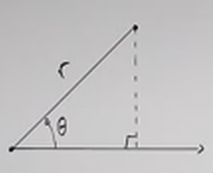
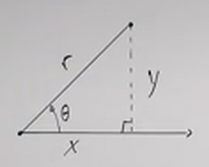

# How to Convert From Polar Coordinates to Rectangular Coordinates (Precalculus - Trigonometry 37)

[Video](https://www.youtube.com/watch?v=nyab0CZK2BE)

---

In this lecture, we are going to convert Polar Coordinates to Rectangular
Coordinates, and in the following lecture, we are going to convert Rectangular
Coordinates to Polar Coordinates.

Recall from our previous lecture in which we introduced The Polar Coordinate
System, that we have a Distance from an origin called the Pole that we refer to
with the variable $r$. We also have an angle, generally called $\theta$, that is
a positive or negative angle away from the Polar Axis (similar to the $x$-axis
in the Rectangular Coordinate system).

This distance measured along the angle is what is known as a Ray.

---

## Converting From Polar To Rectangular

All polar coordinates are denoted with the distance followed by the angle within
some parentheses:

$$ (r, \theta) $$

This is as oppposed to rectangular coordinates, which are measured within $x$
and $y$ coordiantes:

$$ (x, y) $$

Now, the idea is, is there a way to get from Polar Coordinates to Rectangular
Coordinates. Of course! (otherwise there wouldn't be a lecture on it).

If we just drop a vertical line down from wherever our Ray ends (the distance
point), that will be our $y$ coordinate along the Rectangular Coordinate System.
If we then measure from where that Vertical Line meets the Polar Axis, we get
our $x$ coordinate.

Additionally, this essentially creates a Right Triangle, which means we have at
our disposal any Right Triangle Trigonometric Methods to determine these
coordinates.

Even though we have no idea of what $y$ is (and therefore also don't know what
$x$ is). We do know the hypotenuse, $r$, and we do know our angles. Although we
could determine our third angle, we really only need $\theta$ in this case, as
we know that:

$$ \sin\theta = \frac{y}{r} $$

Similarly, we can also find $x$ using Cosine:

$$ \cos\theta = \frac{x}{r} $$

Sine and Cosine are Trigonometric Functions that we utilized in both our
lectures on the Unit Circle Trigonometry and Right Angle Trigonometry.

Thusly we can just plug in our vaalues for both $\theta$ and $r$ to solve for
$y$ and $x$.

$$ \sin\theta = \frac{y}{r} \rightarrow y = r\sin\theta $$

$$ \cos\theta = \frac{x}{r} \rightarrow x = r\cos\theta $$

---

## Converting From Rectangular To Polar (an introduction)

Now, we're going to jump ahead a bit here and ask, what if we needed to go from
Rectangular to Polar and we didn't know the angle, but we knew the $x$ and $y$
coordinates? Well consider our third Trigonometric Function:

$$ \tan\theta = \frac{y}{x} $$

Well to find the value for our angle $\theta$, we could use Inverse Tangent
(Arctangent) to find our angle:

$$ \theta = \tan^{-1}\left(\frac{y}{x}\right) $$

Now, what if we wanted to find $r$ from this?

Well we know both $x$ and $y$ in this scenario, and we're just trying to solve
for the distance, for $r$. But this is just a Pythagorean Theorem example at
this point:

$$ x^2 + y^2 = r^2 $$

And thusly to solve for $r$ we'd just have to fill out the following formula:

$$ r = \sqrt{x^2 + y^2} $$

Now, we still have to contend with which Quadrant we are in in this regard (as
you may have ascertained by the lack of a $\pm$ in our square root above), but
we'll cover that in the next lecture.

For now, let's focuse solely on converting Polar to Rectangular Coordinates.

---

**Examples**

Let's try a few examples to get our feet wet with these concepts

---

Consider the following Polar Coordinate:

$$ \left(4, \frac{3\pi}{2}\right) $$

Let's identify a few things about this right off the bat:

$$ r = 4 $$

$$ \theta = \frac{3\pi}{2} $$

$$ \text{Quadrant: On Quadrant Angle -y axis} $$

Let's now use the Trigonometric Functions we mentioned earlier to find both $x$
and $y$:

$$ y = r\sin\theta $$

$$ y = 4\sin\left(\frac{3\pi}{2}\right) $$

You can either use your calculator or the Unit Circle here as this is a pretty
classic angle, and we know that this angle evaluates on the Unit Circle to $-1$.

$$ y = 4(-1) $$

$$ y = -4 $$

Let's now evaluate for $x$ using Cosine:

$$ x = r\cos\theta $$

$$ x = 4\cos\left(\frac{3\pi}{2}\right)$$

$$ x = 4(0) $$

$$ x = 0 $$

And so our equivalent Rectangular coordinates are:

$$ \boxed{(0, -4)} $$

---

Consider the following Polar Coordinate:

$$ (-2, 0) $$

$$ r = -2 $$

$$ \theta = 0 $$

$$ \text{Quadrant: on Quadrant angle, $x = 0$} $$

$$ y = r\sin\theta $$

$$ y = -2\sin(0) $$

$$ y = -2(0) $$

$$ y = 0 $$

$$ x = -2(1) $$

$$ x = -2 $$

Our Rectangular Coordinate Equivalent is:

$$ \boxed{(-2, 0)} $$

Notice that while we ended up with the same numbers, they mean something
completely different.

---

Consider the following Polar Coordinate:

$$ (6, 150\degree) $$

$$ r = 6 $$

$$ \theta = 150\degree $$

$$ \text{Quadrant: II} $$

$$ y = r\sin\theta $$

$$ y = 6\sin(150\degree) $$

$$ y = 6\left(\frac{1}{2}\right) $$

$$ y = 3 $$

$$ x = r\cos\theta $$

$$ x = 6\cos(150\degree) $$

$$ x = 6\left(-\frac{\sqrt{3}}{2}\right) $$

$$ x = -3\sqrt{3} $$

And so our equivalent Rectangular Coordinate Point is:

$$ \boxed{(-3\sqrt{3}, 3)} $$

---

Consider the following Polar Coordinate:

$$ \left(-2, \frac{3\pi}{4}\right) $$

$$ r = -2 $$

$$ \theta = \frac{3\pi}{4} $$

$$ \text{Quadrant: IV} $$

Why Quadrant IV and not II? Well because of the negative distance. Remember
this, as it could throw you off when evaluating these Rectangular Coordinates.

$$ y = r\sin\theta $$

$$ y = (-2)\sin\left(\frac{3\pi}{4}\right) $$

$$ y = (-2)\left(\frac{\sqrt{2}}{2}\right) $$

$$ y = -\sqrt{2} $$

$$ x = r\cos\theta $$

$$ x = (-2)\cos\left(\frac{3\pi}{4}\right) $$

$$ x = (-2)\left(-\frac{\sqrt{2}}{2}\right) $$

$$ x = (-2)\left(-\frac{\sqrt{2}}{2}\right) $$

$$ x = \sqrt{2} $$

And as you can see, we might get confused if we thought this was supposed to end
up in Quadrant II instead of IV.

Our equivalent Rectangular Coordinate is:

$$ \boxed{(\sqrt{2}, -\sqrt{2})} $$

---

Consider the following Polar Coordinate:

$$ \left(-3, -\frac{\pi}{3}\right) $$

$$ r = -3 $$

$$ \theta = -\frac{\pi}{3} $$

$$ \text{Quadrant: II} $$

Why Quadrant II? Well we go into Quadrant IV by traveling at the angle
$-\dfrac{\pi}{3}$, and then we reflect via the negative distance for $r$.

$$ y = r\sin\theta $$

$$ y = (-3)\sin\theta $$

$$ y = (-3)\sin\left(-\frac{\pi}{3}\right) $$

$$ y = (-3)\left(-\frac{\sqrt{3}}{2}\right) $$

$$ y = \frac{3\sqrt{3}}{2} $$

$$ x = r\cos\theta $$

$$ x = (-3)\cos\left(-\frac{\pi}{3}\right) $$

$$ x = (-3)\left(\frac{1}{2}\right) $$

$$ x = -\frac{3}{2} $$

And our equivalent Rectangular Coordinate is:

$$ \boxed{\left(-\frac{3}{2}, \frac{3\sqrt{3}}{2}\right)} $$

---

Consider the following Polar Coordinate:

$$ (-3.1, 182\degree) $$

We _will_ have to use our Calculator on this one as this point doesn't lie
nicely on the Unit Circle. Therefore, our Rectangular Coordinates will likely be
approximations, and should be denoted as such.

$$ r = -3.1 $$

$$ \theta = 182\degree $$

$$ \text{Quadrant: I} $$

We travel a little over $180\degree$, putting us in Quadrant III, but then we
are reflected by the negative value of $r$ into Quadrant I.

$$ y = r\sin\theta $$

$$ y = (-3.1)\sin(182\degree) $$

$$ y \approx 0.11 $$

$$ x = (-3.1)\cos(182\degree) $$

$$ x \approx 3.10 $$

And our approximate equivalent Rectangular Coordinate is:

$$ (x, y) \approx (3.10, 0.11) $$

---

Consider the following Polar Coordinate:

$$ (6, 3.8 \text{ radians}) $$

This is not common, but here we do have radians, they just aren't expressed in
multiples of $\pi$.

$$ r = 6 $$

$$ \theta = 3.8 \text{ radians} $$

$$ \text{Quadrant: III} $$

We can determine that this angle lies within Quandrant III by evaluating whether
$3.8$ lies inbetween $\pi$ and $\dfrac{3\pi}{2}$.

$$ y = r\sin\theta $$

$$ y = (6)\sin(3.8 \text{ radians}) $$

$$ y \approx -3.67 $$

$$ x = r\cos\theta $$

$$ x = (6)\cos(3.8 \text{ radians})$$

$$ x \approx -4.75 $$

And so our approximate equivalent Rectangular coordinate is:

$$ (x, y) \approx (-4.75, -3.67) $$
