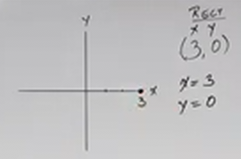
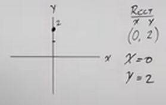
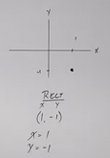
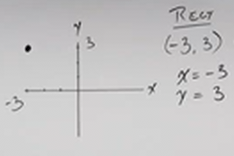
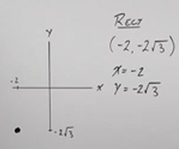
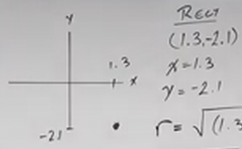
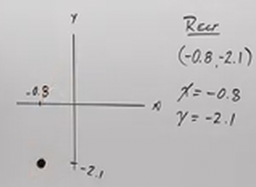

# How to Convert From Rectangular Coordinates to Polar Coordinates (Precalculus - Trigonometry 38)

[Video](https://www.youtube.com/watch?v=klxI0yvJFrg)

---

In the previous lecture, we covered how to convert Polar Coordinates to
Rectangular Coordinates. We introduced formulas involving the standard
Trigonometric Functions, Sine and Cosine, to convert from Polar Coordinates to
Rectangular Coordinates:

$$ \sin\theta = \frac{y}{r} \rightarrow y = r\sin\theta $$

$$ \cos\theta = \frac{x}{r} \rightarrow x = r\cos\theta $$

We also briefly touched on the beginning concepts behind the topic of today's
lecture, Converting From Rectangular Coordintes to Polar Coordiantes.

This included finding the Polar Distance of a Ray:

$$ x^2 + y^2 = r^2 \rightarrow r = \sqrt{x^2 + y^2} $$

And using the Inverse Tangent Trigonometric Function (Arctanget) to find our
Polar Angle:

$$ \tan\theta = \frac{y}{x} \rightarrow \theta = \tan^{-1}\left(\frac{x}{y}\right) $$

In the previous lecture, we left our understanding of this conversion here, but
we indicated that Inverse Tangent only provides the angle of $\theta$ in
Quadrant I and Quadrant IV. This is a limitation we are going to address here
and how to find the appropriate Polar Coordinate with this in mind.

---

So, what this means is that if your Polar Coordinate resides in Quadrant I or
Quadrant IV, you're done!

But what about Quadrant II or Quadrant III? This means that Inverse Tangent
(Arctangent) will _not_ give us the Polar Angle. To address this, if you have a
point in either Quadrant II or Quadrant III, add $\pi$ to $\theta$.

---

**Examples**

---

Consider the following Rectangular Coordinate:

$$ (3, 0) $$

Firstly let's just establish that we are indeed working in the Rectangular
Coordinate System. If we are not told which Coordinate system we are working in,
this gets very difficult. Luckily, most Mathematical Paradigms will define that
for us.

Secondly, we'll simply need to identify what our $x$ and $y$ coordinates are:

$$ (3, 0) $$

$$ x = 3 $$

$$ y = 0 $$

Now let's just plot our point:

Next we'll need to determine which Quadrant we are in:

$$ \text{Quadrant: quadrant angle on y = 0, inbetween I and IV} $$

Next we can define what $r$ is:

$$ r = \sqrt{x^2 + y^2} $$

Note that we always take the positive value for $r$, thusly why we don't include
the $\pm$ here. This is because a negative $r$ gets confusing in this context.
Our angle will determine which quadrant we are in.

$$ r = \sqrt{(3)^2 + (0)^2} $$

$$ r = \sqrt{9} $$

$$ r = 3 $$

Next let's find $\theta$:

$$ \theta = \tan^{-1}\left(\frac{0}{3}\right) $$

$$ \theta = \tan^{-1}(0) $$

$$ \theta = 0 $$

Now, the fact that we know which Quadrant we're in helps us immensely here.

Consider this:

$$ \theta = \tan^{-1}(0) $$

$$ \theta = 0 \text{ or } \pi $$

And this makes sense, because $x$ could be $1$ or $x$ could be $-1$. If $x =
-1$, then we are inbetween Quadrant II and Quadrant III.

But consider the point we made earlier that if are point is in Quadrant II or
Quadrant III, we simply add $\pi$ to $\theta$:

$$ \text{If in Quadrant II or III, add pi: } \theta = \theta + \pi $$

This is not the case here, but had our $x$ been $-3$, it would have been and we
would have had to adjust.

Anyways, here is the final equivalent Polar Coordinates:

$$ \boxed{\text{Equivalent Polar Coordinates} = (3, 0)} $$

Again, note that while these numbers are the same, what they represent is very
different.

---

Consider the following Rectangular Coordinate:

$$ (0, 2) $$

$$ x = 0 $$

$$ y = 2 $$

Plot it:

We are inbetween Quadrant I and Quadrant II.

Find $r$:

$$ r = \sqrt{x^2 + y^2} $$

$$ r = \sqrt{(0)^2 + (2)^2} $$

$$ r = \sqrt{4} $$

$$ r = 2 $$

Find $\theta$:

$$ \theta = \tan^{-1}\left(\frac{y}{x}\right) $$

$$ \theta = \tan^{-1}\left(\frac{2}{0}\right) $$

Uh oh...

Inverse Tangent and Tangent give us an undefined answer wherever $x = 0$. These
would be at angles $\dfrac{\pi}{2}$, $\dfrac{3\pi}{2}$, and so on.

In fact, this means that Inverse Tangent always gives us a multiple of
$\dfrac{\pi}{2}$ ! But which multiple? Well the fact that we're inbetween
Quadrant I and Quadrant II means it is the first multple:

$$ \theta = \frac{\pi}{2} $$

And our equivalent Polar Coordinate is:

$$ \boxed{(r, \theta) = \left(2, \frac{\pi}{2}\right)} $$

---

Consider the following Rectangular Coordinate:

$$ (1, -1) $$

$$ x = 1 $$

$$ y = -1 $$

Plot it:

We're in Quadrant IV.

Find $r$:

$$ r = \sqrt{x^2 + y^2} $$

$$ r = \sqrt{(1)^2 + (-1)^2} $$

$$ r = \sqrt{2} $$

Find $\theta$:

$$ \theta = \tan^{-1}\left(\frac{y}{x}\right) $$

$$ \theta = \tan^{-1}\left(\frac{-1}{1}\right) = \tan^{-1}(-1) $$

$$ \theta = -\frac{\pi}{4} $$

Our equivalent Polar Coordinate is:

$$ \boxed{(r, \theta) = \left(\sqrt{2}, -\frac{\pi}{4}\right)} $$

Now, we are expressing $\theta$ in negative radians, this is perfectly
acceptable if there are no restrictions as to how to express the angle, but
let's say we did have a restriction in the problem statement requiring us to
express this positively, say:

$$ 0 \leq \theta < 2\pi $$

In this case, we would simply add $2\pi$ to $\theta$ to express it within that
range:

$$ \theta = -\frac{\pi}{4} + 2\pi = \frac{7\pi}{4} $$

---

Consider the following Rectangular Coordinate:

$$ (-3, 3) $$

$$ x = -3 $$

$$ y = 3 $$

Graph it:

We are in Quadrant II.

Find $r$:

$$ r = \sqrt{x^2 + y^2} $$

$$ r = \sqrt{(-3)^2 + (3)^2} $$

$$ r = \sqrt{18} $$

$$ r = 3\sqrt{2} $$

Find $\theta$:

$$ \theta = \tan^{-1}\left(\frac{y}{x}\right) $$

$$ \theta = \tan^{-1}\left(\frac{3}{-3}\right) $$

$$ \theta = \tan^{-1}(-1) = -\frac{\pi}{4} $$

We are in Quadrant II, therefore we _should_ add $\pi$ to $\theta$:

$$ \theta = -\frac{\pi}{4} + \pi $$

$$ \theta = \frac{3\pi}{4} $$

Our equivalent Polar Coordinate is:

$$ \boxed{(r, \theta) = \left(3\sqrt{2}, \frac{3\pi}{4}\right)} $$

---

Consider the following Rectangular Coordinate:

$$ (-2, -2\sqrt{3}) $$

$$ x =  -2 $$

$$ y =  -2\sqrt{3} $$

Graph it:

We are in Quadrant III.

Find $r$:

$$ r = \sqrt{x^2 + y^2} $$

$$ r = \sqrt{(-2)^2 + (-2\sqrt{3})^2} $$

$$ r = \sqrt{4 + 12} $$

$$ r = \sqrt{16} $$

$$ r = 4 $$

Find $\theta$:

$$ \theta = \tan^{-1}\left(\frac{y}{x}\right) $$

$$ \theta = \tan^{-1}\left(\frac{-2\sqrt{3}}{-2}\right) $$

$$ \theta = \tan^{-1}(\sqrt{3}) $$

$$ \theta = \frac{\pi}{3} $$

We are in Quadrant III, therefore we _should_ add $\pi$ to $\theta$.

$$ \theta = \frac{\pi}{3} + \pi $$

$$ \theta = \frac{4\pi}{3} $$

Our equivalent Polar Coordinate is:

$$ \boxed{(r, \theta) = \left(4, \frac{4\pi}{3}\right)} $$

---

Consider the following Rectangular Coordinate:

$$ (1.3, -2.1) $$

$$ x = 1.3 $$

$$ y = -2.1 $$

Graph it:

We are in Quadrant IV.

Find $r$:

$$ r = \sqrt{x^2 + y^2} $$

$$ r = \sqrt{(1.3)^2 + (-2.1)^2} $$

$$ r \approx 2.47  $$

Find $\theta$:

$$ \theta = \tan^{-1}\left(\frac{y}{x}\right) $$

$$ \theta = \tan^{-1}\left(\frac{-2.1}{1.3}\right) $$

$$ \theta \approx -1.02 \text{ radians} $$

We are in Quadrant IV, therefore we _should not_ add $\pi$ to $\theta$.

Our equivalent Polar Coordinate is:

$$ \boxed{(r, \theta) \approx (2.47, -1.02 \text{ radians})} $$

---

Consider the following Rectangular Coordinate:

$$ (-0.8, -2.1) $$

$$ x = -0.8 $$

$$ y = -2.1 $$

Graph it:

We are in Quadrant III.

Find $r$:

$$ r = \sqrt{x^2 + y^2} $$

$$ r = \sqrt{(-0.8)^2 + (-2.1)^2} $$

$$ r \approx 2.25 $$

Find $\theta$:

$$ \theta = \tan^{-1}\left(\frac{y}{x}\right) $$

$$ \theta = \tan^{-1}\left(\frac{-2.1}{-0.8}\right) $$

$$ \theta \approx 1.21 \text{ radians} $$

We are in Quadrant III, therefore we _should_ add $\pi$ to $\theta$.

$$ \theta \approx \pi + 1.21 \text{ radians} $$

$$ \theta \approx 4.35 \text{ radians} $$

Our equivalent Polar Coordinate is:

$$ \boxed{(r, \theta) \approx (2.25, 4.35 \text{ radians})} $$
