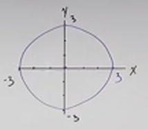
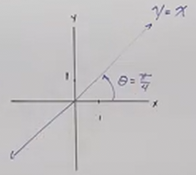
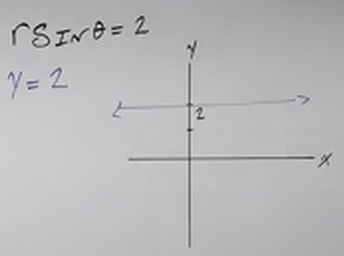
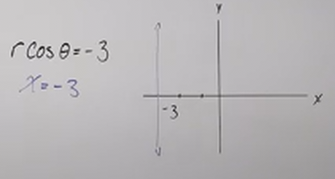
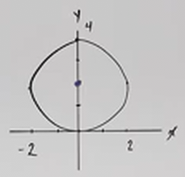
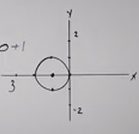

# How to Graph Basic Polar Equations (Precalculus - Trigonometry 41)

[Video](https://www.youtube.com/watch?v=d-KXFtkLZVA)

---

We're going to be graphing some Polar Equations. This lecture will keep things
very basic as this is preemptively covering certain basic topics to build up for
the next lecture, where we will go into more advanced aspects of this topic.

A brief review here is in order. You should already be familiar with these Polar
Identities:

$$ x^2 + y^2 = r^2 $$

$$ x = r\cos\theta $$

$$ y = r\sin\theta $$

$$ \tan\theta = \frac{y}{x} $$

---

Consider this basic Polar Equation:

$$ r = 3 $$

Let's simplify this by simply squaring both sides so we have an $r^2$:

$$ r^2 = 9 $$

We can now immediately convert this into a Rectangular Equation:

$$ x^2 + y^2 = 9 $$

And we can see that if we graph this, this is just a circle, centered around the
origin, with a radius of $3$:

---

Consider this basic Polar Equation:

$$ \theta = \frac{\pi}{4} $$

$$ \tan\theta = \frac{y}{x} $$

$$ \tan\theta = \tan\left(\frac{\pi}{4}\right) $$

$$ \tan\theta = 1 $$

$$ \frac{y}{x} = 1 $$

$$ y = x $$

---

Consider this basic Polar Equation:

$$ r\sin\theta = 2 $$

$$ y = 2 $$

---

Consider this basic Polar Equation:

$$ r\cos\theta = -3 $$

$$ x = -3 $$

---

Notice in these previous examples that if we have some sort of constant, than it
is easier to reason about within the realm of the Rectangular Coordinate System,
whereas when dealing with the radius, or the angle of that radius (_i.e._
Circles/Angles), then it is easier to reason about them in the Polar Coordinate
System.

---

Consider this basic Polar Equation:

$$ r = 4\sin\theta $$

$$ r^2 = 4r\sin\theta $$

$$ x^2 + y^2 = 4y $$

$$ x^2 + y^2 - 4y = 0 $$

We'll have to Complete the Square Here:

$$ x^2 + (y^2 - 4y + 4) = 4 $$

$$ x^2 + (y - 2)^2 = 4 $$

This is a circle shifted _up_ vertically $2$ units along the $y$-axis, and it
has a radius of $4$.

---

Consider this basic Polar Equation:

$$ r = -2\cos\theta $$

$$ r^2 = -2r\cos\theta $$

$$ x^2 + y^2 = -2x $$

$$ x^2 + y^2 + 2x = 0 $$

$$ x^2 + 2x + y^2 = 0 $$

$$ (x^2 + 2x + 1) + y^2 = 1 $$

$$ (x + 1)^2 + y^2 = 1 $$

This is a Circle shifted _left_ horizontally along the $x$-axis, with a radius
if $1$.

