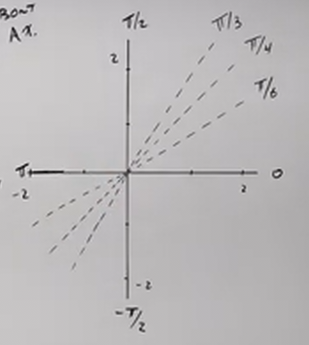

# How to Graph Advanced Polar Equations with Symmetry (Precalculus - Trigonometry 42)

[Video](https://www.youtube.com/watch?v=I9BKbq2MVfg)

---

In this last lecture of this series on Precalculus, we are going to cover how to
Graph Polar Equations using a technique called Symmetry.

Consider the following Polar Equation:

$$ r = 1 - \sin\theta $$

There is no way to reason about converting this into The Rectangular Coordinate
System without it getting exceedingly complicated. Thusly, we will leave this
equation in its Polar form, and use a technique called Symmetry to reason about
it and graph it.

---

## Principles Of Symmetry

There are a few Principles Of Symmetry to keep in mind:

- If $r(\theta) = r(-\theta)$:

  You will have Symmetry about the Polar Axis ($x$-axis$)

- If $r(\theta) = r(\pi - \theta)$:

  You will have Symmetry about $\dfrac{\pi}{2}$ ($y$-axis)

- If $r(\theta) = -r(\theta)$

  You will have Symmetry about the Pole (the origin)

Using these principles, we can then begin to plot in points along many of the
classic Unit Circle Angles and because we know the Symmetry of the Graph, we
will be able to ascertain with a degree of accuracy what our final Graph will
look like.

---

Consider the following Polar Equation from before:

$$ r = 1 - \sin\theta $$

First, let's just try to convert it into a Rectangular Equation. Quickly we will
find it's not really possible due to the presence of $1$.

Let's just take Professor Leonard's word on this and move on. Let's now check
for Symmetry.

Does $r(\theta) = r(-\theta)$ ?

$$ r = 1 - \sin(-\theta) $$

Already, we can see that this is not the case, but let's demonstrate why:

$$ 1 - \sin\theta \stackrel{?}{=} 1 - \sin(-\theta) $$

$$ 1 - \sin\theta \stackrel{?}{=} 1 + \sin(\theta) $$

No, this is not the case. Because Sine is an Odd Function:

$$ \sin(-\theta) = -\sin\theta $$

This changes our $-\sin(-\theta)$ to $\sin\theta$, and we see very clearly that
they are not equal:

$$ 1 - \sin\theta \neq 1 + \sin(\theta) $$

This means that this is _not_ symmetrical about the Polar Axis ($x$-axis).

Next:

Does $r(\theta) = r(\pi - \theta)$ ?

$$ r = 1 - \sin(\pi - \theta) $$

Recall your identities here:

$$ r = 1 - (\sin\pi\cos\theta - \cos\pi\sin\theta) $$

$$ r = 1 - ((0)\cos\theta - (-1)\sin\theta) $$

$$ r = 1 - \sin\theta $$

And that is what we started with:

$$ 1 - \sin\theta = 1 - \sin\theta $$

This holds true and it means we have Symmetry along $\dfrac{\pi}{2}$ (or the
$y$-axis).

Next:

Does $r(\theta) = -r(\theta)$ ?

$$ -r = 1 - \sin\theta $$

$$ r = -1(1 - \sin\theta) $$

$$ r = -1 + \sin\theta $$

And this is not the case:

$$ -1 + \sin\theta \neq 1 - \sin\theta $$

Which means we do _not_ have symmetry about the Pole (origin).

From here, we now plug in common angles for $\theta$, and because we know our
graph is symmetrical around the $\dfrac{\pi}{2}$ (the $y$-axis) we can mirror
them Horizontally on the other side of that axis:

We'll take approximations using our calculator for $r$:

| $(r, \theta$)                              |
| ------------------------------------------ |
| $\left(2, -\dfrac{\pi}{2}\right)$          |
| $\left(1.87, -\dfrac{\pi}{3}\right)$       |
| $\left(1.71, -\dfrac{\pi}{4}\right)$       |
| $\left(1.5, -\dfrac{\pi}{6}\right)$        |
| $\left(d1, 0\right)$                       |
| $\left(\dfrac{1}{2}, \frac{\pi}{6}\right)$ |
| $\left(0.29, \dfrac{\pi}{4}\right)$        |
| $\left(0.13, \dfrac{\pi}{3}\right)$        |
| $\left(0, \dfrac{\pi}{2}\right)$           |

If we now graph these, and then reflect it around the $y$-axis, we actually get
a nice heart shape:

This gives us what is known as a
[cardioid](https://en.wikipedia.org/wiki/Cardioid) shape.

---

Let's do another one.

Consider the following Polar Equation:

$$ r = 1 + 2\cos\theta $$

$(-\theta)$:

$$ r = 1 + 2\cos(-\theta) $$

Cosine is Even:

$$ \cos\theta = \cos(-\theta) $$

$$ r = 1 + 2\cos(\theta) $$

This is equivalent, so this Function will be Symmetric about the Polar Axis
($x$-axis).

$(\pi - \theta)$:

$$ r = 1 + 2\cos(\pi - \theta) $$

We'll need the Cosine Difference Formula Identity Here:

$$ r = 1 + 2(\cos\pi\cos\theta + \sin\pi\sin\theta) $$

$$ r = 1 + 2((-1)\cos\theta + (0)\sin\theta) $$

$$ r = 1 + 2((-1)\cos\theta) $$

$$ r = 1 - 2\cos\theta $$

$$ 1 - 2\cos\theta \neq 1 + 2\cos(\theta) $$

This Function is _not_ symmetrical about the $\dfrac{\pi}{2}$ (the $y$-axis).

$(-r)$:

$$ -r = 1 + 2\cos\theta $$

$$ r = -1 - 2\cos\theta $$

$$ -1 - 2\cos\theta \neq 1 + 2\cos\theta $$

This Function is _not_ symmetric about the Pole (the origin).

Now we plot some points, knowing that anything we plot can mirror about the
Polar Axis ($x$-axis), we can choose positive angle values:

| $(r, \theta$)                        |
| ------------------------------------ |
| $\left(3, 0\right)$                  |
| $\left(2.7, \dfrac{\pi}{6}\right)$   |
| $\left(2.4, \dfrac{\pi}{4}\right)$   |
| $\left(2, \dfrac{\pi}{3}\right)$     |
| $\left(1, \dfrac{\pi}{2}\right)$     |
| $\left(0, \dfrac{2\pi}{3}\right)$    |
| $\left(-0.4, \dfrac{3\pi}{4}\right)$ |
| $\left(-0.7, \dfrac{5\pi}{6}\right)$ |
| $\left(-1, \pi\right)$               |

This creates a nice spiral shape. Once we reflect it, it creates an interesting
shape that overlaps itself:

This is what is known as a [limaçon](https://en.wikipedia.org/wiki/Lima%C3%A7on)
with an inner loop.

---

Consider the following Polar Equation:

$$ r = 2\cos(2\theta) $$

$(-\theta)$:

$$ r = 2\cos(-2\theta) $$

Cosine is an Even Function:

$$ \cos\theta = \cos(-\theta) $$

$$ r = 2\cos(2\theta) $$

This is equivalent, so we are going to have Symmetry about the Polar Axis
($x$-axis).

$(\pi - \theta)$:

$$ r = 2\cos(2(\pi - \theta)) $$

$$ r = 2\cos(2\pi - 2\theta) $$

Because the Period of Cosine is $2\pi$, this means we can actually subtract it
from the Cosine, and we will have the same angle:

$$ r = 2\cos(-2\theta) $$

And we have the same as the previous check for Symmetry:

$$ r = 2\cos(2\theta) $$

This is equivalent, and we will have Symmetry about the $\dfrac{\pi}{2}$
($y$-axis).

$(-r)$:

We don't have to check this, as if you have symmetry about the Polar Axis and
also $\dfrac{\pi}{2}$, then you definitely have symmetry about the Pole.

Now, plotting such equations graphically is very easy, because we only have to
plot within Quadrant I, as it is reflected in all four quadrants:

| $(r, \theta$)                     |
| --------------------------------- |
| $(2, 0)$                          |
| $\left(1, \dfrac{\pi}{6}\right)$  |
| $\left(0, \dfrac{\pi}{4}\right)$  |
| $\left(-1, \dfrac{\pi}{3}\right)$ |
| $\left(-2, \dfrac{\pi}{2}\right)$ |

This creates a nice curve, but remember, we have to reflect it about both the
Polar Axis and also the $\dfrac{\pi}{2}$ axis:

And this creates what is known as a
[rose](https://en.wikipedia.org/wiki/Rose_(mathematics)) shape.

---

Consider the following Polar Equation:

$$ r^2 = 4\sin(2\theta) $$

$(-\theta)$:

$$ r^2 = 4\sin(-2\theta) $$

Sine is an _Odd_ Function:

$$ \sin(-\theta) = -\sin\theta $$

$$ r^2 = -4\sin(2\theta) $$

$$ -4\sin(2\theta) \neq 4\sin(2\theta) $$

This means that this is _not_ symmetric about the Polar Axis.

$(\pi - \theta)$:

$$ r^2 = 4\sin(2\pi - 2\theta) $$

Sine's Period is $2\pi$ so we can subtract it from Sine's argument and we will
get the same angle:

$$ r^2 = 4\sin(-2\theta) $$

And this is the same as the previous check.

Thusly, this is probably _not_ symmetric about the $\dfrac{\pi}{2}$ axis.

$(-r)$:

$$ (-r)^2 = 4\sin(2\theta) $$

$$ r^2 = 4\sin(2\theta) $$

This is symmetric about the Pole.

Because we have Symmetry about the Pole, we'll need to check at least two
Quadrants. Which two quadrants doesn't actually matter, as we'll need to reflect
about both axes.

| $(r, \theta$)                          |
| -------------------------------------- |
| $(0, 0)$                               |
| $\left(\pm 1.9, \dfrac{\pi}{6}\right)$ |
| $\left(\pm 2, \dfrac{\pi}{4}\right)$   |
| $\left(\pm 1.9, \dfrac{\pi}{3}\right)$ |
| $\left(0, \dfrac{\pi}{2}\right)$       |
| $\left(?, \dfrac{2\pi}{3}\right)$      |
| $\left(?, \dfrac{3\pi}{4}\right)$      |
| $\left(?, \dfrac{5\pi}{6}\right)$      |
| $(?, \pi)$                             |

The reason we left the $?$ in there is because when evaluated, we actually get
imaginary numbers! These points do not exist. In fact, our Graph only exists
within Quadrant I and Quadrant III.

When graphed, it looks like an Infinity Symbol:

This is what is known as a
[lemniscate](https://en.wikipedia.org/wiki/Lemniscate).
